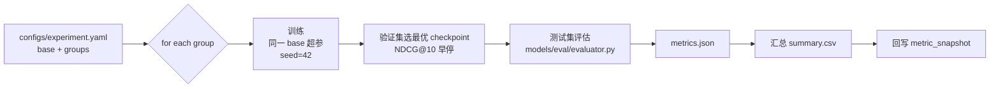

# 消融实验设计

> **实验组编号**：E2　　**对应论文章节**：实验与结果分析 - 消融实验
> 实验环境与数据口径见 [evaluation-plan.md](evaluation-plan.md)。
>
> ⚠️ **本文档中的数值表格为待填模板**。所有指标必须来自 `scripts/run_experiments.py --group E2` 的真实输出，**禁止编造或估算**。第 5 节给出的是**基于文献经验的预期方向**（用于设计实验假设），不是结果。

---

## 一、消融实验目的

本文模型相比原版 SASRec 增加了两个模块：

| 模块 | 位置 | 解决的问题 |
|---|---|---|
| **M1 多兴趣胶囊网络** | SASRec 最后一层自注意力输出之后 | 单一兴趣向量淹没小众偏好 |
| **M2 内容语义融合** | 候选侧（内容向量作输入特征，默认 `add` 零初始化残差）+ 排序侧加权（后验，仅作冷启动在线兜底） | 新番无交互数据，召回为 0 |

消融实验要回答三个问题：

| # | 问题 | 结论形式 |
|---|---|---|
| Q1 | M1 单独加进去，指标提升多少？ | 相对基准的绝对/相对增益 |
| Q2 | M2 单独加进去，指标提升多少？ | 同上 |
| Q3 | M1 + M2 一起，是简单叠加还是有协同效应？ | 协同增益 = 完整模型 − (基准 + M1增益 + M2增益) |

---

## 二、四组实验配置

### 2.1 配置矩阵

| 实验组 | 命名 | 多兴趣胶囊 M1 | 内容融合 M2 | 说明 |
|---|---|---|---|---|
| E2-1 | 纯 SASRec | ❌ | ❌ | **基准线**，验证 SASRec 原版效果 |
| E2-2 | SASRec + 多兴趣 | ✅ | ❌ | 验证 M1 单独增益 |
| E2-3 | SASRec + 内容融合 | ❌ | ✅ | 验证 M2 单独增益 |
| E2-4 | 完整模型 | ✅ | ✅ | 验证协同增益 |

### 2.2 具体配置差异（代码层面的开关）

```yaml
# configs/experiment.yaml → E2_ablation.groups
# 开关名与 scripts/train.py 已落地的口径一致（早期占位的 use_multi_interest /
# use_content_fusion 会被 from_dict 静默忽略，2026-09-14 已废弃）

E2_1_pure_sasrec:
  arch: sasrec                   # 单向量用户表示（SASRec 原版）

E2_2_multi_interest:
  arch: multi_interest
  num_interests: 4               # K=4

E2_3_content_fusion:
  arch: sasrec
  content_fusion: true           # 候选侧：内容向量作【输入特征】端到端训练
  content_mode: add              # 零初始化残差 emb + proj(content)（默认口径，见决策 D5）
  # 对照臂：content_mode: concat（拼接后降维）—— M2.6b 实测在 SASRec 上 −1.1pp

E2_4_full:
  arch: multi_interest
  num_interests: 4
  content_fusion: true
  content_mode: add
```

> ⚠️ **与早期设计稿的差异（按实测证据收敛，2026-09-14）**：本文件早先把 E2-3 描述为
> 「拼接 512 维内容向量 → 线性层降回 64 维」并叠加**排序侧 7:3 加权**。
> 实测后改为：**候选侧为主口径，且用 `add` 而非 `concat`**（`concat` 会把物品表示空间重学
> 一遍，SASRec 上整模型 −1.1pp）；**排序侧后验加权无增益**，不再作为消融组，
> 只保留为「冷启动在线兜底」的可选路径。证据：`progress.md` §4.1（M2.6 / M2.6b）与 §6 决策 D5。

### 2.3 各配置的模型结构差异

```mermaid
flowchart TB
    subgraph E21["E2-1 纯 SASRec"]
        S1[物品嵌入+位置嵌入] --> A1[2层因果自注意力]
        A1 --> U1[取最后位置隐状态<br/>→ 单一用户向量 h]
        U1 --> P1["score = h · item_emb"]
    end
    subgraph E22["E2-2 + 多兴趣"]
        S2[物品嵌入+位置嵌入] --> A2[2层因果自注意力]
        A2 --> C2[动态路由<br/>K=4 胶囊]
        C2 --> U2[4 个兴趣向量]
        U2 --> P2["score = max_k(h_k · item_emb)"]
    end
    subgraph E23["E2-3 + 内容融合（候选侧 add）"]
        S3["物品表示 = item_emb + proj(内容向量)<br/>（零初始化残差，同一张表供输入与打分）"] --> A3[2层因果自注意力]
        A3 --> U3[单一用户向量 h]
        U3 --> P3["score = h · table[v]<br/>table = item_emb + proj(content)"]
    end
    subgraph E24["E2-4 完整（多兴趣 + 候选侧内容）"]
        S4["物品表示 = item_emb + proj(内容向量)"] --> A4[2层因果自注意力]
        A4 --> C4[动态路由 K=4]
        C4 --> U4[4 个兴趣向量]
        U4 --> P4["per-capsule: max_k(h_k · table[v])<br/>内容作用于【表示层】，不在分数层加权"]
    end
```



**关键实现细节（保证消融是"干净"的）**：

| 细节 | 说明 |
|---|---|
| E2-2 的打分方式 | 4 个胶囊分别与本物品算内积，取 **max**（MIND 的做法），而不是平均 |
| E2-3 的物品表示 | `table = item_emb(64) + proj(content(512))`（零初始化残差），投影层 **+32,832 参数**；训练起点逐位等价基准，指标差异可完全归因于内容 |
| E2-4 的融合顺序 | 物品表示先经融合表（同一 `repr_provider`，输入与打分共用），再由各胶囊取 max 内积 —— **内容作用于表示层，不在分数层加权** |
| 参数对齐 | E2-3 / E2-4 引入的额外参数（`add` 32,832 / `concat` 36,928）必须在论文中报告，说明"增益不是靠加参数堆出来的" |
| 训练轮数 | 全部 200 epoch 上限 + 早停 patience=10，不允许某组多训 |

> ⚠️ **容易出错的地方**：内容向量 512 维若不降维就直接参与内积，参数量会暴增，指标提升可能只是因为"参数多了"。
> 必须控制变量并在论文中报告各组参数量。`add` 口径只新增 32,832 参数（占基准 1,107,328 的 **2.97%**），
> 且零初始化使训练起点**严格等价基准** —— 这也正是它比 `concat` 更适合做消融的原因。

---

## 三、训练与评估流程



### 执行命令

```bash
# 跑全部 4 组消融
python scripts/run_experiments.py --config configs/experiment.yaml --group E2 \
    --seed 42 --out experiments/20260912_E2

# 三随机种子重复（最终报告用）
for s in 42 2024 2025; do
  python scripts/run_experiments.py --group E2 --seed $s --out experiments/E2_seed$s
done

# 合并三种子结果（均值 ± 标准差）
python scripts/merge_seeds.py --dirs experiments/E2_seed* --out experiments/E2_final
```

### 输出文件

| 文件 | 内容 |
|---|---|
| `E2_*/metrics.json` | 单组完整指标（含 HR@5/10、NDCG@5/10、MRR、参数量、训练耗时） |
| `E2_*/train_log.csv` | 每 epoch 的 loss 与验证指标 |
| `E2_*/summary.csv` | 4 组汇总表 |
| `E2_*/figures/ablation_grouped.png` | 分组柱状图 |

---

## 四、结果对比表格模板

> **以下表格待填**。填写来源：`experiments/20260912_E2/summary.csv`

### 4.1 主表：四组配置的指标对比

| 实验组 | 配置 | HR@5 | HR@10 | NDCG@5 | NDCG@10 | MRR | 参数量 | 训练耗时 |
|---|---|---|---|---|---|---|---|---|
| E2-1 | 纯 SASRec（基准） | 待填 | 待填 | 待填 | 待填 | 待填 | 待填 | 待填 |
| E2-2 | SASRec + 多兴趣 | 待填 | 待填 | 待填 | 待填 | 待填 | 待填 | 待填 |
| E2-3 | SASRec + 内容融合 | 待填 | 待填 | 待填 | 待填 | 待填 | 待填 | 待填 |
| E2-4 | 完整模型 | 待填 | 待填 | 待填 | 待填 | 待填 | 待填 | 待填 |

### 4.2 增量表：相对基准的增益

| 实验组 | ΔHR@10 | ΔNDCG@10 | 相对提升（NDCG@10） | 显著性 p 值 |
|---|---|---|---|---|
| E2-1 → E2-2（M1 增益） | 待填 | 待填 | 待填 | 待填 |
| E2-1 → E2-3（M2 增益） | 待填 | 待填 | 待填 | 待填 |
| E2-1 → E2-4（总增益） | 待填 | 待填 | 待填 | 待填 |

### 4.3 协同效应分析表

| 项 | 计算方式 | 值 |
|---|---|---|
| 基准 | E2-1 | 待填 |
| M1 单独增益 | E2-2 − E2-1 | 待填 |
| M2 单独增益 | E2-3 − E2-1 | 待填 |
| 独立增益之和 | (E2-2 − E2-1) + (E2-3 − E2-1) | 待填 |
| 实际总增益 | E2-4 − E2-1 | 待填 |
| **协同效应** | 实际总增益 − 独立增益之和 | **待填** |

> **判读规则**：
> - 协同效应 **> 0** → 两模块正协同（多兴趣拆出的兴趣向量为内容融合提供了更精准的查询向量）
> - 协同效应 **≈ 0** → 两模块独立作用，无交互
> - 协同效应 **< 0** → 存在负协同，需在论文中如实分析（可能原因：内容向量引入了噪声，干扰了胶囊路由）

### 4.4 分题材消融结果（Recall@10）

| 题材 | E2-1 纯 SASRec | E2-2 +多兴趣 | E2-3 +内容融合 | E2-4 完整 |
|---|---|---|---|---|
| 热血战斗 | 待填 | 待填 | 待填 | 待填 |
| 冒险奇幻 | 待填 | 待填 | 待填 | 待填 |
| 日常治愈 | 待填 | 待填 | 待填 | 待填 |
| 恋爱校园 | 待填 | 待填 | 待填 | 待填 |
| 悬疑推理 | 待填 | 待填 | 待填 | 待填 |
| 科幻机战 | 待填 | 待填 | 待填 | 待填 |
| 喜剧搞笑 | 待填 | 待填 | 待填 | 待填 |
| **运动竞技** | 待填 | 待填 | 待填 | 待填 |
| 超自然灵异 | 待填 | 待填 | 待填 | 待填 |
| 剧情文艺 | 待填 | 待填 | 待填 | 待填 |
| **青春音乐** | 待填 | 待填 | 待填 | 待填 |
| **后宫福利** | 待填 | 待填 | 待填 | 待填 |

> **重点观察**：多兴趣模块对**小众题材**的增益是否明显大于主流题材。若成立，这是 H3 命题的直接证据。

---

## 五、结果分析框架

> 本节给出**分析模板与分析假设**。实验跑完后按下述结构逐条填写，每条结论必须有数据支撑。

### 5.1 M1（多兴趣胶囊）为什么有效？

**机制解释（写作时可展开）**：

用户在 MAL 上的追番行为天然是多峰的。以数据集中典型的高活跃用户为例，其追番序列可能同时包含《进击的巨人》（热血战斗）、《夏目友人帐》（日常治愈）、《名侦探柯南》（悬疑推理）三类截然不同的作品。

- 单兴趣向量：这三类偏好被平均成一个"中庸"的向量，与任何单一题材的相似度都不高 → 排序时容易被主流题材（喜剧搞笑 6,902 部、热血战斗 5,387 部占库比大）压制
- 多兴趣胶囊：动态路由把序列中位置向量按相似性聚合到 4 个胶囊，每个胶囊专注一类偏好 → 小众题材有了独立的召回通道

**验证路径**：
1. 看 4.4 表中**小众题材的 Recall@10 提升幅度**是否 > 主流题材
2. 看兴趣胶囊的 `label` 分布是否覆盖了用户的多个题材（`user_interest_capsule` 表）
3. 做**兴趣数 K 的敏感性实验**（K=2/4/6/8），观察指标拐点

**预期方向**（文献经验，非本实验结果）：MIND 类多兴趣建模在序列推荐上通常带来 NDCG@10 的 3%–8% 相对提升，且对小众类目增益更大。

### 5.2 M2（内容融合）为什么有效？

**机制解释**：

- **候选侧融合**：把 512 维内容向量拼进物品表示，使**新番**在嵌入空间里有初始位置，而不是随机初始化或零向量 → 冷启动物品不再"不可召回"
- **排序侧融合**：行为分擅长捕捉"和你看过的像"，内容分擅长捕捉"题材/设定像"。二者互补：行为分对长尾新番失效时，内容分顶上（权重从 0.3 提升到 0.5）

**验证路径**：
1. E3 冷启动专项的 HR@10 对比（增益应远大于 E2 全量实验）
2. 内容权重敏感性：0.0 / 0.3 / 0.5 / 0.7 / 1.0，找最优拐点
3. 检查**内容向量质量**：随机抽 20 部番，看 FAISS Top5 近邻是否题材一致（人工抽查，论文可放案例）

**预期方向**：全量测试集上内容融合增益通常小于冷启动子集上的增益——这是**符合预期**的，因为全量集里交互丰富的物品本来就靠行为分就够了。论文应明确说明这一点，而不是因为"全量增益小"就否定该模块。

### 5.3 两模块的协同关系

**需要检查的三种情况**：

| 情况 | 表现 | 解释与写作建议 |
|---|---|---|
| 正协同 | 协同效应 > 0 | 多兴趣提供了多个精准的兴趣查询向量，内容召回在"每个兴趣方向"上分别匹配，比单兴趣平均向量更准 |
| 独立 | 协同效应 ≈ 0 | 两模块作用于不同环节（M1 改用户表示，M2 改物品表示），互不干扰，各自贡献可叠加 |
| 负协同 | 协同效应 < 0 | 内容向量的噪声进入胶囊路由，污染兴趣拆分。此时应讨论是否需要在胶囊输入前对内容分量做降噪 |

### 5.4 反直觉结果的处理原则

如果实验结果与假设不符，**必须如实报告并分析原因**，不得选择性报告。常见反直觉情况及可能原因：

| 反直觉结果 | 可能原因 | 排查方向 |
|---|---|---|
| 完整模型不如某个单模块 | 超参未针对完整模型重新调优 | 对 E2-4 单独做一次小网格搜参 |
| 内容融合在全量集上掉点 | 内容向量引入了与任务无关的语义噪声 | 检查内容向量是否混入了简介中的营销话术（A8 的简介规范化是否生效） |
| 多兴趣在小众题材上没提升 | 胶囊数 K 不足，或胶囊塌缩（多个胶囊学到同一兴趣） | 检查胶囊间余弦相似度，若 > 0.9 则是塌缩，需加正交约束 |
| 指标方差很大 | 随机种子未完全控制 | 三种子重跑，检查是否 `cudnn.deterministic` 生效 |

### 5.5 胶囊塌缩检测（补充实验）

多兴趣建模最常见的技术问题是**胶囊塌缩**——4 个胶囊学成了差不多一样的东西。必须做检测并报告：

```python
# scripts/check_capsule_collapse.py（每个 epoch 记录）
caps = model.get_capsules(batch)            # [B, K, H]
caps_n = F.normalize(caps, dim=-1)
# 胶囊两两余弦相似度，取平均
sim = caps_n @ caps_n.transpose(1, 2)       # [B, K, K]
off_diag = sim[:, ~torch.eye(K, dtype=bool)].mean().item()
# off_diag 越接近 0 越"正交"（好）；接近 1 说明塌缩（坏）
```

| 指标 | 健康值 | 处理 |
|---|---|---|
| 胶囊平均两两余弦相似度 | < 0.5 | 若 > 0.7，加入正交正则项 `λ·‖CᵀC − I‖²`，λ=0.01 |
| 胶囊强度分布熵 | > 1.0 | 若过小说明所有流量集中在一个胶囊 |

> 这一项建议作为**补充实验**放入论文，是很能体现工作量的技术细节。

---

## 六、图表规划

| 图号 | 图类型 | 内容 | 脚本 |
|---|---|---|---|
| 图 1 | 分组柱状图 | 4 组配置 × 4 指标（HR@5/10、NDCG@5/10） | `scripts/plot_results.py --fig ablation` |
| 图 2 | 折线图 | 4 组配置的验证集指标随 epoch 变化曲线 | 同上 |
| 图 3 | 分组柱状图 | 12 题材 × 4 配置的 Recall@10 | 同上 |
| 图 4 | 热力图 | 指标 × 题材，展示提升分布 | 同上 |
| 图 5 | 雷达图 | 完整模型 vs 基准在 12 题材上的相对提升 | 同上 |
| 图 6 | 折线图 | 兴趣数 K 的敏感性（K=2/4/6/8） | `--fig k_sensitivity` |
| 图 7 | 折线图 | 内容融合权重敏感性（0.0→1.0） | `--fig fusion_weight` |

### 图 1 的绘制规范（中文标签，直接进论文）

```python
# scripts/plot_results.py 片段
import matplotlib.pyplot as plt
plt.rcParams['font.sans-serif'] = ['SimHei']    # 中文
plt.rcParams['axes.unicode_minus'] = False

groups = ['纯SASRec', '+多兴趣', '+内容融合', '完整模型']
metrics = {'HR@5': [...], 'HR@10': [...], 'NDCG@5': [...], 'NDCG@10': [...]}
# 分组柱状图 + 误差棒（三种子标准差）
```

---

## 七、常见陷阱清单

跑消融实验前逐项自查：

- [ ] **超参未重调**：给完整模型用了基准的最优超参，可能不是它自己的最优 → 至少做一次小网格
- [ ] **参数量不对齐**：加模块带来的参数增长未被报告 → 必须报告并讨论
- [ ] **早停策略不一致**：某组多训了 20 轮 → 统一 patience 与最大 epoch
- [ ] **验证集泄露**：用测试集选 checkpoint → 只能用验证集
- [ ] **胶囊数 K 变动未说明**：K 从 4 改成 8 时不报告 → K 必须显式记录
- [ ] **内容融合的冷启动权重被混用**：全量实验误用了 0.5 权重 → 检查配置隔离
- [ ] **种子未固定**：结果无法复现 → 验证同种子重跑指标完全一致
- [ ] **胶囊塌缩未检测**：4 个胶囊实际等价 → 跑 5.5 的检测脚本
- [ ] **指标口径不一致**：某组用了全库排序，某组用了 101 候选 → 全部走 `evaluator.py`
- [ ] **只报告均值不报告方差**：无法判断提升是否显著 → 三种子 mean ± std + 配对 t 检验

---

## 八、论文写作建议（"实验结果与分析"章节结构）

```
4.x 消融实验
  4.x.1 实验设置
        - 四组配置定义（表格）
        - 控制变量说明（强调同一 base 超参、同一种子）
        - 参数量对比（说明增益不来自参数增长）
  4.x.2 整体消融结果
        - 主表（4.1）
        - 柱状图（图 1）
        - 结论 1：M1 带来 X% 提升，M2 带来 Y% 提升
  4.x.3 模块增益归因分析
        - 增量表（4.2）+ 协同效应的判读（4.3）
        - 机制解释（5.1、5.2）
  4.x.4 分题材消融分析
        - 分题材表（4.4）+ 热力图
        - 结论：多兴趣对小众题材增益显著大于主流题材
  4.x.5 超参数敏感性
        - K 敏感性曲线 + 融合权重曲线
        - 说明本文选 K=4、权重 0.3/0.5 的依据
  4.x.6 小结
        - 归纳每个模块的价值与适用场景
```

---

## 九、相关文档

- 实验环境与数据口径 → [evaluation-plan.md](evaluation-plan.md)
- 结果汇总与错误案例 → [result-analysis.md](result-analysis.md)
- 融合权重代码位置 → [project-structure.md](project-structure.md) `models/content_encoder/fusion.py`
- 胶囊实现位置 → `models/multi_interest/capsule.py`
