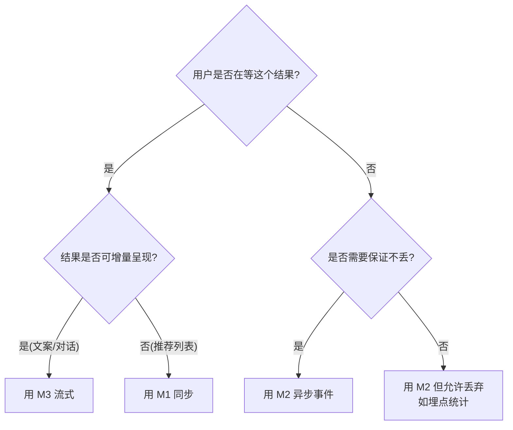
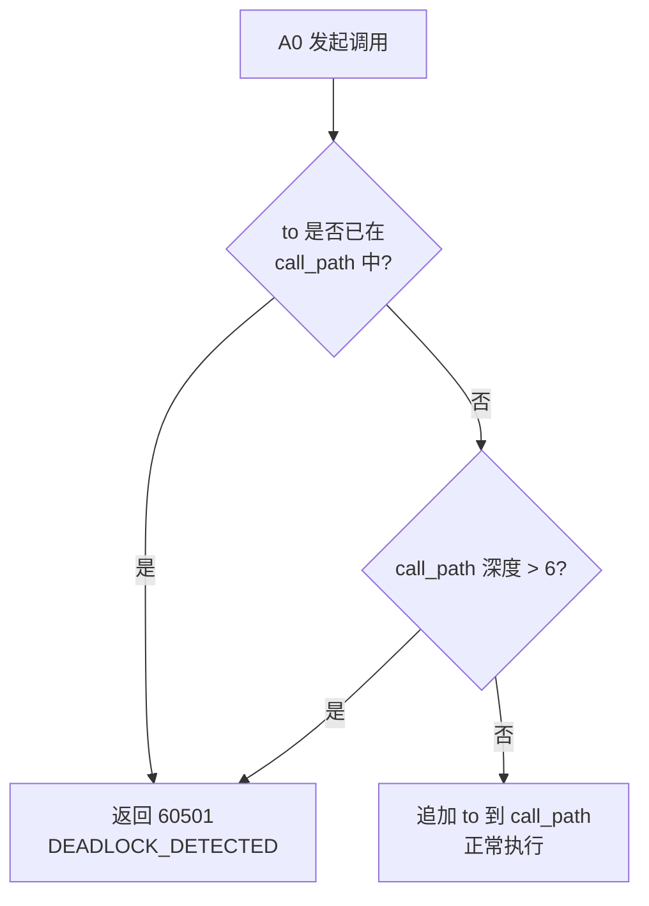
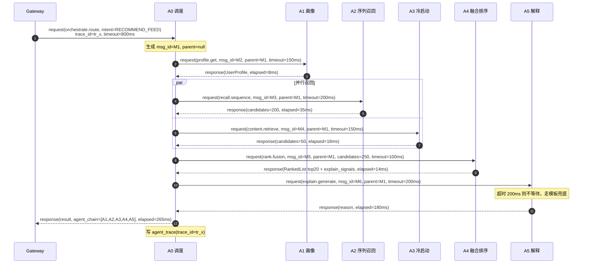
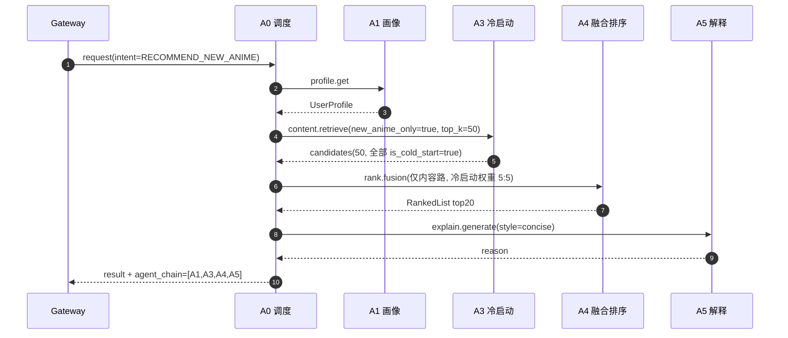
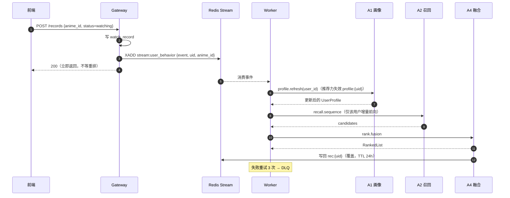
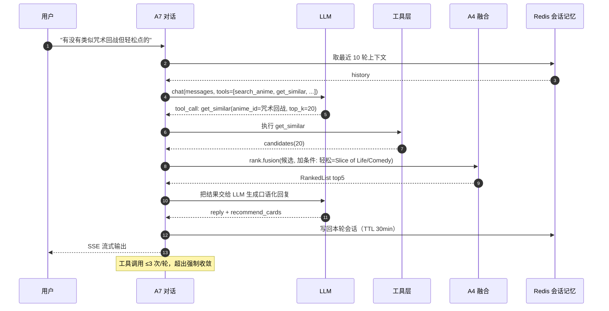
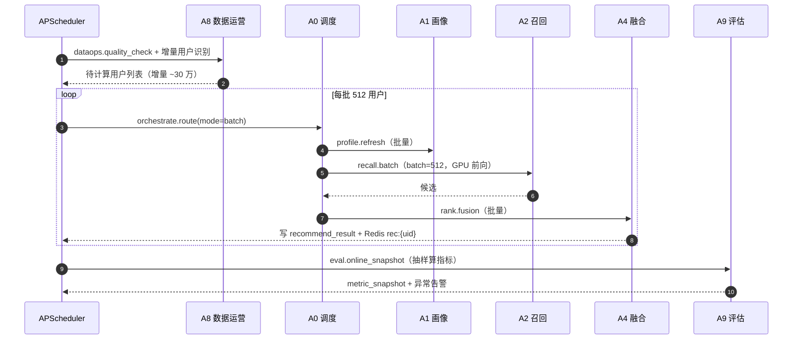

# Agent 交互协议（Agent Interaction Protocol）

> **为什么需要这份文档**：多 Agent 系统崩掉的地方，90% 不是单个 Agent 写错了，而是**交互约定不统一**——有人传 dict 有人传对象、超时没定义、失败了整个链路 500、日志里 trace 对不上。
> 本文定义 Agent 之间「怎么说话」的唯一标准。Agent 职责与能力边界见 [agents.md](agents.md)，提示词与 JSON Schema 见 [agent-prompt-design.md](agent-prompt-design.md)。

---

## 一、设计原则

| 原则 | 说明 |
|---|---|
| **P1 契约先行** | 任何跨 Agent 调用必须先定义 Pydantic 输入/输出模型，禁止传裸 `dict` |
| **P2 单入口** | 所有调用统一走 `BaseAgent.handle(envelope)`，禁止直接调 `agent.invoke()` |
| **P3 全链路可追踪** | `trace_id` 从 Gateway 生成，贯穿所有 Agent，落库 `agent_trace` |
| **P4 失败可降级** | 任何 Agent 失败都必须有明确降级路径，**不允许抛异常穿透到用户** |
| **P5 幂等** | 同一 `msg_id` 重复投递必须只产生一次副作用 |
| **P6 无状态通信** | Agent 之间不共享内存对象，只传序列化 JSON（为将来拆成独立服务留后路）|

---

## 二、三种通信模式

多 Agent 系统最容易混乱的就是"什么场景用什么通信"。本项目**只用三种**，且边界清晰：

| 模式 | 传输方式 | 适用场景 | 延迟 | 失败语义 |
|---|---|---|---|---|
| **M1 同步请求-响应** | 进程内函数调用（生产可切 HTTP/gRPC） | 主链路：A0→A1/A2/A3/A4/A5 | 必须 < 800ms | 调用方负责降级 |
| **M2 异步事件** | Redis Stream（`XADD` / 消费组） | 行为触发增量重排、离线批处理 | 秒级 | 重试 3 次后进死信队列 |
| **M3 流式输出** | SSE（Server-Sent Events） | A5/A7 的 token 级流式返回 | 首 token < 400ms | 断流则前端展示已收到部分 |

### 模式选择决策



### 为什么不同步用 HTTP，异步用 MQ 之外的方案？

- ❌ **不用 Agent 之间自由对话（AutoGen 式）**：流程不可预测、无法保证延迟、答辩讲不清。
- ❌ **不用全异步 MQ**：主链路要求 300ms 内返回，走 MQ 会引入不必要的排队延迟。
- ✅ **同步为主 + 异步补位**：符合推荐系统的真实形态（在线低延迟 + 离线高吞吐）。

---

## 三、消息信封规范（Envelope）

Agent 之间传输的**唯一单位**就是 Envelope。信封负责"路由 + 追踪 + 元信息"，业务数据放在 `payload` 里。

### 3.1 结构定义

```jsonc
{
  "header": {
    "msg_id": "01H8X2K4M9P7Q1R3S5T7V9W2",   // ULID，消息唯一标识（用于幂等）
    "trace_id": "tr_7f3a9c21e0b4",            // 全链路追踪 ID，Gateway 生成
    "parent_msg_id": "01H8X2K4M9P7Q1R3S5T7V9W1", // 上游消息 ID，用于构建调用树（首条为 null）
    "from": "A0",                             // 发送方 Agent ID
    "to": "A2",                               // 接收方 Agent ID
    "type": "request",                        // request | response | event | error
    "action": "recall.sequence",              // 具体动作，命名规范见 3.3
    "priority": "P0",                         // P0 | P1 | P2
    "timestamp": 1757654321123,               // 毫秒时间戳（UTC）
    "timeout_ms": 200,                        // 期望超时，接收方必须遵守
    "retry_count": 0,                         // 已重试次数
    "schema_version": "1.0"                   // 协议版本
  },
  "context": {
    "user_id": 1024,
    "session_id": "sess_9a8b7c",
    "locale": "zh-CN",
    "app_env": "prod"
  },
  "payload": { },                             // 业务数据，由各 Agent 的 schema 定义
  "meta": {
    "degraded": false,                        // 是否为降级结果
    "degraded_reason": null,                  // 降级原因描述
    "cache_hit": false,                       // 是否命中缓存
    "elapsed_ms": 0,                          // 本 Agent 自耗时（response 时回填）
    "tokens_used": 0                          // LLM token 消耗（仅 LLM Agent）
  }
}
```

### 3.2 字段规范明细

| 字段 | 类型 | 必填 | 约束 | 说明 |
|---|---|---|---|---|
| `msg_id` | string | ✅ | ULID 26 位 | 接收方用其做幂等键，TTL 10min |
| `trace_id` | string | ✅ | `tr_` + 12 hex | 全链路唯一，落库与日志必带 |
| `parent_msg_id` | string\|null | ✅ | 首条为 `null` | 用于还原调用树 |
| `from` / `to` | string | ✅ | `A0`–`A9` | 必须是已注册 Agent |
| `type` | enum | ✅ | 见下表 | 决定 `payload` 的解析方式 |
| `action` | string | ✅ | `domain.verb` | 见 3.3 |
| `priority` | enum | ✅ | `P0/P1/P2` | 决定并发队列与是否可丢弃 |
| `timestamp` | int | ✅ | 13 位毫秒 | UTC，禁止本地时间 |
| `timeout_ms` | int | ✅ | 50–30000 | 接收方超时后必须返回 `error` 信封 |
| `retry_count` | int | ✅ | 0–3 | ≥3 视为终态失败 |
| `schema_version` | string | ✅ | 语义化版本 | 不兼容变更时 +1 |

### 3.3 `action` 命名规范

格式：`<域>.<动词>`，全小写，动词用祈使式。

| Agent | 支持的 action |
|---|---|
| A0 | `orchestrate.route`、`orchestrate.aggregate` |
| A1 | `profile.get`、`profile.refresh`、`profile.summarize` |
| A2 | `recall.sequence`、`recall.batch` |
| A3 | `content.retrieve`、`content.match_genre` |
| A4 | `rank.fusion`、`rank.diversify` |
| A5 | `explain.generate`、`explain.stream` |
| A6 | `drift.analyze`、`drift.interpret` |
| A7 | `chat.reply`、`chat.tool_call` |
| A8 | `dataops.sync_new_anime`、`dataops.rebuild_index`、`dataops.quality_check` |
| A9 | `eval.offline_metrics`、`eval.online_snapshot`、`eval.alarm` |

> 新增 action 必须在本文档登记，否则 CI 的 `tests/test_agents/test_action_registry.py` 会失败。

---

## 四、错误码体系

### 4.1 编码规则

```
  A 0 4 0 1
  │ │ └──┬──┘
  │ │    └── 具体错误序号（3 位）
  │ └────── 错误类别（0=通用 1=入参 2=依赖 3=超时 4=降级 5=LLM）
  └──────── 级别：4=客户端可修复  5=服务端错误  6=Agent 链路错误
```

### 4.2 错误码清单

| 错误码 | 名称 | 含义 | 处理策略 | 可重试 |
|---|---|---|---|---|
| `40001` | `INVALID_PARAM` | 入参校验失败 | 返回 400，不重试 | ❌ |
| `40101` | `UNAUTHORIZED` | 未登录 / token 失效 | 返回 401，前端跳登录 | ❌ |
| `40301` | `FORBIDDEN` | 无权限（如访问他人追番） | 返回 403 | ❌ |
| `40401` | `RESOURCE_NOT_FOUND` | 用户/动漫不存在 | 返回 404 | ❌ |
| `40901` | `DUPLICATE_REQUEST` | 幂等冲突（msg_id 重复） | 返回上次结果 | ❌ |
| `42901` | `RATE_LIMITED` | 触发限流 | 返回 429 + `Retry-After` | ✅ 延迟重试 |
| `50001` | `INTERNAL_ERROR` | 未捕获异常 | 返回 500，告警 | ✅ 1 次 |
| `50201` | `MODEL_UNAVAILABLE` | 模型加载失败 / 显存不足 | **降级**到 ItemCF 热门榜 | ✅ |
| `50202` | `DB_UNAVAILABLE` | 数据库连接失败 | 读缓存 / 返回 503 | ✅ |
| `50203` | `CACHE_UNAVAILABLE` | Redis 不可用 | 绕过缓存直算 | ✅ |
| `50204` | `INDEX_MISSING` | FAISS 索引文件缺失 | **降级**到规则打分 | ❌ 需人工 |
| `50301` | `AGENT_TIMEOUT` | Agent 超过 `timeout_ms` | **降级**（见第五节） | ✅ |
| `60301` | `AGENT_CHAIN_BROKEN` | 关键 Agent 链断（P0 全挂） | 返回兜底热门列表 + 告警 | ❌ |
| `60401` | `AGENT_DEGRADED` | 已降级但可用（非错误，仅标记） | `meta.degraded=true`，正常返回 | — |
| `60501` | `DEADLOCK_DETECTED` | Agent 循环调用检测 | 中断链路 + 告警 | ❌ |
| `60502` | `TOOL_CALL_LIMIT` | 工具调用超上限（A7 > 3 次） | 强制收敛输出 | ❌ |
| `60503` | `CONTEXT_OVERFLOW` | 会话上下文超长 | 截断历史后重试 | ✅ |
| `60601` | `LLM_TIMEOUT` | LLM 响应超时 | **降级**到模板文案 | ✅ 1 次 |
| `60602` | `LLM_RATE_LIMITED` | LLM QPS 超限 | 换备用 Key / 降级 | ✅ |
| `60603` | `LLM_INVALID_JSON` | LLM 输出不符合 JSON Schema | 重试 1 次 → 降级 | ✅ 1 次 |
| `60604` | `LLM_HALLUCINATION` | 输出含输入外事实（校验拦截） | 丢弃重生成 → 降级 | ✅ 1 次 |

### 4.3 错误信封示例

```jsonc
{
  "header": {
    "msg_id": "01H8X2K4M9P7Q1R3S5T7V9W3",
    "trace_id": "tr_7f3a9c21e0b4",
    "parent_msg_id": "01H8X2K4M9P7Q1R3S5T7V9W1",
    "from": "A2",
    "to": "A0",
    "type": "error",
    "action": "recall.sequence",
    "priority": "P0",
    "timestamp": 1757654321355,
    "timeout_ms": 200,
    "retry_count": 1,
    "schema_version": "1.0"
  },
  "context": { "user_id": 1024, "session_id": null, "locale": "zh-CN", "app_env": "prod" },
  "payload": {
    "error_code": 50201,
    "error_name": "MODEL_UNAVAILABLE",
    "message": "CUDA out of memory when encoding user 1024",
    "retryable": true,
    "detail": { "agent": "A2", "stage": "model_forward" }
  },
  "meta": { "degraded": true, "degraded_reason": "fallback_to_itemcf_hot", "elapsed_ms": 42 }
}
```

---

## 五、异常处理与降级机制

### 5.1 四级降级策略

| 级别 | 触发条件 | 降级动作 | 用户感知 |
|---|---|---|---|
| **L1 重试** | 瞬时错误（超时、网络抖动、LLM 限流） | 同 Agent 重试 1 次，退避 50ms | 无感（延迟略增） |
| **L2 同级替换** | 重试后仍失败 | 换等价实现：A2 换 ItemCF、A3 换规则打分、A5 换模板 | 结果质量略降，无感 |
| **L3 跳过** | 非必要 Agent 失败（A5/A3/A6） | 跳过该步骤，链路继续 | 功能局部缺失（无解释） |
| **L4 全局兜底** | P0 Agent 全挂（A2+A4 都失败） | 返回全站热门 Top20 + 标注"热门推荐" | 功能降级但可用 |

### 5.2 各 Agent 降级矩阵

| Agent | 优先级 | 超时 | 失败后 | 降级产物 | 是否重试 |
|---|---|---|---|---|---|
| A0 | P0 | 800ms | 直接 L4 兜底 | 热门列表 | ❌ |
| A1 | P0 | 150ms | 用 1h 前的缓存画像；无缓存则空画像 | 空 `UserProfile` | ✅ 1 |
| A2 | P0 | 200ms | L2 换 ItemCF 热门榜 | `fallback_hot` 候选 | ✅ 1 |
| A3 | P1 | 150ms | L3 跳过内容召回 | 空候选集 | ❌ |
| A4 | P0 | 100ms | L2 简化为纯行为分排序 | 未融合排序 | ❌ |
| A5 | P1 | 200ms | L2 模板文案 | 模板理由 | ✅ 1 |
| A6 | P2 | 2000ms | 只返回数值，不返回解读 | 数值型看板 | ❌ |
| A7 | P1 | 5000ms | 退化为引导话术 | 引导文案 | ✅ 1 |
| A8 | P2 | 无 | 记录失败项，下次重跑 | 部分成功报告 | ✅ 3 |
| A9 | P2 | 无 | 跳过本次快照 | 无 | ✅ 1 |

### 5.3 熔断与半开

对**外部依赖**（LLM API、模型推理、DB）实现熔断器，参数如下：

| 参数 | 值 | 说明 |
|---|---|---|
| `failure_threshold` | 5 | 连续 5 次失败打开熔断 |
| `open_duration` | 30s | 熔断持续 30s |
| `half_open_probes` | 3 | 半开状态放 3 个探测请求 |
| `success_threshold` | 2 | 2 次成功则闭合 |

熔断状态存 Redis（key: `circuit:{dependency}`），多 worker 共享。熔断打开期间，**直接走 L2 降级**，不发起真实调用——这是防止 LLM 慢拖垮整个系统的关键防线。

### 5.4 循环调用检测

- 每个 Envelope 的 `header` 携带隐式调用路径：`meta.call_path = ["A0","A2"]`（由 `tracing.py` 自动追加）。
- 若 `to` 已存在于 `call_path` 中 → 判定循环，返回 `60501`。
- 全局链路深度上限 **6 层**，超出直接返回 `60501`。



### 5.5 幂等与重试

| 项 | 约定 |
|---|---|
| 幂等键 | `header.msg_id`，写入 Redis `idem:{msg_id}` TTL 10min |
| 重复投递 | 若键存在，直接返回上次缓存的结果（不重复执行副作用） |
| 重试退避 | 指数退避：`50ms → 100ms → 200ms`，最多 3 次 |
| 不可重试错误 | `40001` / `40101` / `40301` / `40401` / `60204` / `60301` |
| 死信队列 | M2 事件重试 3 次后进 `stream:user_behavior:dlq`，A9 每日巡检 |

---

## 六、核心业务流程时序图

### 6.1 生成综合推荐（主链路）



**关键点**：A2 与 A3 用 `asyncio.gather` 并行 → 串行 253ms 降到 265ms→ 实际约 **265ms**（示意图，含并行节省）。A5 超时不阻塞结果。

### 6.2 新番专区推荐（跳过 A2）



### 6.3 用户行为触发的增量重排（异步）



### 6.4 对话推荐（多轮 + 工具调用）



### 6.5 每日离线全量推荐



---

## 七、消息序列化与传输

| 模式 | 编码 | 说明 |
|---|---|---|
| 进程内（开发/单机） | Python 对象直接传递（`asyncio`） | `agent_client.py` 提供 `LocalTransport` |
| 跨进程（生产） | JSON（UTF-8） | `agent_client.py` 提供 `HttpTransport`，与 Local 同接口 |
| 异步事件 | Redis Stream 字段扁平化 | `payload` 序列化为单字段 JSON 字符串 |
| 流式 | SSE `data: {json}\n\n` | 每帧一个 Envelope 片段，`type=chunk` |

> **切换传输只需改一个配置**（`AGENT_TRANSPORT=local|http`），业务代码零改动。这是 M1 模式"无状态通信"带来的收益。

### 大对象传递约定

候选集可能很大（250 条 × 多条字段）。为避免 Envelope 膨胀：

| 情况 | 方案 |
|---|---|
| payload < 64KB | 直接内联在 `payload` |
| payload ≥ 64KB | 写入 Redis `tmp:{msg_id}`，`payload` 里放 `{ "ref": "tmp:{msg_id}" }`，接收方按 ref 取 |
| 向量/张量 | **禁止进 Envelope**。走文件/特征库引用（`item_emb_ref`），只传 ID 与索引 |

---

## 八、可观测性

### 8.1 调用链记录（`agent_trace` 表）

每次 `handle()` 结束都落一行：

| 字段 | 内容 |
|---|---|
| `trace_id` | 全链路 ID |
| `msg_id` / `parent_msg_id` | 调用树 |
| `from_agent` / `to_agent` | 调用双方 |
| `action` | 动作 |
| `status` | `success` / `degraded` / `error` / `timeout` |
| `elapsed_ms` | 耗时 |
| `error_code` | 错误码 |
| `tokens_used` | LLM 消耗 |
| `created_at` | 时间 |

### 8.2 关键监控指标

| 指标 | 目标 | 告警阈值 |
|---|---|---|
| 主链路 P95 延迟 | < 300ms | > 500ms |
| 各 Agent 错误率 | < 0.5% | > 2% |
| 降级率 | < 3% | > 10% |
| LLM 超时率 | < 5% | > 15% |
| 幂等冲突率 | 接近 0 | > 1% |
| 循环检测触发 | 0 | > 0（立即告警）|

### 8.3 日志规范

```
[tr_7f3a9c21e0b4][A2][recall.sequence][P0] start user_id=1024 seq_len=50
[tr_7f3a9c21e0b4][A2][recall.sequence][P0] done candidates=200 elapsed=35ms degraded=false
```

格式：`[trace_id][agent][action][priority] message key=value …`，由 `core/logging.py` 自动注入前缀。

---

## 九、协议版本演进

| 版本 | 变更 | 兼容性 |
|---|---|---|
| 1.0 | 初版：Envelope + 4 位错误码 + 三种通信模式 | — |
| *后续* | `payload` 加字段 → 小版本；字段语义变更/删除 → 大版本 | 大版本需双写过渡期 |

**兼容规则**：
- 新增可选字段：接收方必须容忍未知字段（Pydantic `model_config = ConfigDict(extra="ignore")`）。
- 删除/重命名字段：必须先双写一个版本周期，再删除。

---

## 十、相关文档

- Agent 职责与边界 → [agents.md](agents.md)
- 提示词与 JSON Schema → [agent-prompt-design.md](agent-prompt-design.md)
- 记忆读写 → [agent-memory-design.md](agent-memory-design.md)
- 表结构 → [database-design.md](database-design.md)
