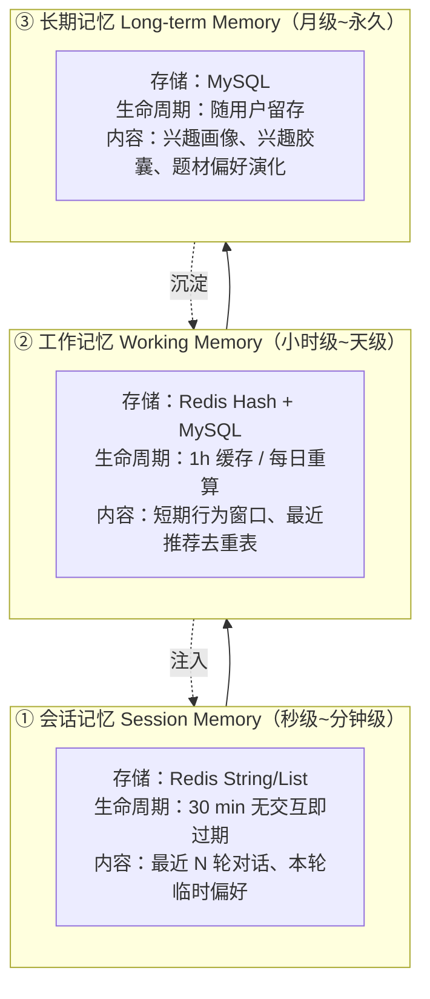
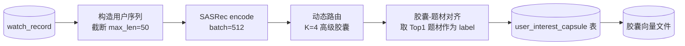

# Agent 记忆机制设计

> **为什么需要记忆**：推荐系统的"智能"很大一部分来自**记得住**——记得用户长期口味（喜欢悬疑）、记得这次会话刚说了什么（刚说想要轻松的）、记得上次推荐过什么（别重复推）。
> 本文定义记忆的**分层、存储、更新、检索、过期**五件事。提示词见 [agent-prompt-design.md](agent-prompt-design.md)，表结构见 [database-design.md](database-design.md)。

---

## 一、记忆分层总览

模仿认知科学的三层结构，映射到工程实现：



| 层 | 对应 Agent | 回答的问题 | 存储 | TTL |
|---|---|---|---|---|
| **① 会话记忆** | A7 对话、A1 | "他刚才说了什么？" | Redis | 30 min |
| **② 工作记忆** | A1、A4 | "他最近在看什么？推过什么？" | Redis + MySQL | 1 h / 每日 |
| **③ 长期记忆** | A1、A2、A6 | "他是谁？口味什么样？" | MySQL | 永久（按需衰减）|

### 与推荐模型的分工

| 记忆层 | 是否进入模型 | 说明 |
|---|---|---|
| ③ 长期记忆 | ✅ 间接进入 | 兴趣画像决定召回时的兴趣胶囊权重与内容向量加权 |
| ② 工作记忆 | ✅ 直接进入 | 短期行为窗口参与序列构造（序列本身即工作记忆的一种） |
| ① 会话记忆 | ❌ 不进入 | 只用于 A7 对话上下文与 A5 风格选择 |

> **重要设计**：序列推荐模型（SASRec）的输入序列 `[v₁…vₙ]` **本身就是最强的记忆载体**。我们不额外维护"用户看过什么"的冗余记忆——直接查 `watch_record`。记忆模块只负责**模型不擅长的那部分**：语义画像、会话上下文、去重与漂移。

---

## 二、① 会话记忆（Session Memory）

### 2.1 存储结构

Redis，每个会话一个 Key：

```
Key:   mem:short:{user_id}:{session_id}
Type:  List（右进左出，天然时间序）
TTL:   1800 秒（每次读写续期）
Size:  最多保留最近 10 轮（20 条消息）
```

单条消息结构：

```json
{
  "role": "user",
  "content": "有没有类似咒术回战但是更轻松点的",
  "msg_id": "01H8X2K4M9P7Q1R3S5T7V9W2",
  "ts": 1757654321123,
  "extracted": {
    "anime_title": "咒术回战",
    "genres": ["热血战斗"],
    "keywords": ["轻松"]
  },
  "referenced_anime_ids": [40748],
  "shown_anime_ids": [50265, 51009]
}
```

> 注意 `shown_anime_ids`：记录**本轮已推给用户的动漫**，用于避免多轮对话里重复推荐同一部（"怎么又是间谍过家家"）。

### 2.2 写入时机

| 时机 | 写入内容 | 执行者 |
|---|---|---|
| 用户发送消息 | `role=user` 记录 | A7 |
| A7 返回回复 | `role=assistant` 记录 + `shown_anime_ids` | A7 |
| A0 识别到会话型意图 | 更新 `extracted` | A0 |
| 会话结束（前端关闭/超时） | 不特殊处理，靠 TTL 自然过期 | — |

### 2.3 过期策略

| 策略 | 说明 |
|---|---|
| **滑动过期** | 每次读写都把 TTL 重置为 1800s，活跃会话不过期 |
| **硬上限** | `LTRIM 0 19`，永远只留最近 10 轮，防止 prompt 无限膨胀 |
| **显式清空** | 用户点"开始新对话" → `DEL`，且 `session_id` 重新生成 |
| **上下文溢出兜底** | 单条消息超 1000 token 时截断，并在该条打 `truncated=true` |

### 2.4 与 LLM 的交互

```python
# agents/chat/agent.py（伪代码）
history = memory.get_short(user_id, session_id, limit=10)     # 取最近 10 轮
messages = [{"role": "system", "content": CHAT_SYSTEM_PROMPT}]
messages += [{"role": h.role, "content": h.content} for h in history]
messages.append({"role": "user", "content": current_message})
# → 调用 LLM，随后把本轮两条消息写回
```

> 只传 `role` + `content` 给 LLM，**不传** `msg_id` / `ts` / `extracted` —— 减少 token 且避免 LLM 被元信息干扰。`extracted` 只在服务端用于生成 `user_profile` 增量，不进 prompt。

### 2.5 降级

| 情况 | 行为 |
|---|---|
| Redis 不可用 | 会话降级为**无记忆单轮模式**，A7 仍可回答，只是记不住上一轮 |
| 会话不存在 | 视为新会话，`session_id` 由前端生成 UUID 传入 |

---

## 三、② 工作记忆（Working Memory）

工作记忆是"最近发生的事"，直接服务于推荐新鲜度与去重。

### 3.1 三个组成部分

| 组成 | 存储 | 内容 | 更新触发 |
|---|---|---|---|
| **短期行为窗口** | 从 `watch_record` 实时查 | 最近 30 天新增追番/评分 | 每次推荐时查询 |
| **已推荐去重表** | Redis Set | 最近 7 天推给该用户的 anime_id | A4 每次输出后写入 |
| **会话级兴趣偏置** | Redis Hash | 从会话记忆抽出的临时偏好（"要轻松的"） | A7 每轮解析 |

> **短期行为窗口为什么不额外存一份？** 因为 `watch_record` 表已经是权威事实源，且已按 `(user_id, updated_at)` 建索引，查最近 30 天成本极低（< 3ms）。**冗余存储只会带来一致性风险**。

### 3.2 Redis 结构定义

```bash
# 已推荐去重表（7 天窗口）
Key:    mem:dedup:{user_id}
Type:   Sorted Set（score = 推荐时间戳）
写:     ZADD mem:dedup:1024 1757654321 40748
查询:   ZRANGEBYSCORE mem:dedup:1024 1757567921 +inf   # 最近 7 天
清理:   ZREMRANGEBYSCORE mem:dedup:1024 -inf 1757567921
TTL:    7 天

# 会话级兴趣偏置（临时偏好，不落库）
Key:    mem:bias:{user_id}:{session_id}
Type:   Hash
字段:   genres / keywords / exclude_genres / exclude_anime
TTL:    1800 秒（与会话同生命周期）
```

### 3.3 去重规则（A4 融合排序中执行）

| 规则 | 处理 |
|---|---|
| 已在 `watch_record` 中（看过） | 直接排除 |
| 用户标记为「弃番」的作品及其同系列 | 排除 |
| 最近 7 天已推荐过 | 降权 ×0.5（不硬排除，避免内容枯竭） |
| 最近 3 天已推荐过 | 硬排除 |
| 会话内已展示过 | 硬排除（来自 `shown_anime_ids`） |

```python
def apply_dedup(candidates, user_id, session_id):
    seen_soft = redis.zrangebyscore(f"mem:dedup:{user_id}", now - 7d, "+inf")
    seen_hard = redis.zrangebyscore(f"mem:dedup:{user_id}", now - 3d, "+inf")
    shown = memory.get_shown(session_id)
    for c in candidates:
        if c.anime_id in seen_hard or c.anime_id in shown:
            c.drop()
        elif c.anime_id in seen_soft:
            c.score *= 0.5
    return candidates
```

### 3.4 写入时机

```
A4 输出 TopN 后：
  ZADD mem:dedup:{user_id} <now> <anime_id>   # 对每条 N 都写
  EXPIRE mem:dedup:{user_id} 604800
```

> 只记 Top20，不记全部 250 候选——只有"用户看见的"才算推荐过。

---

## 四、③ 长期记忆（Long-term Memory）

长期记忆就是**用户兴趣画像**，是 A1 画像 Agent 的核心产出，也是推荐质量的地基。

### 4.1 逻辑结构

```jsonc
{
  "user_id": 1024,

  // ① 12 维题材兴趣分布（核心）
  "top_genres": [
    { "genre": "热血战斗", "strength": 0.82, "count": 46, "avg_rating": 8.7, "trend": "rising" },
    { "genre": "悬疑推理", "strength": 0.61, "count": 23, "avg_rating": 8.9, "trend": "rising" },
    { "genre": "日常治愈", "strength": 0.23, "count": 11, "avg_rating": 7.2, "trend": "falling" }
    // … 共 12 项，未涉及的题材 strength = 0
  ],

  // ② 行为统计特征
  "activity_level": "high",          // low | medium | high
  "watch_intensity": 0.78,           // 单位时间追番速度
  "avg_rating_tendency": 8.1,        // 打分倾向（严格型/宽容型）
  "dropped_rate": 0.12,              // 弃番率
  "preferred_types": ["TV", "MOVIE"],// 偏好载体类型
  "preferred_era": [2015, 2024],     // 偏好年代区间
  "total_records": 168,

  // ③ 语义摘要（LLM 生成，仅用于展示）
  "summary_text": "这是一位偏好热血战斗与悬疑推理的高活跃度追番用户。",
  "user_tag": "热血悬疑高活跃",

  // ④ 兴趣胶囊（由 A2 离线写入，一份 4 个向量）
  "interest_capsules": [
    { "capsule_id": 0, "label": "热血战斗", "vector_ref": "cap:1024:0", "strength": 0.44 },
    { "capsule_id": 1, "label": "悬疑推理", "vector_ref": "cap:1024:1", "strength": 0.28 },
    { "capsule_id": 2, "label": "科幻机战", "vector_ref": "cap:1024:2", "strength": 0.19 },
    { "capsule_id": 3, "label": "日常治愈", "vector_ref": "cap:1024:3", "strength": 0.09 }
  ],

  "updated_at": "2026-09-12T13:40:00+08:00",
  "version": 37
}
```

> `vector_ref` 指向向量存储位置（文件/特征库），**向量不进 Redis/JSON**，避免膨胀。

### 4.2 兴趣强度计算（确定性算法，非 LLM）

```python
def compute_genre_strength(records: list[Record], now: datetime) -> dict[str, float]:
    """计算 12 类题材兴趣强度，输出归一化到 [0,1]"""
    raw = defaultdict(float)
    for r in records:
        # 1) 时间衰减：半衰期 180 天
        age_days = (now - r.updated_at).days
        decay = 0.5 ** (age_days / 180)

        # 2) 行为权重：状态 + 评分
        w_status = {"watching": 1.0, "watched": 0.8, "want": 0.6, "dropped": -0.5}[r.status]
        w_rating = (r.rating / 10) if r.rating else 0.5

        # 3) 该动漫的题材按占比分摊（多题材不重复计满）
        for g in r.anime.genres_12cls:
            raw[g] += decay * w_status * w_rating / len(r.anime.genres_12cls)

    # 4) 归一化：min-max 到 [0,1]
    if not raw:
        return {g: 0.0 for g in GENRES_12}
    mx = max(raw.values()) or 1.0
    return {g: round(max(raw.get(g, 0.0), 0.0) / mx, 4) for g in GENRES_12}
```

**为什么不用 LLM 算？** 因为要做到：① 结果可复现（同一份数据必须得到同一个强度）② 可解释（每个数字能追溯到具体动漫）③ 快（1.3M 用户批量计算不能走 LLM）。**LLM 只把结果翻译成 `summary_text`。**

### 4.3 兴趣胶囊的生成与更新

胶囊由 **A2 离线批量**产出，不是每用户实时算：



**胶囊标签怎么来的？** 每个胶囊向量与 12 类题材的**题材中心向量**做余弦相似度，取最高的那个作为 `label`。这样"胶囊 0 = 热血战斗"不是拍脑袋，而是算出来的。

```python
def label_capsules(capsules: Tensor, genre_centers: Tensor) -> list[str]:
    sims = F.cosine_similarity(capsules.unsqueeze(1), genre_centers.unsqueeze(0), dim=-1)
    return [GENRES_12[i] for i in sims.argmax(dim=-1).tolist()]
```

### 4.4 更新机制

| 触发方式 | 时机 | 范围 | 执行者 |
|---|---|---|---|
| **实时增量** | 用户新增/修改追番记录 | 单用户 | A1（异步 Worker） |
| **每日全量** | 每日 03:00 | 活跃用户（30 天内有行为） | A1 批量 |
| **每日增量** | 每日 03:30 | 其余全量用户，分片轮转（7 天一轮） | A1 批量 |
| **冷启动** | 用户注册后首次行为 | 单用户 | A1 |

> **为什么要分片轮转**：1.3M 用户全量重算画像成本高。非活跃用户的画像变化极小，7 天一轮足够。活跃用户每天更新。

### 4.5 记忆衰减与遗忘

长期记忆不能只增不减，否则用户三年前的口味会永久污染推荐。

| 机制 | 规则 |
|---|---|
| **时间衰减** | 半衰期 180 天（见 4.2 的 `decay`）|
| **强度地板** | `strength < 0.05` 的题材归零，不参与内容召回 |
| **负向记忆** | 弃番（`dropped`）计负权重，可主动压制题材 |
| **硬性遗忘** | 超过 3 年且 `status=dropped` 的记录不参与画像计算 |
| **胶囊轮换** | 连续 2 次全量更新中 `strength < 0.05` 的胶囊被丢弃并重新路由填充 |

```python
# 胶囊轮换伪代码
def rotate_capsules(capsules, strengths, min_strength=0.05):
    keep = [c for c, s in zip(capsules, strengths) if s >= min_strength]
    if len(keep) < K:
        # 用次级兴趣重新填充不足的胶囊位
        keep += repick_from_residual(K - len(keep))
    return keep
```

---

## 五、记忆检索机制

### 5.1 检索触发条件

| Agent | 检索哪层记忆 | 触发条件 | 检索量 |
|---|---|---|---|
| A0 | 会话记忆 | 意图为 `CHAT_RECOMMEND` | 最近 10 轮 |
| A1 | 长期 + 工作 | 每次被调用 | 全量画像 + 30 天行为 |
| A2 | 长期（胶囊） | 每次召回 | 4 个胶囊向量 |
| A3 | 长期（题材分布） | 每次内容召回 | 12 维分布 |
| A4 | 工作（去重表） | 每次排序 | 最近 7 天推荐记录 |
| A5 | 长期 + 会话 | 每次解释 | 画像摘要 + 会话风格偏好 |
| A6 | 长期 | 用户查看看板 | 全部历史（按季度聚合）|
| A7 | 会话 + 长期 | 每轮对话 | 10 轮 + 画像摘要 |

### 5.2 检索优先级与预算

主链路上记忆检索必须**极其便宜**（总预算 < 20ms）：

| 检索项 | 来源 | 耗时预算 | 降级 |
|---|---|---|---|
| 画像快照 | Redis `profile:{uid}` | < 2ms | 未命中查 MySQL（< 10ms）→ 再未命中算空画像 |
| 兴趣胶囊 | 本地向量文件 + LRU 缓存 | < 3ms | 退化为单兴趣（不拆分） |
| 去重表 | Redis ZSET | < 2ms | Redis 挂了则不去重（接受重复） |
| 会话记忆 | Redis List | < 2ms | 挂则退化为单轮 |

> **分层缓存顺序**：Redis 热点 → MySQL 冷数据 → 空值兜底。**任何一层挂掉都不能阻塞主链路**。

### 5.3 "相似度算法"说明

记忆检索**不用向量相似度**（因为检索键都是精确 ID，不是语义查询）。真正用到相似度的是两处：

| 场景 | 算法 | 说明 |
|---|---|---|
| 内容召回（A3） | 余弦相似度（FAISS 内积索引） | 用户内容向量 vs 番剧内容向量，512 维 |
| 兴趣胶囊打标 | 余弦相似度 | 胶囊向量 vs 12 类题材中心向量 |
| 漂移检测（A6） | Jensen-Shannon 散度 | 相邻时间窗口的题材分布差异，取值 [0,1] |
| 对话内意图收敛 | 无（LLM 直接理解） | 不额外做语义检索 |

**JS 散度计算（A6 漂移点判定，确定性）**：

```python
def js_divergence(p: np.ndarray, q: np.ndarray) -> float:
    """两个题材分布（12维，和为1）的 JS 散度，范围 [0,1]"""
    p = p / (p.sum() or 1); q = q / (q.sum() or 1)
    m = 0.5 * (p + q)
    def kl(a, b):
        mask = a > 0
        return float(np.sum(a[mask] * np.log2(a[mask] / np.maximum(b[mask], 1e-12))))
    return 0.5 * kl(p, m) + 0.5 * kl(q, m)

# drift_threshold 默认 0.35：超过即判定为兴趣漂移点
```

---

## 六、存储与同步

### 6.1 存储介质对照

| 记忆层 | Redis | MySQL | 向量文件 |
|---|---|---|---|
| ① 会话记忆 | ✅ 唯一存储 | ❌ | ❌ |
| ② 工作记忆 | ✅ 去重表、偏置 | ✅ 行为事实源 | ❌ |
| ③ 长期记忆 | ✅ 画像快照（缓存） | ✅ 权威存储 | ✅ 胶囊向量 |

### 6.2 一致性策略

| 数据 | 一致性要求 | 策略 |
|---|---|---|
| 画像快照 | 最终一致（允许 1h 偏差） | Cache-Aside：写 MySQL 成功后 DEL Redis |
| 已推荐去重表 | 弱一致 | Redis 单点，无副本，丢了接受重复推荐 |
| 兴趣胶囊 | 最终一致（每日更新） | 离线批量覆盖写，版本号递增 |
| 会话记忆 | 强一致（单会话内） | 单 Key 操作天然原子 |

```python
# 画像更新的一致性写法（agents/profile/agent.py）
def update_profile(user_id, new_profile):
    db.upsert_user_profile(new_profile)         # 1) 先写权威存储
    redis.setex(f"profile:{user_id}", 3600, serialize(new_profile))  # 2) 再更新缓存
    redis.delete(f"rec:{user_id}")              # 3) 画像变了，推荐结果失效
```

> ⚠️ 第 3 步**必须做**。画像更新而推荐结果不失效，会出现"口味变了但推荐没变"的诡异现象。

### 6.3 记忆版本管理

`user_profile.version` 每次更新 +1。Agent 在 Envelope 的 `meta` 中带上读取到的 version：

```json
{ "meta": { "profile_version": 37 } }
```

若 A4 写缓存时发现 `profile_version` 已被更新（Redis 中版本更高），则**放弃这次写入**，避免旧画像产出的推荐覆盖新画像的结果（典型的并发竞态）。

---

## 七、隐私与安全

| 项 | 措施 |
|---|---|
| 敏感字段不进 prompt | `llm.py` 内置 PII 过滤器，拦截手机号、邮箱、身份证 |
| 会话记忆隔离 | Key 含 `user_id` + `session_id`，接口层强制校验归属 |
| 记忆导出 | 用户可在"个人设置"中导出/清空自己的画像（`DELETE /api/v1/users/me/memory`） |
| 记忆加密 | 长期记忆中不存原始文本，只存统计量与向量引用 |
| 日志脱敏 | `agent_trace` 只记 ID 与耗时，不记 payload 明细 |

---

## 八、与三期迭代的关系

| 阶段 | 记忆能力 |
|---|---|
| 阶段 2（算法） | 只有③长期记忆的题材分布 + 胶囊（离线批量） |
| 阶段 3（系统） | 加入②工作记忆去重表；①会话记忆暂不实现 |
| 阶段 4+（增强） | 完整三层记忆 + A6 漂移检测 + A7 多轮对话 |

> **不要一开始就上完整三层记忆**。先让模型跑通，再补记忆——记忆是锦上添花，不是地基。

---

## 九、相关文档

- 表结构（记忆表） → [database-design.md](database-design.md) 第 5 节
- 提示词与上下文构造 → [agent-prompt-design.md](agent-prompt-design.md)
- 消息与降级 → [agent-interaction-protocol.md](agent-interaction-protocol.md)
- 数据流 → [architecture.md](architecture.md) 第 4 节
