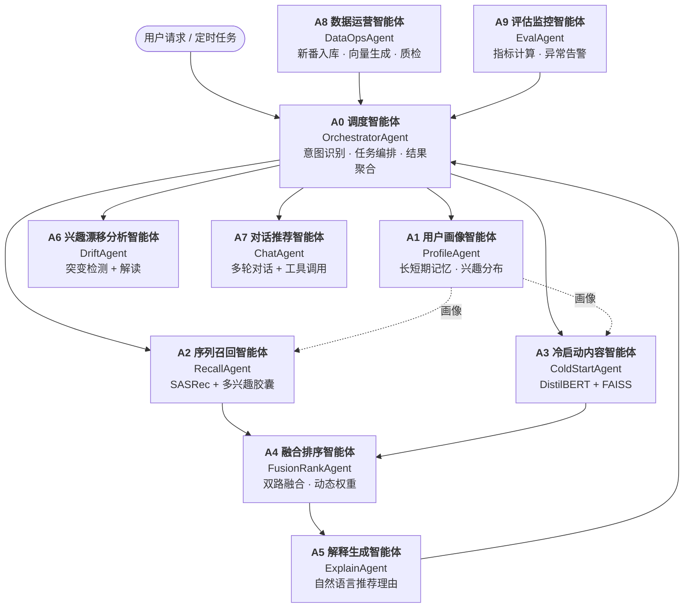
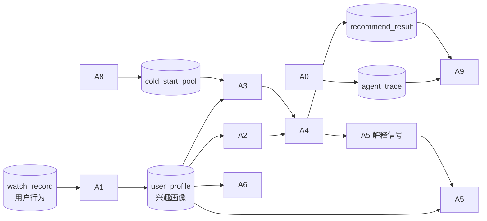

# 智能体总览（Agents Overview）

> 本文是 Agent 层的「花名册」：**有哪 10 个 Agent、各自干什么、输入输出是什么、边界在哪、谁跟谁协作**。
> 通信细节见 [agent-interaction-protocol.md](agent-interaction-protocol.md)，提示词见 [agent-prompt-design.md](agent-prompt-design.md)。

---

## 一、Agent 全景图

### 分层视图

| 层 | Agent | 一句话定位 |
|---|---|---|
| **调度层** | A0 调度 | 系统的"总机"，负责听懂需求并派人干活 |
| **感知层** | A1 画像、A6 漂移 | 理解"用户是谁、口味怎么变" |
| **执行层** | A2 召回、A3 冷启动、A4 融合排序 | 真正产出候选与排序的"工人" |
| **表达层** | A5 解释、A7 对话 | 把机器结果翻译成人话 |
| **运营层** | A8 数据运营、A9 评估监控 | 保障数据新鲜度与系统健康 |

---

## 二、Agent 详细档案

### A0 · 调度智能体（OrchestratorAgent）

| 项 | 内容 |
|---|---|
| **Agent ID** | `A0` |
| **角色定位** | 系统入口与大脑。解析用户意图，拆解任务，编排下游 Agent，聚合结果，处理失败降级 |
| **实现方式** | LLM 意图分类 + LangGraph 状态图路由 |
| **核心职责** | ① 意图识别（8 类意图）② 任务规划 ③ 并行调度 ④ 超时与重试控制 ⑤ 结果聚合与排序归一化 ⑥ 写入 agent_trace |
| **输入** | `OrchestratorInput`：`trace_id`、`user_id`、`raw_query`（可选）、`intent_hint`（可选）、`params`、`context`（会话历史） |
| **输出** | `OrchestratorOutput`：`intent`、`confidence`、`result`（业务载荷）、`agent_chain[]`（调用链）、`degraded[]`（降级记录）、`elapsed_ms` |
| **支持的意图** | `RECOMMEND_FEED` / `RECOMMEND_BY_GENRE` / `RECOMMEND_NEW_ANIME` / `EXPLAIN_RECOMMEND` / `CHAT_RECOMMEND` / `ANALYZE_INTEREST` / `SEARCH_ANIME` / `SYSTEM_QUERY` |
| **能力边界** | ❌ 不做任何向量计算 ❌ 不直接查业务表 ❌ 不生成推荐理由文案 ❌ 不修改用户数据 |
| **上游** | FastAPI Gateway、APScheduler |
| **下游** | A1、A2、A3、A6、A7（按意图分支） |
| **超时/降级** | 自身 800ms 上限；下游全部失败时返回 `RECOMMEND_FEED` 的热门兜底列表 |
| **优先级** | P0（主链路必经，不可缺席） |

---

### A1 · 用户画像智能体（ProfileAgent）

| 项 | 内容 |
|---|---|
| **Agent ID** | `A1` |
| **角色定位** | 维护"用户是谁"的唯一事实来源：长期兴趣画像 + 短期会话偏好 |
| **实现方式** | 规则统计为主（题材分布、活跃度、追番强度）+ LLM 生成画像摘要文案 |
| **核心职责** | ① 从 `watch_record` 聚合题材兴趣分布 ② 计算追番强度、活跃度、弃番率 ③ 维护短期记忆（最近 N 次交互，Redis）④ 生成画像摘要（LLM，如"偏好热血战斗与悬疑推理的中度追番用户"）⑤ 更新 `user_profile` 表 |
| **输入** | `ProfileInput`：`user_id`、`scope`（`long` / `short` / `both`）、`force_refresh`（bool） |
| **输出** | `UserProfile`：`top_genres[12]`（12 类题材兴趣强度 0-1）、`activity_level`、`watch_intensity`、`avg_rating_tendency`、`preferred_types[]`（TV/MOVIE/OVA）、`summary_text`、`recent_items[10]`、`updated_at` |
| **能力边界** | ❌ 不产生候选推荐 ❌ 不做排序 ❌ 不访问模型权重 |
| **上游** | A0、行为事件 Worker |
| **下游** | 被 A2 / A3 / A4 / A5 / A7 读取 |
| **缓存策略** | Redis `profile:{uid}` TTL 1h；行为事件触发主动失效 |
| **优先级** | P0（画像缺失时 A2 退回"仅序列"模式） |

---

### A2 · 序列召回智能体（RecallAgent）

| 项 | 内容 |
|---|---|
| **Agent ID** | `A2` |
| **角色定位** | 主召回源。用 SASRec + 多兴趣胶囊网络从全库 15,687 部动漫中筛出候选 |
| **实现方式** | **纯模型驱动**（无 LLM）。Agent 外壳负责取数、组装、策略、去重 |
| **核心职责** | ① 取用户追番序列并截断至 `max_len=50` ② 调 SASRec 得隐状态 ③ 过多兴趣胶囊网络得 K=4 兴趣向量 ④ 每胶囊独立 TopK 召回 ⑤ 合并去重、过滤已看、按兴趣维度打标 ⑥ 输出候选 + 每个候选的「命中兴趣」标签 |
| **输入** | `RecallInput`：`user_id`、`user_seq[]`、`profile`、`interests`（K，默认 4）、`top_k_per_interest`（默认 50）、`exclude_items[]` |
| **输出** | `RecallOutput`：`candidates[]`，每项含 `anime_id`、`score`、`interest_id`（0-3）、`source="sequence"` |
| **能力边界** | ❌ 不做最终排序 ❌ 不调 LLM ❌ 不写数据库（只读）|
| **上游** | A0 |
| **下游** | A4 |
| **降级策略** | 模型不可用 → 退回 **ItemCF 预计算热门榜**（`fallback_hot_{genre}`），并在 `degraded` 中标注 |
| **性能** | 单用户前向 < 30ms（GPU）/ < 80ms（CPU）；批量 512/次 |
| **优先级** | P0 |

---

### A3 · 冷启动内容智能体（ColdStartAgent）

| 项 | 内容 |
|---|---|
| **Agent ID** | `A3` |
| **角色定位** | 补足新番（交互数 < 10）无交互数据的召回缺口，走纯内容语义相似 |
| **实现方式** | DistilBERT 向量 + FAISS 近邻检索（无 LLM）|
| **核心职责** | ① 取用户历史高分番剧的内容向量求加权平均，得到「兴趣内容向量」② 在**新番子集** FAISS 索引中检索 TopK ③ 计算题材标签重合度 ④ 输出候选 + 重合度分数 |
| **输入** | `ColdStartInput`：`user_id`、`profile`、`new_anime_only`（默认 True）、`top_k`（默认 50）、`min_year` |
| **输出** | `ColdStartOutput`：`candidates[]`，每项含 `anime_id`、`content_score`（余弦相似度）、`genre_overlap`（0-1）、`is_cold_start=true` |
| **能力边界** | ❌ 不参与非新番的召回 ❌ 不做加权排序（交给 A4）❌ 不训练模型，只推理 |
| **上游** | A0 |
| **下游** | A4 |
| **降级策略** | FAISS 索引缺失 → 退回按"题材重合度 + 年代新近度"的规则打分 |
| **性能** | 单用户 < 20ms |
| **优先级** | P1（新番专区必需；综合推荐中失败不阻塞）|

---

### A4 · 融合排序智能体（FusionRankAgent）

| 项 | 内容 |
|---|---|
| **Agent ID** | `A4` |
| **角色定位** | 把多路候选合并成唯一有序列表，并产出**结构化解释信号** |
| **实现方式** | **纯算法**（无 LLM）。双路加权 + 多样性重排 |
| **核心职责** | ① 合并 A2 / A3 候选并去重 ② 归一化打分（min-max）③ 双路融合：`行为 0.7 : 内容 0.3`；候选交互数 < 10 时 `0.5 : 0.5` ④ 业务规则过滤（已弃番、已看、下架）⑤ MMR 多样性重排，保证 K=4 兴趣维度均有曝光 ⑥ 提取注意力 Top3 历史番、题材重合度，组装解释信号 ⑦ 落库 + 写缓存 |
| **输入** | `FusionInput`：`user_id`、`candidate_sets[]`（来自 A2/A3）、`profile`、`top_n`（默认 20）、`diversity_lambda`（默认 0.7）|
| **输出** | `FusionOutput`：`items[]`，每项含 `anime_id`、`final_score`、`behavior_score`、`content_score`、`interest_id`、`explain_signals{ top_attn_items[], genre_overlap, matched_genres[] }` |
| **能力边界** | ❌ 不生成自然语言 ❌ 不调 LLM ❌ 不重新训练 |
| **上游** | A2、A3 |
| **下游** | A5、A9、应用层 |
| **降级策略** | 候选为空 → 用 `fallback_popular` 全站热榜填充并标注 `degraded=true` |
| **性能** | 500 候选 ~15ms |
| **优先级** | P0 |

---

### A5 · 解释生成智能体（ExplainAgent）

| 项 | 内容 |
|---|---|
| **Agent ID** | `A5` |
| **角色定位** | 把 A4 的结构化信号转成用户能读懂的推荐理由，落实"可解释推荐"创新点 |
| **实现方式** | **LLM 驱动**（Qwen-Plus / DeepSeek，可切 Ollama）|
| **核心职责** | ① 接收 A4 的 `explain_signals` ② 按模板化约束生成 1-2 句自然语言理由 ③ 强制输出结构化 JSON（含 `reason`、`core_items[]`、`match_percent`）④ 事实校验：不得出现输入信号之外的番剧名 |
| **输入** | `ExplainInput`：`user_id`、`target_anime{title, genres}`、`explain_signals`、`style`（`concise` / `detailed` / `casual`）|
| **输出** | `ExplainOutput`：`reason`（≤60 字）、`core_items[]`（Top3 核心影响番剧）、`match_percent`（整数）、`confidence` |
| **能力边界** | ❌ **不得新增未在信号中出现的番剧或题材**（硬约束）❌ 不改变排序 ❌ 不编造用户行为 |
| **上游** | A0（主链路，200ms 超时）/ 应用层（单条解释接口）|
| **下游** | 无（终端输出）|
| **降级策略** | LLM 超时/失败 → **模板兜底**：`你近期观看了《{top1}》《{top2}》等{genre}番（题材匹配度{match}%）`，保证任何情况下都有解释可用 |
| **性能** | P95 < 200ms（流式首 token < 400ms）|
| **优先级** | P1（失败不影响推荐结果，只影响体验）|

---

### A6 · 兴趣漂移分析智能体（DriftAgent）

| 项 | 内容 |
|---|---|
| **Agent ID** | `A6` |
| **角色定位** | 支撑「兴趣漂移分析看板」，识别用户口味转变并给出解读 |
| **实现方式** | **混合**：统计突变检测（CUSUM / 滑动窗口 JS 散度）+ LLM 解读 |
| **核心职责** | ① 按季度聚合用户题材分布 ② 计算相邻窗口分布差异（Jensen-Shannon 散度）③ 超过阈值判定为"漂移点" ④ 12 维雷达图数据 ⑤ 时间趋势序列 ⑥ LLM 生成漂移解读文案（如"你在 2025 Q2 后从日常治愈转向悬疑推理"）|
| **输入** | `DriftInput`：`user_id`、`granularity`（`quarter` 默认）、`start`、`end`、`drift_threshold`（默认 0.35）|
| **输出** | `DriftOutput`：`radar[]`（12 题材强度）、`trend[]`（时间序列）、`drift_points[]`（时间点 + JS 散度 + 变化描述）、`interpretation`（LLM 文案）|
| **能力边界** | ❌ 不参与推荐排序 ❌ 不修改画像（只读）❌ 漂移判定由统计方法定，LLM 仅解读 |
| **上游** | A0（`ANALYZE_INTEREST` 意图）|
| **下游** | 无 |
| **降级策略** | LLM 不可用 → 只返回数值型雷达/趋势/漂移点，`interpretation` 置空 |
| **优先级** | P2（独立入口，不阻塞主链路）|

---

### A7 · 对话推荐智能体（ChatAgent）

| 项 | 内容 |
|---|---|
| **Agent ID** | `A7` |
| **角色定位** | 多轮对话式推荐：「有没有类似《咒术回战》但更轻松点的？」 |
| **实现方式** | **LLM 驱动 + 工具调用**（Function Calling）|
| **核心职责** | ① 维护多轮会话上下文（Redis）② 理解模糊/对比型需求 ③ 调用工具：`search_anime`、`recall_by_genre`、`get_similar`、`explain` ④ 生成口语化回复 + 推荐卡片 |
| **可调用工具** | `search_anime(keyword)`、`recall_by_genre(genres[], top_k)`、`get_similar(anime_id, top_k)`、`get_recommendation(user_id)`、`explain_recommendation(anime_id)` |
| **输入** | `ChatInput`：`user_id`、`session_id`、`message`、`history[]`（最近 10 轮）|
| **输出** | `ChatOutput`：`reply`（文本）、`recommend_cards[]`（结构化推荐）、`tool_calls[]`（调用记录）、`session_id` |
| **能力边界** | ❌ 工具调用次数上限 3 次/轮（防止无限循环）❌ 不得生成库外动漫 ❌ 不做排序融合（交给 A4）|
| **上游** | A0（`CHAT_RECOMMEND` 意图）/ 前端对话页 |
| **下游** | 工具 → A2 / A3 / A4 / A5 |
| **降级策略** | 工具调用失败 → 退化为纯闲聊 + 引导用户去推荐页 |
| **记忆** | 短期记忆（会话 30min）+ 复用 A1 长期画像 |
| **优先级** | P1 |

---

### A8 · 数据运营智能体（DataOpsAgent）

| 项 | 内容 |
|---|---|
| **Agent ID** | `A8` |
| **角色定位** | 保障数据新鲜度：新番入库、向量生成、质量校验、数据修复 |
| **实现方式** | LLM（简介摘要/题材打标）+ 规则脚本（校验/清洗）|
| **核心职责** | ① 每周拉取新番元数据 ② 剔除不合规题材（Hentai/Erotica）③ LLM 生成规范简介与 12 类题材归类 ④ 触发 DistilBERT 批量编码 ⑤ 重建 FAISS 索引与 `cold_start_pool` ⑥ 数据质量报告（缺失率、异常值、重复项）⑦ 异常时输出修复建议 |
| **输入** | `DataOpsInput`：`task`（`sync_new_anime` / `rebuild_index` / `quality_check` / `fix_data`）、`params` |
| **输出** | `DataOpsOutput`：`processed_count`、`failed_items[]`、`quality_report`、`suggestions[]` |
| **能力边界** | ❌ 不修改用户行为数据 ❌ 不直接删除动漫（只标记下架）❌ 不参与在线推荐 |
| **上游** | APScheduler、管理后台手动触发 |
| **下游** | A3（索引）、A9（质量指标）|
| **优先级** | P2（离线）|

---

### A9 · 评估监控智能体（EvalAgent）

| 项 | 内容 |
|---|---|
| **Agent ID** | `A9` |
| **角色定位** | 系统"体检医生"：算指标、看趋势、做归因、发告警 |
| **实现方式** | 脚本计算指标（确定性）+ LLM 归因与告警文案 |
| **核心职责** | ① 离线指标：HR@5/10、NDCG@5/10、分题材 Recall@10 ② 在线指标：曝光、点击率、收藏转化 ③ 冷启动看板数据 ④ 指标异常检测（环比下跌 > 10% 告警）⑤ 调用链耗时分析，定位瓶颈 Agent ⑥ 生成告警与归因说明 |
| **输入** | `EvalInput`：`mode`（`offline` / `online` / `ablation`）、`exp_dir`、`date_range` |
| **输出** | `EvalOutput`：`metrics{}`、`trend[]`、`anomalies[]`、`bottleneck_agent`、`alert_text` |
| **能力边界** | ❌ 不修改模型 ❌ 不修改推荐结果 ❌ 指标公式必须与 `models/eval/` 保持一致（唯一实现）|
| **上游** | APScheduler、`scripts/run_experiments.py`、管理后台 |
| **下游** | 管理后台、A8（触发修复）|
| **优先级** | P2（离线）|

---

## 三、Agent 优先级与资源分配

| 优先级 | Agent | 含义 | 可用性要求 | 资源配额 |
|---|---|---|---|---|
| **P0** | A0、A1、A2、A4 | 主链路必经，缺席即功能不可用 | 99.9% | 同步阻塞，超时 200-800ms |
| **P1** | A3、A5、A7 | 影响体验但不致命 | 99% | A5 超时 200ms 可降级；A3 失败不阻塞综合推荐 |
| **P2** | A6、A8、A9 | 离线 / 独立入口 | 95% | 异步执行，无实时超时约束 |

### 并发与限流

| Agent | 最大并发 | 限流手段 |
|---|---|---|
| A0 | 200 | 信号量 + 请求级超时 |
| A2 | 8（GPU 推理串行化） | 模型推理队列 |
| A3 | 16 | asyncio 并发上限 |
| A5 | 20 | LLM QPS 限流 + 令牌桶 |
| A7 | 10 | 会话级串行（同一 session 排队） |
| A8 / A9 | 1 | 全局互斥锁（避免重复离线任务） |

---

## 四、协作关系总览

### 4.1 调用关系矩阵

> `R` = 读取对方产出　`C` = 调用对方　`W` = 写入对方依赖数据　空 = 无直接关系

| 调用方 ↓ \ 被调用方 → | A0 | A1 | A2 | A3 | A4 | A5 | A6 | A7 | A8 | A9 |
|---|---|---|---|---|---|---|---|---|---|---|
| **A0 调度** | — | C | C | C | | C | C | C | C | C |
| **A1 画像** | | — | | | | | R(W) | | | |
| **A2 召回** | | R | — | | | | | | | |
| **A3 冷启动** | | R | | — | | | | | W | |
| **A4 融合排序** | | R | R | R | — | | | | | |
| **A5 解释** | | R | | | R | — | | | | |
| **A6 漂移** | | R | | | | | — | | | |
| **A7 对话** | | R | C | C | C | C | | — | | |
| **A8 数据运营** | C | | | C | | | | | — | C |
| **A9 评估监控** | R | | R | R | R | | | | C | — |

### 4.2 数据依赖链

### 4.3 典型协作场景

| 场景 | 参与 Agent | 顺序 |
|---|---|---|
| 首页推荐 | A0 → A1 → (A2 ∥ A3) → A4 → A5 | 串并混合 |
| 新番专区 | A0 → A1 → A3 → A4 → A5 | 串行（跳过 A2）|
| 单条解释点击 | A0 → A5 | 串行 |
| 兴趣看板 | A0 → A6（内部读 A1） | 串行 |
| 对话推荐 | A0 → A7 → 工具(A2/A3/A4/A5) | 多轮 |
| 每日离线推荐 | APScheduler → A0 → A1 → A2 → A4 → 写缓存 | 批处理 |
| 每周新番更新 | APScheduler → A8 → A3 索引 → A9 校验 | 批处理 |
| 指标异常 | A9 → A8（触发数据修复） | 事件驱动 |

---

## 五、能力边界速查（"这个 Agent 不做什么"）

| Agent | 明确不做 |
|---|---|
| A0 | 不算向量、不写业务表、不写文案 |
| A1 | 不召回、不排序、不碰模型 |
| A2 | 不最终排序、不调 LLM、不写库 |
| A3 | 不管非新番、不做加权、不训练 |
| A4 | 不出自然语言、不调 LLM |
| A5 | 不新增事实、不改排序、不编造行为 |
| A6 | 不参与推荐、不修改画像 |
| A7 | 工具调用 ≤3 次/轮、不生成库外动漫 |
| A8 | 不改用户数据、不物理删除动漫 |
| A9 | 不改模型、不改推荐结果 |

> **边界原则**：Agent 只做自己档案里"核心职责"列出的事。需要新的能力时，**新增 Agent** 而不是给现有 Agent 加职责——这是多 Agent 架构不腐化的关键。

---

## 六、命名与文件约定

| 项 | 约定 | 示例 |
|---|---|---|
| Agent ID | `A` + 数字 | `A0` … `A9` |
| 类名 | 大驼峰 + `Agent` 后缀 | `RecallAgent` |
| 目录 | 小写英文，语义化 | `agents/recall/` |
| 入口文件 | 固定 `agent.py` | `agents/recall/agent.py` |
| 提示词 | `prompts.py` 或 `prompts/*.txt` | `agents/explain/prompts.py` |
| 输入输出模型 | `schemas.py`，Pydantic v2 | `agents/recall/schemas.py` |
| 单测 | `tests/agents/test_recall_agent.py` | — |

详见 [project-structure.md](project-structure.md)。
