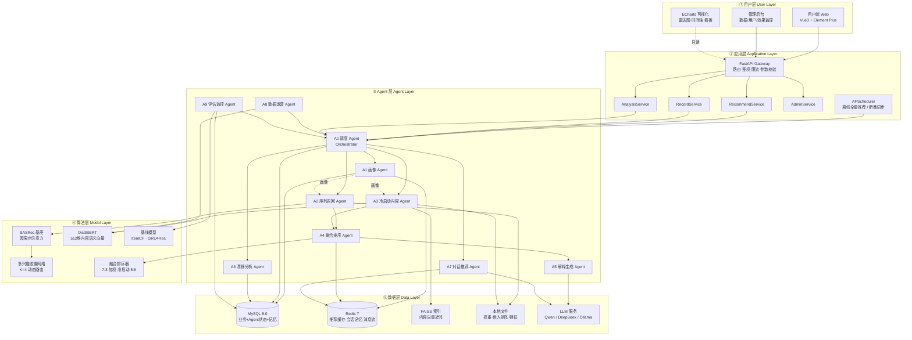
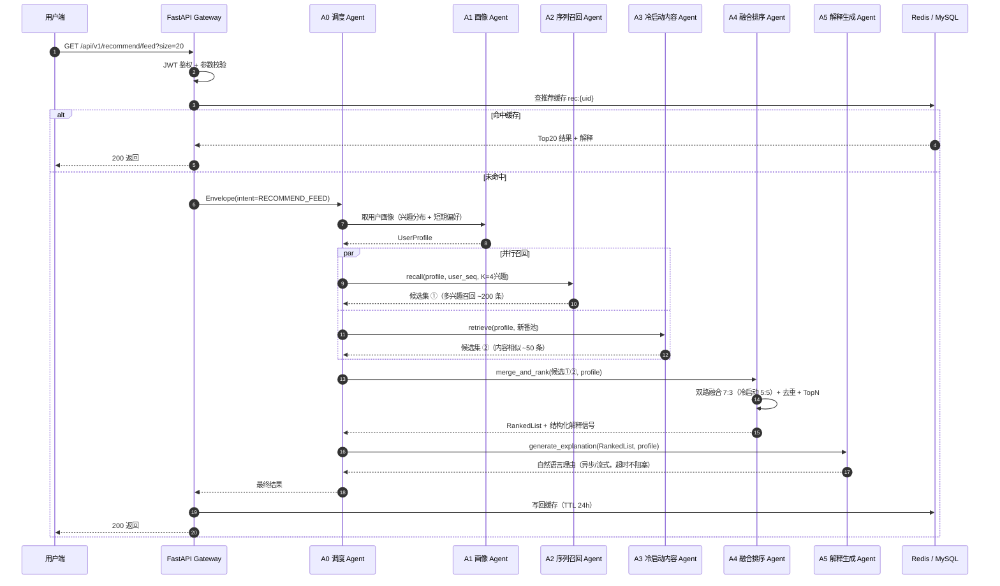
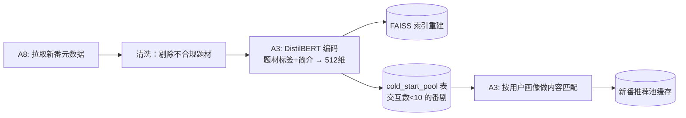
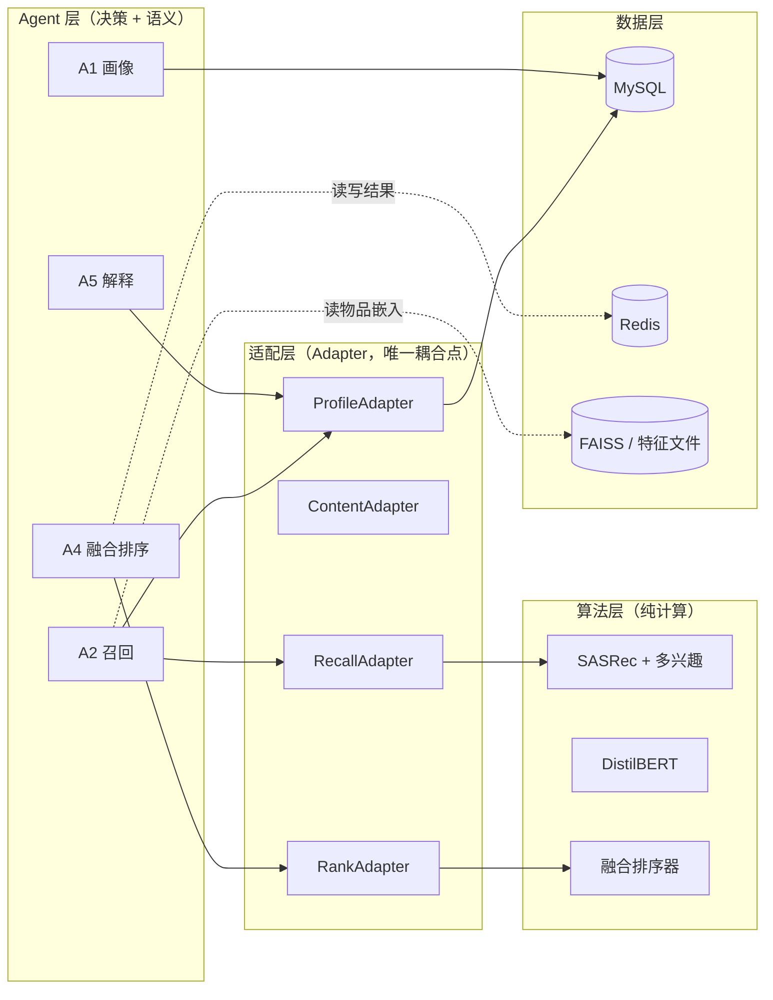
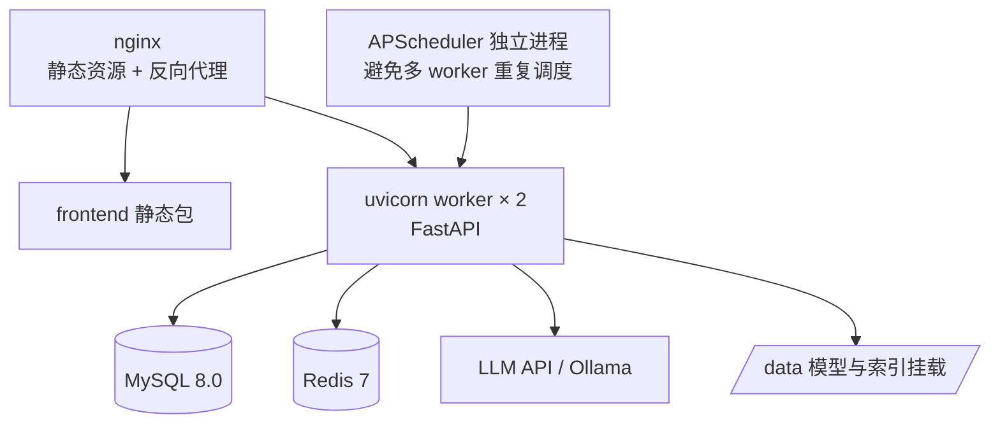

# 系统整体架构设计

> 对应代码：`server/`（应用层）、`agents/`（Agent 层）、`models/`（算法层）
> 本文回答三个问题：**系统分几层**、**一次请求怎么流动**、**Agent 与传统代码如何分工**。

---

## 一、设计目标与约束

| 目标 | 具体约束 |
|---|---|
| 推荐可解释 | 每条推荐必须能给出「核心影响番剧 + 题材匹配度 + 自然语言理由」 |
| 冷启动可用 | 新番（交互数 < 10）必须有非零召回与合理排序 |
| 多兴趣覆盖 | 小众题材召回率不得被主流题材淹没（分题材 Recall@10 单独考核） |
| 响应可控 | 推荐接口 P95 < 300ms；LLM 解释走异步/流式，不阻塞主链路 |
| 可观测 | 每次推荐请求有完整 Agent 调用链记录（trace_id 贯穿） |
| 可降级 | 任一 Agent 失败不得导致整条链路 500 |

**核心设计取舍**：**LLM 不参与候选生成**。召回与排序全部由确定性模型（SASRec / 胶囊网络 / FAISS）完成，LLM 只负责「解释、对话、规划、运营文案」等**语义层任务**。这样做的原因：

1. 推荐精度由模型保证，不会被 LLM 幻觉污染；
2. 主链路不依赖外部 API，LLM 挂了推荐照常返回（只损失解释文案）；
3. 离线指标可复现，不受 LLM 随机性影响。

---

## 二、五层架构



### 各层职责边界

| 层 | 职责 | 不该做的事 |
|---|---|---|
| ① 用户层 | 展示、交互、可视化 | 不做任何业务判断与数据加工 |
| ② 应用层 | 协议转换（HTTP ↔ 内部消息）、鉴权、限流、任务调度 | 不写推荐算法逻辑，不直接查模型 |
| ③ Agent 层 | 业务决策、任务编排、语义生成 | 不做张量计算，不直接读写原始数据文件 |
| ④ 算法层 | 纯模型前向/训练/指标计算，**输入张量、输出张量** | 不碰数据库、不调 LLM、不知道 HTTP 存在 |
| ⑤ 数据层 | 持久化、缓存、检索、外部 LLM | 不含业务策略 |

> **强约束**：算法层（`models/`）必须是**纯函数式**的——给定相同输入必然得到相同输出，且不依赖任何外部服务。这是消融实验可复现的前提。

---

## 三、Agent 层定位：什么用 Agent，什么用传统代码

这是本项目最容易讲混的地方，先给结论表：

| 业务逻辑 | 实现方式 | 理由 |
|---|---|---|
| 意图识别（用户想看推荐 / 想聊天 / 想看分析） | **Agent（LLM）** | 自然语言模糊输入，规则难穷举 |
| 任务规划与 Agent 编排 | **Agent（状态图）** | 分支多、需动态决策与失败重试 |
| 召回计算（SASRec + 多兴趣） | **传统代码** | 矩阵运算，必须确定性、可复现 |
| 内容向量编码（DistilBERT） | **传统代码** | 一次前向，无决策成分 |
| 近邻检索（FAISS TopK） | **传统代码** | 标准算法，无需 LLM |
| 排序融合与加权 | **传统代码** | 权重公式固定，数值必须可复现 |
| 兴趣胶囊路由 | **传统代码** | 动态路由是迭代算法，非语言任务 |
| 生成推荐理由文案 | **Agent（LLM）** | 把结构化信号转成人话，LLM 不可替代 |
| 多轮对话推荐 | **Agent（LLM）** | 上下文理解 + 工具调用 |
| 兴趣漂移点识别 | **传统代码**（突变检测） | 统计方法更稳；LLM 只做**漂移解读** |
| 新番入库时生成简介摘要 / 题材打标 | **Agent（LLM）** | 文本理解与生成 |
| 数据质量校验（缺失/异常） | **传统代码**（规则） | 规则校验准确率 100%，LLM 反而不可靠 |
| 指标计算（HR/NDCG） | **传统代码** | 可复现性硬要求 |
| 异常归因与告警文案 | **Agent（LLM）** | 需要跨日志综合推理 |

### 一句话划分原则

> **数值计算交给算法层，语言理解与生成交给 Agent，两者之间用结构化 JSON 契约隔开。**
> Agent 永远不直接碰向量与张量；算法层永远不产出自然语言。

### Agent 的类型划分

| 类型 | Agent | 是否 LLM 驱动 | 是否在主请求链路上 |
|---|---|---|---|
| 调度型 | A0 调度 | ✅ | ✅（必须） |
| 数据型 | A2 召回、A3 冷启动、A4 融合 | ❌（模型驱动，Agent 只是封装壳） | ✅（必须） |
| 画像型 | A1 画像 | 🔶 混合（规则统计 + LLM 摘要） | ✅ |
| 生成型 | A5 解释、A7 对话、A8 数据运营 | ✅ | 🔶 可异步 |
| 分析型 | A6 漂移分析 | 🔶 混合（统计检测 + LLM 解读） | ❌ 独立入口 |
| 监控型 | A9 评估监控 | 🔶 混合（脚本计算 + LLM 归因） | ❌ 离线 |

> 🔶 = 混合型：核心计算用传统算法保证准确，LLM 只做包装层。**答辩时务必强调这一点**——不是"什么都丢给大模型"，而是"该用统计的地方用统计，该用语言模型的地方用语言模型"。

---

## 四、核心数据流

### 4.1 主流程：个性化推荐（同步，P95 < 300ms）



**关键性能设计**：
- **缓存前置**：`rec:{uid}` 命中则完全绕过 Agent 层，这是 P95 达标的主要手段（离线全量预计算覆盖 95% 请求）。
- **并行召回**：A2 与 A3 无依赖，`asyncio.gather` 并行，节省 ~80ms。
- **解释降级**：A5 走 200ms 超时，超时则返回**模板化理由**（由 A4 的结构化信号直接拼装），保证主链路不被 LLM 拖慢。

### 4.2 离线全量推荐（异步，每日 03:00）

```mermaid
flowchart LR
    T[APScheduler<br/>03:00 触发] --> A8[A8 数据运营 Agent]
    A8 --> Q1{增量用户?}
    Q1 -- 是 --> SEQ[重建用户追番序列]
    Q1 -- 否 --> SKIP[跳过]
    SEQ --> RUN[A2 批量前向<br/>batch=512]
    RUN --> MRG[A4 批量融合排序]
    MRG --> W1[(写入 recommend_result 表)]
    MRG --> W2[(写入 Redis rec:{uid}<br/>TTL 24h)]
    W1 --> A9[A9 评估监控 Agent<br/>抽样计算线上指标]
    W2 --> A9
    A9 --> W3[(metric_snapshot 表)]
```

### 4.3 在线增量重排（异步，用户行为触发）

```mermaid
flowchart LR
    EV[用户标记「在看」/评分/弃番] --> API[POST /api/v1/records]
    API --> MQ[(Redis Stream<br/>topic: user_behavior)]
    API --> RESP[立即 200 返回<br/>不阻塞用户]
    MQ --> WK[Worker 消费]
    WK --> A1[A1 画像 Agent<br/>更新兴趣分布 + 短期记忆]
    A1 --> A2[A2 序列召回 Agent<br/>仅该用户增量前向]
    A2 --> A4[A4 融合排序 Agent]
    A4 --> INV[失效并重写 rec:{uid}]
```

> 增量链路存在的意义：用户刚看完《进击的巨人》，如果推荐列表还是 24 小时前的，体验会断裂。增量重排把「行为 → 新推荐」的延迟压到秒级。

### 4.4 新番冷启动链路（每周一 04:00）



---

## 五、非 Agent 模块与 Agent 的关联方式

这是「多 Agent 如何与原有推荐系统结合」的核心答案：**Agent 不重写模型，而是把模型包装成有明确契约的服务，由 Agent 负责调度与语义化。**



### 5.1 SASRec 与 Agent 的关联

| 问题 | 答案 |
|---|---|
| Agent 会重新实现 SASRec 吗？ | **不会**。`models/sasrec/` 是独立训练好的模型，只暴露 `encode(seq) -> (hidden_states, user_repr)` |
| A2 召回 Agent 做什么？ | ① 从 MySQL 取用户序列；② 调 `RecallAdapter` 让模型算分；③ 应用多兴趣合并去重策略；④ 返回结构化候选 |
| 模型怎么注册到 Agent？ | `agents/common/registry.py` 里登记 `ModelSpec`，Agent 通过名字取实例，不 import 具体模型类 |
| 重新训练模型要改 Agent 吗？ | **不需要**。只要 `encode` 接口不变，换权重即生效 |

### 5.2 数据库与 Agent 的关联

| 表 | 由谁写 | 由谁读 |
|---|---|---|
| `watch_record` | 应用层（用户操作） | A1 画像、A2 召回、A6 漂移 |
| `user_profile` | A1 画像 | A2 / A3 / A4 / A5 |
| `user_interest_capsule` | A2（离线批量） | A2 在线、A4 |
| `recommend_result` | A4（离线批量） | 应用层、A9 |
| `agent_trace` | A0（每次调用） | A9、管理后台 |
| `agent_memory_short` | A1 / A7 | A1 / A7 |
| `cold_start_pool` | A8 | A3 |

> Agent **不直接写业务表**（除了自己的状态表与记忆表）。推荐结果统一由 A4 通过 `server/services/` 落库，保证事务边界清晰。

### 5.3 缓存与 Agent 的关联

| Key 模式 | 内容 | TTL | 写入方 | 读取方 |
|---|---|---|---|---|
| `rec:{uid}` | Top20 推荐结果 + 解释 | 24h | A4（离线）/ 增量重排 | 应用层（主链路） |
| `rec:new:{uid}` | 新番专区推荐 | 7d | A3 | 应用层 |
| `profile:{uid}` | 用户画像快照 | 1h | A1 | A2 / A3 / A4 / A5 |
| `mem:short:{uid}:{sid}` | 会话短期记忆 | 30min | A1 / A7 | A1 / A7 |
| `stream:user_behavior` | 行为事件流 | — | 应用层 | Worker |
| `agent:lock:{agent}:{key}` | 并发去重锁 | 10s | A0 | A0 |

### 5.4 LLM 与 Agent 的关联

- 全部 LLM 调用收敛到 `agents/common/llm.py` 一个客户端，**统一做**：超时、重试、Token 计量、降级、脱敏。
- LLM 只在 **A0 / A5 / A7 / A8** 以及 A1、A6 的解读环节出现。
- LLM 不接触用户明文隐私字段（手机号、邮箱）——`llm.py` 内置 PII 过滤。

---

## 六、关键架构决策记录（ADR）

| # | 决策 | 备选方案 | 选择理由 | 代价 |
|---|---|---|---|---|
| ADR-1 | LLM 不参与召回排序 | 用 LLM 直接生成推荐列表 | 精度可控、链路可离线复现、不依赖外部 API | 需要额外维护模型服务 |
| ADR-2 | 采用 LangGraph 状态图编排 | 自研 if-else 编排 / AutoGen 自由对话 | 流程显式、可视化强、答辩好讲、便于插桩观测 | 引入框架学习成本 |
| ADR-3 | Redis 做主链路缓存 | 每次实时计算 | P95 从 ~800ms 降到 ~60ms | 结果有最长 24h 延迟（用增量重排缓解） |
| ADR-4 | 内容向量用 FAISS 本地索引 | Milvus / Elasticsearch | 15,687 物品量级下 FAISS 足够且零运维 | 后续上百万物品需迁移 |
| ADR-5 | Agent 间同步 HTTP + 异步 Redis Stream | 全异步 MQ | 主链路需要低延迟同步结果，全 MQ 反而增加复杂度 | 混合模型需明确边界（见协议文档） |
| ADR-6 | 算法层纯函数化 | 在模型里直接查库 | 保证消融实验可复现 | 需要额外写 Adapter 做数据准备 |

---

## 七、部署拓扑（生产参考）



> ⚠️ 定时任务必须**独立进程**运行，否则 uvicorn 多 worker 会把离线任务触发多次。

---

## 八、相关文档

- Agent 清单与职责 → [agents.md](agents.md)
- Agent 通信与降级 → [agent-interaction-protocol.md](agent-interaction-protocol.md)
- 代码目录落地 → [project-structure.md](project-structure.md)
- 数据表设计 → [database-design.md](database-design.md)
