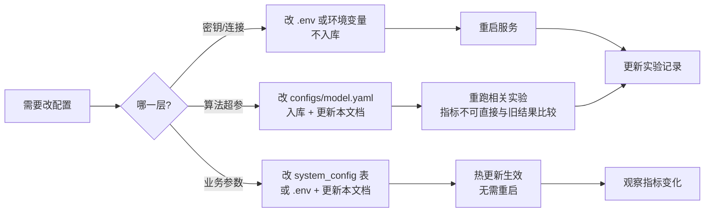

# 配置说明（Configuration Guide）

> 本文覆盖：**配置分层机制、全部配置项清单、三套环境差异、密钥管理、常见配置错误**。
> 配置模板见项目根目录 `.env.example` 与 `configs/` 目录。

---

## 一、配置分层机制

项目有**四层配置**，优先级从低到高：

```
① 代码默认值（server/core/config.py 中的 default）
        ↓ 被覆盖
② .env 文件 / 系统环境变量        ← 本机/密钥相关
        ↓ 被覆盖
③ configs/*.yaml                 ← 算法与实验参数
        ↓ 被覆盖
④ system_config 表（运行时热更新）  ← 需动态调整的业务参数
        ↓ 被覆盖
⑤ 请求参数（临时覆盖，仅部分接口支持）
```

### 1.1 各层职责划分

| 层 | 存放内容 | 是否入库 | 加载时机 |
|---|---|---|---|
| ① 代码默认值 | 兜底值，保证缺失配置也能启动 | ✅ | 启动 |
| ② `.env` | **密钥**、连接串、路径、环境标识 | ❌（`.env.example` 入库） | 启动 |
| ③ `configs/*.yaml` | 模型超参、实验分组、日志级别 | ✅ | 启动 / 指定 `--config` |
| ④ `system_config` 表 | 冷启动阈值、融合权重等业务参数 | ✅（数据） | 启动 + 每次读取时判缓存 |
| ⑤ 请求参数 | 如 `?refresh=true` | — | 单次请求 |

### 1.2 加载实现

```python
# server/core/config.py
from pydantic_settings import BaseSettings, SettingsConfigDict

class Settings(BaseSettings):
    model_config = SettingsConfigDict(
        env_file=".env",
        env_file_encoding="utf-8",
        extra="ignore",            # 容忍未知环境变量
        case_sensitive=False,
    )
    app_env: str = "dev"
    mysql_host: str = "127.0.0.1"
    # … 与 .env.example 一一对应

settings = Settings()
```

```python
# 业务参数的读取（含 system_config 热更新）
def get_cold_start_threshold() -> int:
    """优先级：system_config 表 > .env > 默认值"""
    v = config_cache.get("COLD_START_THRESHOLD")     # 5 分钟本地缓存
    if v is not None:
        return int(v)
    return settings.cold_start_threshold
```

> **判断标准**：需要在**不重启**的情况下调整 → 放 `system_config`；只在部署时定 → 放 `.env`；只在训练/实验时变 → 放 `configs/`。

---

## 二、配置项完整清单

### 2.1 运行环境（`.env`）

| 配置项 | 类型 | 默认 | 说明 | 可热更新 |
|---|---|---|---|---|
| `APP_ENV` | enum | `dev` | `dev` / `test` / `prod`，影响日志级别、调试接口、鉴权严格度 | ❌ |
| `APP_NAME` | string | `anirec` | 应用名，用于日志与监控标识 | ❌ |
| `APP_HOST` / `APP_PORT` | string/int | `0.0.0.0` / `8000` | 服务监听地址 | ❌ |
| `LOG_LEVEL` | enum | `INFO` | `DEBUG`/`INFO`/`WARNING`/`ERROR` | ✅ |
| `LOG_DIR` | string | `./logs` | 日志目录 | ❌ |
| `LOG_RETENTION_DAYS` | int | `30` | 日志保留天数 | ✅ |

### 2.2 数据库与缓存

| 配置项 | 类型 | 默认 | 说明 |
|---|---|---|---|
| `MYSQL_HOST` / `MYSQL_PORT` | string/int | `127.0.0.1` / `3306` | MySQL 地址 |
| `MYSQL_USER` / `MYSQL_PASSWORD` | string | `root` / — | 账号密码 |
| `MYSQL_DB` | string | `anirec` | 库名 |
| `MYSQL_POOL_SIZE` | int | `10` | 连接池大小（建议 = 并发 worker × 2） |
| `MYSQL_MAX_OVERFLOW` | int | `20` | 溢出连接数 |
| `MYSQL_POOL_RECYCLE` | int | `3600` | 连接回收秒数（避开 MySQL 8h 超时） |
| `REDIS_HOST` / `REDIS_PORT` | string/int | `127.0.0.1` / `6379` | Redis 地址 |
| `REDIS_PASSWORD` | string | — | 密码（生产必填） |
| `REDIS_DB` | int | `0` | 库号（**测试环境用 1，避免污染开发数据**） |
| `REC_CACHE_TTL` | int | `86400` | 推荐结果缓存秒数（24h） |
| `PROFILE_CACHE_TTL` | int | `3600` | 画像缓存秒数（1h） |

### 2.3 LLM

| 配置项 | 类型 | 默认 | 说明 |
|---|---|---|---|
| `LLM_PROVIDER` | enum | `dashscope` | `dashscope` / `deepseek` / `openai` / `ollama` / `mock` |
| `LLM_BASE_URL` | string | DashScope 兼容端点 | OpenAI 兼容 base URL |
| `LLM_API_KEY` | string | — | **密钥，严禁入库** |
| `LLM_MODEL` | string | `qwen-plus` | 模型名 |
| `LLM_TEMPERATURE` | float | `0.3` | 采样温度（分类类 Agent 代码内强制 0） |
| `LLM_MAX_TOKENS` | int | `1024` | 单次最大输出 |
| `LLM_TIMEOUT` | int | `30` | 请求超时秒数（A5 在代码内单独设 200ms） |
| `LLM_MAX_RETRY` | int | `2` | 重试次数 |
| `LLM_MOCK` | bool | `false` | 置 true 时全部走 Mock，用于无 Key 联调 |

**各 Provider 配置示例**：

```bash
# ① 阿里云 DashScope（通义千问）
LLM_PROVIDER=dashscope
LLM_BASE_URL=https://dashscope.aliyuncs.com/compatible-mode/v1
LLM_MODEL=qwen-plus

# ② DeepSeek
LLM_PROVIDER=deepseek
LLM_BASE_URL=https://api.deepseek.com/v1
LLM_MODEL=deepseek-chat

# ③ 本地 Ollama（无需 Key，离线可用）
LLM_PROVIDER=ollama
LLM_BASE_URL=http://127.0.0.1:11434/v1
LLM_API_KEY=ollama
LLM_MODEL=qwen2.5:7b

# ④ Mock（答辩演示无网络时兜底）
LLM_MOCK=true
```

### 2.4 模型与数据路径

| 配置项 | 默认 | 说明 |
|---|---|---|
| `MODEL_DIR` | `./data/checkpoints` | 权重目录 |
| `SASREC_CKPT` | `sasrec_best.pt` | SASRec 权重文件名 |
| `MULTI_INTEREST_CKPT` | `multi_interest.pt` | 多兴趣模型权重 |
| `CONTENT_ENCODER_DIR` | `./models/content_encoder/pretrained` | DistilBERT 目录 |
| `ITEM_EMB_PATH` | `./data/features/item_emb.npy` | 物品嵌入矩阵（15,687 × 64） |
| `CONTENT_VEC_PATH` | `./data/features/content_vec_512.npy` | 内容向量（15,687 × 512） |
| `FAISS_INDEX_PATH` | `./data/features/faiss.index` | FAISS 索引 |
| `DATA_DIR` | `./dataset` | 数据集根目录 |
| `ANIME_META_PATH` | `./dataset/animes.csv` | 动漫元数据 |
| `RATING_PATH` | `./dataset/ratings.csv` | 评分数据 |
| `GENRE_MAP_PATH` | `./dataset/id_to_genreids.json` | 题材映射 |
| `DATASET_PKL` | `./dataset/dataset.pkl` | 序列数据集 |
| `NEG_SAMPLE_PKL` | `./dataset/random-sample_size100-seed98765.pkl` | 负采样池 |

> ⚠️ **路径一律用相对项目根目录的写法**。代码内部通过 `PROJECT_ROOT / settings.xxx_path` 解析为绝对路径，避免"换个目录启动就找不到文件"。

### 2.5 算法超参（`configs/model.yaml`）

| 配置项 | 默认 | 搜索范围 | 说明 |
|---|---|---|---|
| `max_seq_len` | `50` | — | 最大序列长度（与数据集构造一致） |
| `hidden_size` | `64` | 32/64/128 | 隐层维度 |
| `num_layers` | `2` | 1/2/3 | 自注意力层数 |
| `num_heads` | `2` | 1/2/4 | 注意力头数（须整除 hidden_size） |
| `dropout` | `0.2` | 0.1/0.2/0.3/0.5 | Dropout 率 |
| `num_interests` | `4` | 2/4/6/8 | **兴趣胶囊数 K** |
| `routing_iters` | `3` | — | 动态路由迭代次数（MIND 默认 3） |
| `batch_size` | `256` | 128/256/512 | 训练批大小 |
| `lr` | `0.001` | 1e-4 ~ 3e-3 | 学习率（Adam） |
| `weight_decay` | `0.0` | — | L2 正则 |
| `epochs` | `200` | — | 最大训练轮数 |
| `early_stop_patience` | `10` | — | 验证集 NDCG@10 早停耐心值 |
| `neg_sample_num` | `100` | — | 评估负采样数（**改动会使指标不可比**） |
| `device` | `cuda` | `cuda`/`cpu` | 训练设备 |
| `seed` | `42` | 42/2024/2025 | 随机种子 |

### 2.6 融合与冷启动参数

| 配置项 | 默认 | 说明 | 可热更新 |
|---|---|---|---|
| `COLD_START_THRESHOLD` | `10` | 交互数低于此值视为新番（**与数据集构造口径一致，改动需重跑实验**） | ✅ |
| `FUSION_W_BEHAVIOR` | `0.7` | 排序侧行为分权重 | ✅ |
| `FUSION_W_CONTENT` | `0.3` | 排序侧内容分权重 | ✅ |
| `FUSION_W_CONTENT_COLD` | `0.5` | 冷启动时内容分权重（提权） | ✅ |
| `DIVERSITY_LAMBDA` | `0.7` | MMR 多样性重排参数（越大越偏相关性） | ✅ |
| `DEDUP_WINDOW_DAYS` | `7` | 已推荐去重窗口天数 | ✅ |
| `REC_TOP_N` | `20` | 推荐返回条数 | ✅ |

> ⚠️ `FUSION_W_BEHAVIOR + FUSION_W_CONTENT` 必须等于 1.0，启动时校验，否则报错退出。

### 2.7 Agent 与链路参数

| 配置项 | 默认 | 说明 |
|---|---|---|
| `AGENT_TRANSPORT` | `local` | `local`（进程内）/ `http`（跨进程） |
| `AGENT_MAX_DEPTH` | `6` | 调用链最大深度（超限判定循环） |
| `A0_TIMEOUT_MS` | `800` | 调度 Agent 超时 |
| `A1_TIMEOUT_MS` | `150` | 画像 Agent 超时 |
| `A2_TIMEOUT_MS` | `200` | 召回 Agent 超时 |
| `A3_TIMEOUT_MS` | `150` | 冷启动 Agent 超时 |
| `A4_TIMEOUT_MS` | `100` | 融合排序 Agent 超时 |
| `A5_TIMEOUT_MS` | `200` | 解释 Agent 超时（超时走模板） |
| `A6_TIMEOUT_MS` | `2000` | 漂移分析超时 |
| `A7_TIMEOUT_MS` | `5000` | 对话 Agent 超时 |
| `A7_MAX_TOOL_CALLS` | `3` | 单轮工具调用上限 |
| `CIRCUIT_FAILURE_THRESHOLD` | `5` | 熔断触发失败次数 |
| `CIRCUIT_OPEN_SECONDS` | `30` | 熔断开持续时间 |

### 2.8 定时任务

| 配置项 | 默认 | 说明 |
|---|---|---|
| `CRON_OFFLINE_REC` | `0 3 * * *` | 离线全量推荐（每日 03:00） |
| `CRON_CACHE_WARMUP` | `0 330 * * *`→`30 3 * * *` | 缓存预热（03:30） |
| `CRON_NEW_ANIME_SYNC` | `0 4 * * 1` | 新番同步（每周一 04:00） |
| `CRON_METRICS_SNAPSHOT` | `0 * * * *` | 指标快照（每小时） |
| `CRON_TRACE_CLEANUP` | `0 5 * * *` | 调用链清理（每日 05:00） |
| `OFFLINE_BATCH_SIZE` | `512` | 离线推理批大小 |
| `SCHEDULER_ENABLED` | `true` | **多 worker 部署时必须只有一个进程为 true** |

### 2.9 安全

| 配置项 | 默认 | 说明 |
|---|---|---|
| `JWT_SECRET` | — | **生产必须改，且用强随机串** |
| `JWT_ALGORITHM` | `HS256` | 签名算法 |
| `JWT_EXPIRE_MINUTES` | `1440` | token 有效期 |
| `INTERNAL_TOKEN` | — | Agent 内部接口鉴权 token |
| `CORS_ORIGINS` | `http://127.0.0.1:5173` | 允许的前端源（逗号分隔） |
| `RATE_LIMIT_ENABLED` | `true` | 是否启用限流（压测时置 false） |
| `BCRYPT_ROUNDS` | `12` | 密码哈希强度 |

### 2.10 代码仓库

| 配置项 | 默认 | 说明 |
|---|---|---|
| `GIT_REPO_URL` | `https://github.com/zarbzarb/animes.git` | 项目源码托管地址（GitHub 远程仓库） |
| `GIT_REPO_BRANCH` | `main` | 主干分支名 |

```bash
# 首次推送
git remote add origin $GIT_REPO_URL
git push -u origin $GIT_REPO_BRANCH
```

> **说明**：`GIT_REPO_URL` 仅供脚本/文档引用，不含任何凭据。HTTPS 推送需在本地配置 Personal Access Token 或 SSH 密钥，
> 凭据一律走本机 git credential helper 存储，**禁止写入 `.env` 提交到仓库**。

---

## 三、三套环境差异

### 3.1 对照表

| 维度 | 开发 dev | 测试 test | 生产 prod |
|---|---|---|---|
| `APP_ENV` | `dev` | `test` | `prod` |
| 数据库 | 本地 MySQL，库 `anirec_dev` | 独立 MySQL，库 `anirec_test` | 生产 MySQL，库 `anirec` |
| Redis DB | `0` | `1`（隔离，避免污染） | `0` |
| 数据规模 | **采样 5 万用户** | 采样 10 万用户 | 全量 130 万用户 |
| 模型 | 小模型 + 随机权重可跑通 | 完整模型 checkpoint | 完整模型 + 定期重训 |
| LLM | `LLM_MOCK=true` 或便宜模型 | 真实模型，`qwen-turbo` | `qwen-plus` / 生产 Key |
| 日志级别 | `DEBUG` | `INFO` | `WARNING`（错误单独告警） |
| 调试接口 | `/analysis/agent-invoke` **开放** | 开放 | **关闭**（`APP_ENV=prod` 时路由不注册） |
| Swagger `/docs` | 开放 | 开放 | 关闭（`docs_url=None`） |
| 定时任务 | `SCHEDULER_ENABLED=false`（手动跑） | `true` | `true`（**独立进程**） |
| 限流 | `false` | `true` | `true` |
| CORS | 宽松（含 localhost 各端口） | 严格 | 仅线上域名 |
| 覆盖写数据 | 允许随意清库 | 谨慎 | **禁止直接改库** |
| 备份 | 无 | 每周 | 每日全量 + binlog |

### 3.2 配置文件组织

```
configs/
├── config.py              # 加载器：合并 yaml + 环境覆盖
├── base.yaml              # 公共配置（所有环境共享）
├── dev.yaml               # 开发覆盖
├── test.yaml              # 测试覆盖
├── prod.yaml              # 生产覆盖
├── data.yaml              # 数据预处理参数
├── model.yaml             # 模型超参与训练循环参数
├── scale.yaml             # 训练规模档位（user_ratio / seeds / epoch 上限 / 评估频率）
├── genre_taxonomy.yaml    # 12 类题材体系的单一事实源
├── experiment.yaml        # 实验分组（E1-E4），并指定每组使用哪个档位
└── log.yaml               # 日志格式与轮转
```

**`scale.yaml` 与 `model.yaml` 的职责边界（重要）**：

| 文件 | 管什么 | 是否影响模型结构 |
|---|---|---|
| `scale.yaml` | 训练**规模**：抽多少用户、跑几个种子、epoch 上限、多久评估一次 | ❌ 不影响 |
| `model.yaml` | 模型**结构与训练超参**：hidden_size / num_layers / batch_size / lr / AMP | ✅ 影响 |

两者分开的原因是：**超参不随规模变化**。这样小档（`dev`）调出的超参可以直接拿到大档（`main`）使用。
若把 `user_ratio` 和 `hidden_size` 写进同一个文件，换档时很容易顺手改错超参，
导致跨档结果不可比 —— 而"小档调参、大档直接用"正是本项目压缩训练时间的核心策略。

使用方式：

```bash
python scripts/train.py --config configs/model.yaml --scale dev     # 开发档：HPO / 消融
python scripts/train.py --config configs/model.yaml --scale main    # 论文主表
```

`--scale` 的优先级高于 `model.yaml` 里的 `scale` 默认值。
档位设计理由、抽样口径与算力预算见 `evaluation-plan.md` §6.6。

加载方式：

```bash
# 自动按 APP_ENV 叠加：base.yaml → {APP_ENV}.yaml
python scripts/train.py --config configs/model.yaml

# 显式指定环境
APP_ENV=test python scripts/train.py --config configs/model.yaml
```

```python
# configs/config.py 核心逻辑
def load_config(path: str) -> dict:
    base = yaml.safe_load(open(ROOT / "configs" / "base.yaml"))
    env = os.getenv("APP_ENV", "dev")
    env_cfg = yaml.safe_load(open(ROOT / "configs" / f"{env}.yaml"))
    task = yaml.safe_load(open(ROOT / path))
    return deep_merge(base, env_cfg, task)     # 后者覆盖前者
```

### 3.3 环境启动命令对照

```bash
# ---------- 开发 ----------
cp .env.example .env          # 填本地 MySQL 密码，LLM_MOCK=true
python scripts/init_db.py --create-schema --seed-genre --seed-agent
python scripts/sample_users.py --n 50000        # 只导入 5 万用户，快
python scripts/import_anime_meta.py
uvicorn server.main:app --reload --port 8000

# ---------- 测试 ----------
APP_ENV=test python scripts/init_db.py --create-schema --seed-genre --seed-agent
APP_ENV=test pytest tests/ -v --cov=server --cov=agents

# ---------- 生产 ----------
APP_ENV=prod uvicorn server.main:app --host 0.0.0.0 --port 8000 --workers 2
APP_ENV=prod python -m server.tasks.scheduler    # 独立进程跑定时任务
```

---

## 四、密钥管理与安全

### 4.1 铁律

| # | 规则 |
|---|---|
| 1 | `.env` **永不入库**，已在 `.gitignore` 中排除 |
| 2 | `.env.example` 只放占位值（`sk-xxxx`），**不放真实 Key** |
| 3 | 提交前用 `git diff --cached` 自查，确认没有密钥泄漏 |
| 4 | 生产密钥通过**环境变量注入**（Docker `--env-file` / K8s Secret / 服务器 export），不落盘 |
| 5 | 密钥一旦泄漏，**立即轮换**，不要只删 commit（历史里还在） |

### 4.2 防泄漏检查

```bash
# 提交前扫描（在 .pre-commit-config.yaml 中已配置）
gitleaks protect --staged

# 手动全库扫描
gitleaks detect --source . --verbose

# 快速自查常见模式
git grep -nE "(sk-[A-Za-z0-9]{20,}|AKIA[0-9A-Z]{16}|password\s*=\s*['\"][^'\"]+)" -- . ':!.env.example'
```

### 4.3 敏感配置清单

| 配置项 | 敏感级别 | 生产获取方式 |
|---|---|---|
| `MYSQL_PASSWORD` | 🔴 高 | 环境变量 / Secret Manager |
| `LLM_API_KEY` | 🔴 高 | 环境变量 |
| `JWT_SECRET` | 🔴 高 | 随机生成，`openssl rand -hex 32` |
| `INTERNAL_TOKEN` | 🟠 中 | 环境变量 |
| `REDIS_PASSWORD` | 🟠 中 | 环境变量 |
| 其他 | 🟢 低 | 可入库 |

```bash
# 生成强随机 JWT_SECRET
python -c "import secrets; print(secrets.token_hex(32))"
```

---

## 五、配置校验

启动时强制执行，避免"配错了但跑起来才发现"：

```python
# server/core/config.py
def validate_settings(s: Settings) -> None:
    errors = []

    # 1) 融合权重必须归一
    if abs(s.fusion_w_behavior + s.fusion_w_content - 1.0) > 1e-6:
        errors.append("FUSION_W_BEHAVIOR + FUSION_W_CONTENT 必须等于 1.0")

    # 2) 冷启动权重需 >= 常规内容权重
    if s.fusion_w_content_cold < s.fusion_w_content:
        errors.append("FUSION_W_CONTENT_COLD 应不小于 FUSION_W_CONTENT")

    # 3) 注意力头数须整除隐层维度
    if s.hidden_size % s.num_heads != 0:
        errors.append(f"hidden_size({s.hidden_size}) 必须能被 num_heads({s.num_heads}) 整除")

    # 4) 生产环境必须有强密钥
    if s.app_env == "prod":
        if not s.jwt_secret or s.jwt_secret in ("change-me-in-production", ""):
            errors.append("生产环境必须设置强随机 JWT_SECRET")
        if s.llm_mock:
            errors.append("生产环境不应启用 LLM_MOCK")
        if not s.llm_api_key and s.llm_provider != "ollama":
            errors.append("生产环境必须配置 LLM_API_KEY")

    # 5) 路径存在性（关键文件）
    for p in [s.anime_meta_path, s.dataset_pkl]:
        if not (PROJECT_ROOT / p).exists():
            errors.append(f"必需数据文件不存在: {p}")

    # 6) 冷启动阈值必须与实验口径一致
    if s.cold_start_threshold != 10:
        warnings.warn(f"COLD_START_THRESHOLD={s.cold_start_threshold} 与实验口径(10)不一致，"
                      f"会导致线上与离线指标不可比")

    if errors:
        raise ConfigError("配置校验失败:\n  - " + "\n  - ".join(errors))
```

### 启动自检命令

```bash
python scripts/check_config.py
# 输出示例：
# ✅ 配置文件加载成功 (env=dev)
# ✅ 融合权重归一 (0.7 + 0.3 = 1.0)
# ✅ hidden_size % num_heads == 0 (64 % 2 == 0)
# ✅ 数据文件齐全 (6/6)
# ✅ MySQL 连接正常 (anirec_dev)
# ✅ Redis 连接正常 (db=0)
# ⚠️  LLM_MOCK=true —— 解释文案将使用模板，非真实 LLM 输出
```

---

## 六、常见配置错误

| 现象 | 原因 | 解决 |
|---|---|---|
| `ModuleNotFoundError: No module named 'torch'` | 未激活虚拟环境 | `source .venv/bin/activate`（Win: `.venv\Scripts\activate`） |
| 启动报「数据文件不存在」 | `DATA_DIR` 指向错误，或 `dataset/` 未分发 | 检查 `.env` 的 `DATA_DIR`，确认数据集已放入 |
| 推荐结果全是热门 | 模型权重未加载成功，静默降级 | 看启动日志是否有 `MODEL_UNAVAILABLE`；`python scripts/check_config.py` |
| 离线任务被重复触发 | uvicorn 多 worker 都开了 `SCHEDULER_ENABLED=true` | **定时任务独立进程**运行，API 进程设 `false` |
| 解释文案全是模板 | `LLM_MOCK=true` 或 Key 无效或 LLM 超时 | 检查 `LLM_API_KEY`；看 `agent_trace` 的 `error_code=60601` |
| 冷启动实验指标虚高 | 新番未从训练集剥离 | 检查 `scripts/build_cold_start_subset.py` 的剥离逻辑 |
| 线上与离线指标对不上 | `COLD_START_THRESHOLD` 或 `neg_sample_num` 被改 | 恢复为 10 / 100，两者必须与实验口径一致 |
| `Access denied for user` | MySQL 账号密码错 / 未授权远程 | 检查 `.env`，确认用户有对应库权限 |
| `Redis connection refused` | Redis 未启动或端口错 | `redis-cli ping` 验证 |
| 中文图表乱码 | 未配置中文字体 | 已在 `plot_results.py` 设 `SimHei`；Windows 需确认系统有该字体 |
| 训练 OOM | `batch_size` 过大 | 降到 128 或 64；开梯度累积 `grad_accum_steps` |
| 指标跑出来超过 1.0 | 指标实现被改 / 用了全库排序 | 确认走 `models/eval/metrics.py` |

---

## 七、配置变更流程



### 变更记录

| 日期 | 配置项 | 原值 | 新值 | 影响 | 操作人 |
|---|---|---|---|---|---|
| 2026-09-12 | 初版建立 | — | — | — | — |

> ⚠️ **改 `configs/model.yaml` 中任何超参后，必须重跑实验**，不能把新配置的结果与旧配置的结果放在同一张对比表里——这是实验公平性的硬要求。

---

## 八、相关文档

- 项目目录 → [project-structure.md](project-structure.md)
- 实验参数 → [evaluation-plan.md](evaluation-plan.md) 第四节
- Agent 超时与降级 → [agent-interaction-protocol.md](agent-interaction-protocol.md) 第五节
- 提交规范 → [dev-conventions.md](dev-conventions.md)
