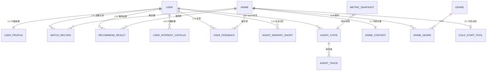
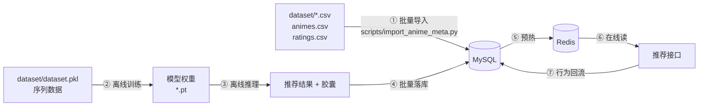

# 数据库设计

> **数据库**：MySQL 8.0（业务数据权威存储）+ Redis 7（缓存、会话记忆、消息流）+ 本地文件（模型权重与向量）
> 详细目录对应见 [project-structure.md](project-structure.md) 的 `server/db/models/`。表结构与本文必须一一对应，新增字段必须同步本文。

---

## 一、设计原则

| 原则 | 说明 |
|---|---|
| **P1 一个事实源** | 用户行为只有一个权威表 `watch_record`，任何统计都是它的派生 |
| **P2 离线结果落表** | 模型算出的推荐结果写 `recommend_result`，不在线实时算（缓存失效时可回表） |
| **P3 向量不进 MySQL** | 512 维内容向量、胶囊向量存文件，表里只存 `ref` 路径 |
| **P4 高频日志分区** | `agent_trace` 按天分区，保留 30 天 |
| **P5 字符集统一** | `utf8mb4` / `utf8mb4_0900_ai_ci`，支持 emoji 与日文标题 |
| **P6 时间统一 UTC** | 所有 `datetime` 存 UTC，展示层转换 |

### 命名规范

| 对象 | 规范 | 示例 |
|---|---|---|
| 表名 | 小写下划线，单数 | `watch_record` |
| 主键 | `id` BIGINT UNSIGNED AUTO_INCREMENT | — |
| 外键 | `{表}_id` | `anime_id` |
| 布尔 | `is_xxx` TINYINT(1) | `is_cold_start` |
| 状态 | `status` ENUM 或 TINYINT | — |
| 时间 | `created_at` / `updated_at` DATETIME(3) | — |
| 索引 | `idx_{列}` / `uk_{列}` | `idx_user_updated` |

### 通用字段（每张业务表都有）

```sql
id          BIGINT UNSIGNED NOT NULL AUTO_INCREMENT,
created_at  DATETIME(3)     NOT NULL DEFAULT CURRENT_TIMESTAMP(3),
updated_at  DATETIME(3)     NOT NULL DEFAULT CURRENT_TIMESTAMP(3) ON UPDATE CURRENT_TIMESTAMP(3),
PRIMARY KEY (id)
```

---

## 二、ER 总览



---

## 三、核心业务表

### 3.1 `user` —— 用户表

```sql
CREATE TABLE `user` (
  `id`            BIGINT UNSIGNED NOT NULL AUTO_INCREMENT COMMENT '用户ID',
  `username`      VARCHAR(50)     NOT NULL                COMMENT '登录用户名',
  `email`         VARCHAR(120)    DEFAULT NULL            COMMENT '邮箱（可空）',
  `password_hash` VARCHAR(128)    NOT NULL                COMMENT 'bcrypt 哈希',
  `nickname`      VARCHAR(50)     NOT NULL                COMMENT '昵称',
  `avatar_url`    VARCHAR(255)    DEFAULT NULL            COMMENT '头像地址',
  `role`          TINYINT         NOT NULL DEFAULT 0      COMMENT '0=普通用户 1=管理员',
  `status`        TINYINT         NOT NULL DEFAULT 1      COMMENT '1=正常 0=禁用',
  `src_user_id`   INT UNSIGNED    DEFAULT NULL            COMMENT '来源数据集 userID（用于导入实验用户）',
  `last_login_at` DATETIME(3)     DEFAULT NULL            COMMENT '最近登录时间',
  `created_at`    DATETIME(3)     NOT NULL DEFAULT CURRENT_TIMESTAMP(3),
  `updated_at`    DATETIME(3)     NOT NULL DEFAULT CURRENT_TIMESTAMP(3) ON UPDATE CURRENT_TIMESTAMP(3),
  PRIMARY KEY (`id`),
  UNIQUE KEY `uk_username` (`username`),
  UNIQUE KEY `uk_email` (`email`),
  KEY `idx_src_user_id` (`src_user_id`)
) ENGINE=InnoDB DEFAULT CHARSET=utf8mb4 COMMENT='用户表';
```

> `src_user_id` 是关键设计：MAL 数据集有 1,306,691 个用户。本地演示/实验时不需要全部导入，只导入采样用户，通过 `src_user_id` 与 `dataset.pkl` 的 `umap` 对齐。

### 3.2 `anime` —— 动漫表

```sql
CREATE TABLE `anime` (
  `id`             BIGINT UNSIGNED NOT NULL AUTO_INCREMENT COMMENT '内部ID',
  `src_anime_id`   INT UNSIGNED    NOT NULL                COMMENT 'MAL animeID（与数据集对齐）',
  `title`          VARCHAR(255)    NOT NULL                COMMENT '主标题',
  `alt_title`      VARCHAR(255)    DEFAULT NULL            COMMENT '副标题/日文名',
  `type`           VARCHAR(16)     DEFAULT NULL            COMMENT 'TV/OVA/MOVIE/ONA/SPECIAL',
  `year`           SMALLINT        DEFAULT NULL            COMMENT '首播年份',
  `season`         CHAR(6)         DEFAULT NULL            COMMENT '季度 如 2026Q3（A8 计算写入）',
  `score`          DECIMAL(4,2)    DEFAULT NULL            COMMENT 'MAL 评分 0-10',
  `episodes`       SMALLINT        DEFAULT NULL            COMMENT '集数',
  `mal_url`        VARCHAR(255)    DEFAULT NULL            COMMENT 'MAL 链接',
  `image_url`      VARCHAR(512)    DEFAULT NULL            COMMENT '封面图',
  `is_sequel`      TINYINT(1)      NOT NULL DEFAULT 0       COMMENT '是否续作',
  `summary`        TEXT            DEFAULT NULL            COMMENT '规范化简介（A8 生成）',
  `raw_summary`    TEXT            DEFAULT NULL            COMMENT '原始简介（A8 保留）',
  `genre_raw`      JSON            DEFAULT NULL            COMMENT '原始 genres 数组',
  `genre_detail`   JSON            DEFAULT NULL            COMMENT '原始细分标签数组',
  `n_interactions` INT UNSIGNED    NOT NULL DEFAULT 0       COMMENT '交互数（离线统计，判冷启动用）',
  `is_forbidden`   TINYINT(1)      NOT NULL DEFAULT 0       COMMENT '是否不合规（Hentai/Erotica）',
  `is_online`      TINYINT(1)      NOT NULL DEFAULT 1       COMMENT '是否上架',
  `created_at`     DATETIME(3)     NOT NULL DEFAULT CURRENT_TIMESTAMP(3),
  `updated_at`     DATETIME(3)     NOT NULL DEFAULT CURRENT_TIMESTAMP(3) ON UPDATE CURRENT_TIMESTAMP(3),
  PRIMARY KEY (`id`),
  UNIQUE KEY `uk_src_anime_id` (`src_anime_id`),
  KEY `idx_year_type` (`year`, `type`),
  KEY `idx_n_interactions` (`n_interactions`),
  KEY `idx_online_forbidden` (`is_online`, `is_forbidden`),
  FULLTEXT KEY `ft_title` (`title`, `alt_title`) COMMENT '标题全文检索（A7 search_anime 用）'
) ENGINE=InnoDB DEFAULT CHARSET=utf8mb4 COMMENT='动漫元数据表';
```

**数据来源**：`dataset/animes.csv`（20,237 行）→ `scripts/import_anime_meta.py` 导入。
**清洗规则**：`genres` 含 `Hentai` / `Erotica` 的 1,675 条记录 → `is_forbidden=1`。
其中 **1,551 条实际存在于 `dataset.pkl` 的推荐池内**（实测，见 `docs/evaluation-plan.md` 第十节），
因此 `is_forbidden=1` 的语义是「在候选池与评估阶段屏蔽」，而非「数据集中不存在」。
`scripts/preprocess.py` 会输出屏蔽清单 `compliance.forbidden_item_indices` 供审计。

### 3.3 `genre` —— 题材表（12 类）

```sql
CREATE TABLE `genre` (
  `id`          TINYINT UNSIGNED NOT NULL AUTO_INCREMENT COMMENT '题材ID 1-12',
  `name_cn`     VARCHAR(20)      NOT NULL                COMMENT '中文名',
  `name_en`     VARCHAR(40)      NOT NULL                COMMENT '英文名',
  `mal_genres`  JSON             NOT NULL                COMMENT '映射到的 MAL 主题材',
  `description` VARCHAR(255)     DEFAULT NULL            COMMENT '说明',
  `sort_order`  TINYINT          NOT NULL DEFAULT 0      COMMENT '展示顺序',
  PRIMARY KEY (`id`),
  UNIQUE KEY `uk_name_cn` (`name_cn`)
) ENGINE=InnoDB DEFAULT CHARSET=utf8mb4 COMMENT='题材分类表';
```

**初始化数据（12 类）**：

| id | name_cn | name_en | 映射的 MAL 主题材 |
|---|---|---|---|
| 1 | 热血战斗 | Action | Action |
| 2 | 冒险奇幻 | Adventure-Fantasy | Adventure, Fantasy |
| 3 | 日常治愈 | Slice-of-Life | Slice of Life, Gourmet |
| 4 | 恋爱校园 | Romance | Romance |
| 5 | 悬疑推理 | Mystery | Mystery, Suspense |
| 6 | 科幻机战 | Sci-Fi | Sci-Fi |
| 7 | 喜剧搞笑 | Comedy | Comedy |
| 8 | 运动竞技 | Sports | Sports |
| 9 | 超自然灵异 | Supernatural | Supernatural, Horror |
| 10 | 剧情文艺 | Drama | Drama, Award Winning, Avant Garde |
| 11 | 青春音乐 | Music-Idol | （MAL 无对应，由细分标签 music/idol 判定）|
| 12 | 后宫福利 | Ecchi-Harem | Ecchi |

> 映射依据 `dataset/id_to_genreids.json`（21 类 MAL 主题材）与 `genres_detailed` 细分标签。
> 口径定义在 `configs/genre_taxonomy.yaml`。**Hentai / Erotica 不映射为任何 12 类题材**，
> 故池内有 1,248 个物品的题材标签为空——它们同时在候选池中被屏蔽。

### 3.4 `anime_genre` —— 动漫-题材关联表

```sql
CREATE TABLE `anime_genre` (
  `anime_id`  BIGINT UNSIGNED  NOT NULL COMMENT '动漫ID',
  `genre_id`  TINYINT UNSIGNED NOT NULL COMMENT '题材ID',
  `is_primary` TINYINT(1)      NOT NULL DEFAULT 0 COMMENT '是否主题材（每部最多1个）',
  `weight`    DECIMAL(4,3)     NOT NULL DEFAULT 1.000 COMMENT '题材权重（多题材分摊用）',
  PRIMARY KEY (`anime_id`, `genre_id`),
  KEY `idx_genre_anime` (`genre_id`, `anime_id`) COMMENT '分题材统计走此索引',
  CONSTRAINT `fk_ag_anime` FOREIGN KEY (`anime_id`) REFERENCES `anime`(`id`) ON DELETE CASCADE,
  CONSTRAINT `fk_ag_genre` FOREIGN KEY (`genre_id`) REFERENCES `genre`(`id`)
) ENGINE=InnoDB DEFAULT CHARSET=utf8mb4 COMMENT='动漫题材关联表';
```

> `is_primary` 用于"某部番的主题材是什么"，`weight` 用于画像强度计算时的多题材分摊。

### 3.5 `anime_content` —— 动漫内容向量表

```sql
CREATE TABLE `anime_content` (
  `anime_id`     BIGINT UNSIGNED NOT NULL COMMENT '动漫ID',
  `vec_dim`      SMALLINT        NOT NULL DEFAULT 512 COMMENT '向量维度',
  `vec_ref`      VARCHAR(255)    NOT NULL             COMMENT '向量在 npy 中的行偏移，如 "content_vec_512.npy#1234"',
  `faiss_idx`    INT UNSIGNED    DEFAULT NULL          COMMENT 'FAISS 索引位',
  `encode_model` VARCHAR(64)     NOT NULL DEFAULT 'distilbert-base-multilingual-cased',
  `encode_ver`   VARCHAR(16)     NOT NULL DEFAULT 'v1',
  `created_at`   DATETIME(3)     NOT NULL DEFAULT CURRENT_TIMESTAMP(3),
  PRIMARY KEY (`anime_id`),
  KEY `idx_faiss_idx` (`faiss_idx`)
) ENGINE=InnoDB DEFAULT CHARSET=utf8mb4 COMMENT='动漫内容语义向量索引表';
```

> **为什么向量存文件不存表**：15,687 × 512 float32 ≈ 32MB，存 BLOB 会让表膨胀且无法用 FAISS 直接加载。表中只记"第几行"，`np.load(mmap_mode='r')` 按行取即可。

### 3.6 `watch_record` —— 追番记录表（核心事实源）

```sql
CREATE TABLE `watch_record` (
  `id`         BIGINT UNSIGNED NOT NULL AUTO_INCREMENT,
  `user_id`    BIGINT UNSIGNED NOT NULL              COMMENT '用户ID',
  `anime_id`   BIGINT UNSIGNED NOT NULL              COMMENT '动漫ID',
  `status`     TINYINT         NOT NULL DEFAULT 1    COMMENT '0=想看 1=在看 2=已看 3=弃番',
  `rating`     TINYINT         DEFAULT NULL          COMMENT '评分 1-10，可空',
  `progress`   SMALLINT        NOT NULL DEFAULT 0    COMMENT '看到第几集',
  `watched_at` DATE            DEFAULT NULL          COMMENT '实际观看日期（时间轴用）',
  `tags`       JSON            DEFAULT NULL          COMMENT '用户自定标签',
  `created_at` DATETIME(3)     NOT NULL DEFAULT CURRENT_TIMESTAMP(3),
  `updated_at` DATETIME(3)     NOT NULL DEFAULT CURRENT_TIMESTAMP(3) ON UPDATE CURRENT_TIMESTAMP(3),
  PRIMARY KEY (`id`),
  UNIQUE KEY `uk_user_anime` (`user_id`, `anime_id`) COMMENT '同一用户同一番只有一条',
  KEY `idx_user_updated` (`user_id`, `updated_at` DESC) COMMENT '序列构造：按时间取用户历史',
  KEY `idx_user_status` (`user_id`, `status`),
  KEY `idx_anime_id` (`anime_id`) COMMENT '统计动漫交互数',
  CONSTRAINT `fk_wr_user`  FOREIGN KEY (`user_id`)  REFERENCES `user`(`id`)  ON DELETE CASCADE,
  CONSTRAINT `fk_wr_anime` FOREIGN KEY (`anime_id`) REFERENCES `anime`(`id`)
) ENGINE=InnoDB DEFAULT CHARSET=utf8mb4 COMMENT='追番记录表';
```

**这张表是整个系统的地基**：
- A2 序列召回的输入序列 → `WHERE user_id=? AND status IN (1,2) ORDER BY updated_at LIMIT 50`
- A1 画像的统计来源
- A6 漂移分析的时间序列来源

**⚠️ 序列构造的关键细节**：`dataset.pkl` 里的序列用的是 `animeID` 原始顺序，而线上表按 `updated_at` 排序。两者要能对齐，所以 `src_anime_id` 与 `src_user_id` 必须准确，否则离线实验和线上结果对不上。

### 3.7 `user_profile` —— 用户兴趣画像表（长期记忆）

```sql
CREATE TABLE `user_profile` (
  `user_id`              BIGINT UNSIGNED NOT NULL COMMENT '用户ID',
  `top_genres`           JSON            NOT NULL COMMENT '12维题材兴趣强度 [{genre,strength,count,avg_rating,trend}]',
  `activity_level`       TINYINT         NOT NULL DEFAULT 0 COMMENT '0=low 1=medium 2=high',
  `watch_intensity`      DECIMAL(5,4)    NOT NULL DEFAULT 0 COMMENT '追番强度 0-1',
  `avg_rating_tendency`  DECIMAL(4,2)    DEFAULT NULL COMMENT '打分倾向 1-10',
  `dropped_rate`         DECIMAL(5,4)    NOT NULL DEFAULT 0 COMMENT '弃番率 0-1',
  `preferred_types`      JSON            DEFAULT NULL COMMENT '偏好载体类型',
  `preferred_era_start`  SMALLINT        DEFAULT NULL COMMENT '偏好年代起',
  `preferred_era_end`    SMALLINT        DEFAULT NULL COMMENT '偏好年代止',
  `total_records`        INT UNSIGNED    NOT NULL DEFAULT 0 COMMENT '总追番数',
  `summary_text`         VARCHAR(255)    DEFAULT NULL COMMENT 'LLM 生成的画像摘要',
  `user_tag`             VARCHAR(32)     DEFAULT NULL COMMENT '用户标签',
  `version`              INT UNSIGNED    NOT NULL DEFAULT 0 COMMENT '版本号（并发控制）',
  `computed_at`          DATETIME(3)     DEFAULT NULL COMMENT '最近计算时间',
  `created_at`           DATETIME(3)     NOT NULL DEFAULT CURRENT_TIMESTAMP(3),
  `updated_at`           DATETIME(3)     NOT NULL DEFAULT CURRENT_TIMESTAMP(3) ON UPDATE CURRENT_TIMESTAMP(3),
  PRIMARY KEY (`user_id`),
  KEY `idx_activity` (`activity_level`),
  KEY `idx_version` (`version`),
  CONSTRAINT `fk_up_user` FOREIGN KEY (`user_id`) REFERENCES `user`(`id`) ON DELETE CASCADE
) ENGINE=InnoDB DEFAULT CHARSET=utf8mb4 COMMENT='用户兴趣画像表';
```

> `top_genres` 用 JSON 而不是 12 个列：① 题材数量可能调整（12→16）② 每个题材带多个属性（strength/count/trend），列式会变成 60 个字段 ③ 实际查询都是"整行取出"，不需要按题材过滤。若将来要按题材聚合，再抽一张 `user_genre_strength` 表。

### 3.8 `user_interest_capsule` —— 兴趣胶囊表

```sql
CREATE TABLE `user_interest_capsule` (
  `id`          BIGINT UNSIGNED NOT NULL AUTO_INCREMENT,
  `user_id`     BIGINT UNSIGNED NOT NULL COMMENT '用户ID',
  `capsule_id`  TINYINT UNSIGNED NOT NULL COMMENT '胶囊序号 0..K-1（K=4）',
  `label`       VARCHAR(20)     NOT NULL COMMENT '胶囊标签（对齐到12类题材）',
  `strength`    DECIMAL(5,4)    NOT NULL COMMENT '胶囊强度 0-1（路由系数归一化）',
  `vec_ref`     VARCHAR(255)    NOT NULL COMMENT '向量文件引用 cap_{user}.npy#{idx}',
  `model_ver`   VARCHAR(32)     NOT NULL DEFAULT 'multi_interest_v1' COMMENT '产出模型版本',
  `computed_at` DATETIME(3)     NOT NULL COMMENT '本次计算时间',
  `created_at`  DATETIME(3)     NOT NULL DEFAULT CURRENT_TIMESTAMP(3),
  `updated_at`  DATETIME(3)     NOT NULL DEFAULT CURRENT_TIMESTAMP(3) ON UPDATE CURRENT_TIMESTAMP(3),
  PRIMARY KEY (`id`),
  UNIQUE KEY `uk_user_capsule` (`user_id`, `capsule_id`),
  KEY `idx_label` (`label`) COMMENT '分析某题材胶囊分布',
  CONSTRAINT `fk_uic_user` FOREIGN KEY (`user_id`) REFERENCES `user`(`id`) ON DELETE CASCADE
) ENGINE=InnoDB DEFAULT CHARSET=utf8mb4 COMMENT='用户多兴趣胶囊表';
```

> 每个用户固定 4 行（K=4）。1.3M 用户 ×4 = 522 万行，用 `(user_id, capsule_id)` 唯一键定位，单用户查询 < 1ms。

### 3.9 `recommend_result` —— 推荐结果表

```sql
CREATE TABLE `recommend_result` (
  `id`             BIGINT UNSIGNED NOT NULL AUTO_INCREMENT,
  `user_id`        BIGINT UNSIGNED NOT NULL COMMENT '用户ID',
  `scene`          TINYINT         NOT NULL DEFAULT 0 COMMENT '0=综合 1=分题材 2=新番 3=对话',
  `genre_id`       TINYINT UNSIGNED DEFAULT NULL COMMENT 'scene=1 时的题材',
  `anime_id`       BIGINT UNSIGNED NOT NULL COMMENT '被推荐动漫',
  `rank_no`        TINYINT UNSIGNED NOT NULL COMMENT '排名 1..N',
  `final_score`    DECIMAL(8,5)    NOT NULL COMMENT '最终融合得分',
  `behavior_score` DECIMAL(8,5)    DEFAULT NULL COMMENT '行为路得分',
  `content_score`  DECIMAL(8,5)    DEFAULT NULL COMMENT '内容路得分',
  `interest_id`    TINYINT UNSIGNED DEFAULT NULL COMMENT '命中哪个兴趣胶囊',
  `is_cold_start`  TINYINT(1)      NOT NULL DEFAULT 0 COMMENT '是否冷启动推荐',
  `explain_signals` JSON           DEFAULT NULL COMMENT '解释信号（core_items/genre_overlap）',
  `batch_id`       VARCHAR(32)     NOT NULL COMMENT '批次号（每日离线任务ID）',
  `expire_at`      DATETIME(3)     NOT NULL COMMENT '过期时间（默认+24h）',
  `created_at`     DATETIME(3)     NOT NULL DEFAULT CURRENT_TIMESTAMP(3),
  PRIMARY KEY (`id`),
  UNIQUE KEY `uk_user_scene_rank` (`user_id`, `scene`, `genre_id`, `rank_no`, `batch_id`),
  KEY `idx_user_scene` (`user_id`, `scene`, `rank_no`) COMMENT '在线回表主键路径',
  KEY `idx_batch` (`batch_id`) COMMENT '批次清理',
  KEY `idx_expire` (`expire_at`) COMMENT '过期清理',
  KEY `idx_anime` (`anime_id`) COMMENT '统计某番曝光次数',
  CONSTRAINT `fk_rr_user`  FOREIGN KEY (`user_id`)  REFERENCES `user`(`id`)  ON DELETE CASCADE,
  CONSTRAINT `fk_rr_anime` FOREIGN KEY (`anime_id`) REFERENCES `anime`(`id`)
) ENGINE=InnoDB DEFAULT CHARSET=utf8mb4 COMMENT='推荐结果表';
```

**规模估算**：1.3M 用户 × 20 条 = 2600 万行/批。**必须做过期清理**：

```sql
-- 每日任务：删除 2 天前的批次（保留 2 个批次用于对比与回滚）
DELETE FROM recommend_result WHERE expire_at < DATE_SUB(NOW(), INTERVAL 1 DAY) LIMIT 50000;
```

> 生产建议：单表超过 2000 万行时按 `batch_id` 做**分区表**或归档到 `recommend_result_history`。

### 3.10 `recommend_explain` —— 推荐解释表

```sql
CREATE TABLE `recommend_explain` (
  `id`             BIGINT UNSIGNED NOT NULL AUTO_INCREMENT,
  `user_id`        BIGINT UNSIGNED NOT NULL COMMENT '用户ID',
  `anime_id`       BIGINT UNSIGNED NOT NULL COMMENT '动漫ID',
  `reason`         VARCHAR(255)    NOT NULL COMMENT '自然语言推荐理由',
  `core_items`     JSON            NOT NULL COMMENT '核心影响番剧 [{title,weight}]',
  `match_percent`  TINYINT UNSIGNED NOT NULL COMMENT '题材匹配度 0-100',
  `matched_genres` JSON            DEFAULT NULL COMMENT '命中题材',
  `style`          VARCHAR(16)     NOT NULL DEFAULT 'concise' COMMENT '风格',
  `source`         TINYINT         NOT NULL DEFAULT 0 COMMENT '(0=LLM 1=模板兜底)',
  `prompt_ver`     VARCHAR(32)     DEFAULT NULL COMMENT 'Prompt 版本（实验复现用）',
  `llm_model`      VARCHAR(64)     DEFAULT NULL COMMENT '实际使用的模型',
  `tokens_used`    INT UNSIGNED    NOT NULL DEFAULT 0 COMMENT 'token 消耗',
  `created_at`     DATETIME(3)     NOT NULL DEFAULT CURRENT_TIMESTAMP(3),
  PRIMARY KEY (`id`),
  UNIQUE KEY `uk_user_anime_style` (`user_id`, `anime_id`, `style`) COMMENT '同用户同番同风格复用',
  KEY `idx_user` (`user_id`),
  KEY `idx_source` (`source`) COMMENT '统计降级率'
) ENGINE=InnoDB DEFAULT CHARSET=utf8mb4 COMMENT='推荐解释表';
```

> `source` + `prompt_ver` 两列是**实验复现**的关键：出问题时能回答"这条解释是哪个 Prompt 版本生成的、有没有走降级"。

### 3.11 `cold_start_pool` —— 新番冷启动池

```sql
CREATE TABLE `cold_start_pool` (
  `anime_id`      BIGINT UNSIGNED NOT NULL COMMENT '动漫ID',
  `season`        CHAR(6)         NOT NULL COMMENT '季度 2026Q3',
  `n_interactions` INT UNSIGNED   NOT NULL DEFAULT 0 COMMENT '当前交互数（<10 才入池）',
  `content_vec_ready` TINYINT(1)  NOT NULL DEFAULT 0 COMMENT '内容向量是否就绪',
  `faiss_idx`     INT UNSIGNED    DEFAULT NULL COMMENT '新番子索引中的位置',
  `exposure_cnt`  INT UNSIGNED    NOT NULL DEFAULT 0 COMMENT '曝光次数',
  `click_cnt`     INT UNSIGNED    NOT NULL DEFAULT 0 COMMENT '点击次数',
  `fav_cnt`       INT UNSIGNED    NOT NULL DEFAULT 0 COMMENT '收藏次数',
  `enter_at`      DATETIME(3)     NOT NULL COMMENT '入池时间',
  `exit_at`       DATETIME(3)     DEFAULT NULL COMMENT '出池时间（交互数达标）',
  `is_active`     TINYINT(1)      NOT NULL DEFAULT 1 COMMENT '是否在池中',
  `created_at`    DATETIME(3)     NOT NULL DEFAULT CURRENT_TIMESTAMP(3),
  `updated_at`    DATETIME(3)     NOT NULL DEFAULT CURRENT_TIMESTAMP(3) ON UPDATE CURRENT_TIMESTAMP(3),
  PRIMARY KEY (`anime_id`),
  KEY `idx_active_season` (`is_active`, `season`),
  KEY `idx_ctr` (`is_active`, `exposure_cnt`) COMMENT '冷启动看板',
  CONSTRAINT `fk_csp_anime` FOREIGN KEY (`anime_id`) REFERENCES `anime`(`id`) ON DELETE CASCADE
) ENGINE=InnoDB DEFAULT CHARSET=utf8mb4 COMMENT='新番冷启动池';
```

> 入池条件：`n_interactions < 10`（与 `.env` 的 `COLD_START_THRESHOLD` 一致）。
> 出池条件：`n_interactions >= 10` → `is_active=0, exit_at=NOW()`。
> **冷启动看板的三个转化率指标**（曝光→点击→收藏）直接由这三列算出。

### 3.12 `user_feedback` —— 用户反馈表

```sql
CREATE TABLE `user_feedback` (
  `id`         BIGINT UNSIGNED NOT NULL AUTO_INCREMENT,
  `user_id`    BIGINT UNSIGNED NOT NULL COMMENT '用户ID',
  `anime_id`   BIGINT UNSIGNED NOT NULL COMMENT '动漫ID',
  `scene`      TINYINT         NOT NULL DEFAULT 0 COMMENT '来源场景（同 recommend_result.scene）',
  `action`     TINYINT         NOT NULL COMMENT '0=曝光 1=点击 2=收藏 3=不感兴趣 4=感兴趣',
  `position`   TINYINT UNSIGNED DEFAULT NULL COMMENT '推荐位次（算 CTR 分位用）',
  `reason`     VARCHAR(255)    DEFAULT NULL COMMENT '不感兴趣的原因（可空）',
  `batch_id`   VARCHAR(32)     DEFAULT NULL COMMENT '对应推荐批次',
  `created_at` DATETIME(3)     NOT NULL DEFAULT CURRENT_TIMESTAMP(3),
  PRIMARY KEY (`id`),
  KEY `idx_user_created` (`user_id`, `created_at` DESC),
  KEY `idx_anime_action` (`anime_id`, `action`) COMMENT '动漫转化率统计',
  KEY `idx_scene_created` (`scene`, `created_at`) COMMENT '在线指标按场景聚合',
  CONSTRAINT `fk_uf_user`  FOREIGN KEY (`user_id`)  REFERENCES `user`(`id`)  ON DELETE CASCADE,
  CONSTRAINT `fk_uf_anime` FOREIGN KEY (`anime_id`) REFERENCES `anime`(`id`)
) ENGINE=InnoDB DEFAULT CHARSET=utf8mb4 COMMENT='用户行为反馈表';
```

> 反馈分两种用途：**在线指标**（CTR、转化率）与**模型迭代**（"不感兴趣"作为隐式负反馈）。后者可在下一版模型中加入负反馈损失。

---

## 四、Agent 状态表

### 4.1 `agent_state` —— Agent 运行时状态表

```sql
CREATE TABLE `agent_state` (
  `id`            BIGINT UNSIGNED NOT NULL AUTO_INCREMENT,
  `agent_id`      VARCHAR(8)      NOT NULL COMMENT 'A0..A9',
  `agent_name`    VARCHAR(32)     NOT NULL COMMENT 'recall / explain ...',
  `status`        TINYINT         NOT NULL DEFAULT 1 COMMENT '0=下线 1=正常 2=降级中 3=熔断',
  `health_score`  DECIMAL(5,4)    NOT NULL DEFAULT 1.0 COMMENT '健康分 0-1（滑动窗口成功率）',
  `success_cnt`   BIGINT UNSIGNED NOT NULL DEFAULT 0 COMMENT '累计成功',
  `fail_cnt`      BIGINT UNSIGNED NOT NULL DEFAULT 0 COMMENT '累计失败',
  `timeout_cnt`   BIGINT UNSIGNED NOT NULL DEFAULT 0 COMMENT '累计超时',
  `degrade_cnt`   BIGINT UNSIGNED NOT NULL DEFAULT 0 COMMENT '累计降级',
  `avg_elapsed_ms` INT UNSIGNED   NOT NULL DEFAULT 0 COMMENT '平均耗时',
  `p95_elapsed_ms` INT UNSIGNED   NOT NULL DEFAULT 0 COMMENT 'P95 耗时',
  `circuit_open_at` DATETIME(3)   DEFAULT NULL COMMENT '熔断开始时间',
  `version`       VARCHAR(32)     DEFAULT NULL COMMENT '当前实现版本',
  `config`        JSON            DEFAULT NULL COMMENT '运行时配置快照（超时/并发等）',
  `last_active_at` DATETIME(3)    DEFAULT NULL COMMENT '最近活跃时间',
  `created_at`    DATETIME(3)     NOT NULL DEFAULT CURRENT_TIMESTAMP(3),
  `updated_at`    DATETIME(3)     NOT NULL DEFAULT CURRENT_TIMESTAMP(3) ON UPDATE CURRENT_TIMESTAMP(3),
  PRIMARY KEY (`id`),
  UNIQUE KEY `uk_agent_id` (`agent_id`),
  KEY `idx_status` (`status`)
) ENGINE=InnoDB DEFAULT CHARSET=utf8mb4 COMMENT='Agent 运行时状态表';
```

**初始化 10 行**（A0–A9）。管理后台"Agent 健康"面板直接读这张表。

> 熔断状态**双写**：Redis（快速判断，`circuit:{dependency}`） + 本表（持久化，重启后恢复）。Redis 丢了不影响熔断逻辑正确性。

### 4.2 `agent_trace` —— Agent 调用链日志表（按天分区）

```sql
CREATE TABLE `agent_trace` (
  `id`          BIGINT UNSIGNED NOT NULL AUTO_INCREMENT,
  `trace_id`    VARCHAR(24)     NOT NULL COMMENT '全链路追踪ID',
  `msg_id`      VARCHAR(32)     NOT NULL COMMENT '消息ID（ULID）',
  `parent_msg_id` VARCHAR(32)   DEFAULT NULL COMMENT '上游消息ID',
  `from_agent`  VARCHAR(8)      NOT NULL COMMENT '调用方',
  `to_agent`    VARCHAR(8)      NOT NULL COMMENT '被调用方',
  `action`      VARCHAR(48)     NOT NULL COMMENT '动作',
  `priority`    VARCHAR(4)      NOT NULL DEFAULT 'P0',
  `status`      TINYINT         NOT NULL COMMENT '0=success 1=degraded 2=error 3=timeout',
  `error_code`  INT UNSIGNED    DEFAULT NULL COMMENT '错误码',
  `elapsed_ms`  INT UNSIGNED    NOT NULL COMMENT '耗时',
  `cache_hit`   TINYINT(1)      NOT NULL DEFAULT 0,
  `tokens_used` INT UNSIGNED    NOT NULL DEFAULT 0,
  `call_path`   JSON            DEFAULT NULL COMMENT '调用路径 ["A0","A2"]',
  `detail`      JSON            DEFAULT NULL COMMENT '错误详情（脱敏）',
  `created_at`  DATETIME(3)     NOT NULL DEFAULT CURRENT_TIMESTAMP(3),
  PRIMARY KEY (`id`, `created_at`),
  KEY `idx_trace` (`trace_id`),
  KEY `idx_agent_time` (`to_agent`, `created_at` DESC) COMMENT 'Agent 耗时趋势',
  KEY `idx_status_time` (`status`, `created_at` DESC) COMMENT '错误率统计',
  KEY `idx_created` (`created_at`)
) ENGINE=InnoDB DEFAULT CHARSET=utf8mb4 COMMENT='Agent 调用链日志'
PARTITION BY RANGE COLUMNS(`created_at`) (
  PARTITION p20260912 VALUES LESS THAN ('2026-09-13'),
  PARTITION p20260913 VALUES LESS THAN ('2026-09-14'),
  -- … 由定时任务每日自动增建
  PARTITION pmax      VALUES LESS THAN (MAXVALUE)
);
```

**保留策略**：只留 30 天。`agent_trace` 是**最高频写入表**（每次推荐产生 4-6 行），必须分区 + 定期 `DROP PARTITION`，否则会拖垮整个库。

```sql
-- 每日清理
ALTER TABLE agent_trace DROP PARTITION p20260912;
```

### 4.3 `agent_memory_short` —— 会话记忆持久化表（可选）

> 主要记忆在 Redis。本表**只落关键会话的摘要**（用于 session 过期后复盘与 A7 训练数据积累），非必需。

```sql
CREATE TABLE `agent_memory_short` (
  `id`          BIGINT UNSIGNED NOT NULL AUTO_INCREMENT,
  `user_id`     BIGINT UNSIGNED NOT NULL COMMENT '用户ID',
  `session_id`  VARCHAR(64)     NOT NULL COMMENT '会话ID',
  `turn_no`     SMALLINT UNSIGNED NOT NULL COMMENT '第几轮',
  `role`        VARCHAR(16)     NOT NULL COMMENT 'user / assistant',
  `content`     TEXT            NOT NULL COMMENT '消息内容（已脱敏）',
  `extracted`   JSON            DEFAULT NULL COMMENT '抽取的结构化信息',
  `shown_anime_ids` JSON        DEFAULT NULL COMMENT '本轮展示的动漫',
  `tokens`      INT UNSIGNED    NOT NULL DEFAULT 0,
  `created_at`  DATETIME(3)     NOT NULL DEFAULT CURRENT_TIMESTAMP(3),
  PRIMARY KEY (`id`),
  KEY `idx_session_turn` (`session_id`, `turn_no`),
  KEY `idx_user_created` (`user_id`, `created_at` DESC),
  KEY `idx_created` (`created_at`) COMMENT '保留 90 天后归档',
  CONSTRAINT `fk_ams_user` FOREIGN KEY (`user_id`) REFERENCES `user`(`id`) ON DELETE CASCADE
) ENGINE=InnoDB DEFAULT CHARSET=utf8mb4 COMMENT='会话记忆持久化表';
```

---

## 五、指标与配置表

### 5.1 `metric_snapshot` —— 指标快照表

```sql
CREATE TABLE `metric_snapshot` (
  `id`          BIGINT UNSIGNED NOT NULL AUTO_INCREMENT,
  `metric_date` DATE            NOT NULL COMMENT '统计日期',
  `scene`       TINYINT         NOT NULL DEFAULT 0 COMMENT '场景',
  `metric_type` VARCHAR(32)     NOT NULL COMMENT 'hr5/hr10/ndcg5/ndcg10/ctr/cvr/recall10',
  `metric_value` DECIMAL(8,5)   NOT NULL COMMENT '指标值',
  `sample_size` INT UNSIGNED    NOT NULL DEFAULT 0 COMMENT '样本量',
  `model_ver`   VARCHAR(32)     DEFAULT NULL COMMENT '模型版本（离线指标有值）',
  `is_cold_start` TINYINT(1)    NOT NULL DEFAULT 0 COMMENT '是否冷启动子集指标',
  `genre_id`    TINYINT UNSIGNED DEFAULT NULL COMMENT '分题材指标时对应题材',
  `extra`       JSON            DEFAULT NULL COMMENT '附加信息',
  `created_at`  DATETIME(3)     NOT NULL DEFAULT CURRENT_TIMESTAMP(3),
  PRIMARY KEY (`id`),
  UNIQUE KEY `uk_date_scene_metric` (`metric_date`, `scene`, `metric_type`, `model_ver`, `is_cold_start`, `genre_id`),
  KEY `idx_type_date` (`metric_type`, `metric_date` DESC) COMMENT '趋势图查询',
  KEY `idx_model` (`model_ver`)
) ENGINE=InnoDB DEFAULT CHARSET=utf8mb4 COMMENT='指标快照表';
```

> 这张表同时承载**在线指标**（CTR/CVR，来自 `user_feedback` 聚合）与**离线指标**（HR/NDCG，来自实验脚本回写），用 `metric_type` 区分。管理后台的效果监控看板读这里。

### 5.2 `system_config` —— 系统配置表

```sql
CREATE TABLE `system_config` (
  `id`           INT UNSIGNED    NOT NULL AUTO_INCREMENT,
  `config_key`   VARCHAR(64)     NOT NULL COMMENT '配置键（与.env 的键名一致）',
  `config_value` VARCHAR(255)    NOT NULL COMMENT '配置值',
  `value_type`   VARCHAR(16)     NOT NULL DEFAULT 'string' COMMENT 'string/int/float/bool/json',
  `scope`        VARCHAR(16)     NOT NULL DEFAULT 'global' COMMENT 'global/agent:recall/...',
  `description`  VARCHAR(255)    DEFAULT NULL COMMENT '说明',
  `is_hot_reload` TINYINT(1)     NOT NULL DEFAULT 1 COMMENT '是否支持热更新',
  `updated_by`   BIGINT UNSIGNED DEFAULT NULL COMMENT '修改人',
  `created_at`   DATETIME(3)     NOT NULL DEFAULT CURRENT_TIMESTAMP(3),
  `updated_at`   DATETIME(3)     NOT NULL DEFAULT CURRENT_TIMESTAMP(3) ON UPDATE CURRENT_TIMESTAMP(3),
  PRIMARY KEY (`id`),
  UNIQUE KEY `uk_key` (`config_key`)
) ENGINE=InnoDB DEFAULT CHARSET=utf8mb4 COMMENT='系统配置表';
```

> **配置优先级**：`.env`（启动时）< `system_config`（运行时）< 请求参数（临时覆盖）。支持热更新的配置（如 `COLD_START_THRESHOLD`、融合权重）改完立即生效，不需要重启。

### 5.3 `data_quality_log` —— 数据质量日志表（A8 产出）

```sql
CREATE TABLE `data_quality_log` (
  `id`            BIGINT UNSIGNED NOT NULL AUTO_INCREMENT,
  `check_date`    DATE            NOT NULL COMMENT '检查日期',
  `check_type`    VARCHAR(32)     NOT NULL COMMENT 'missing/duplicate/outlier/forbidden/genre_unmapped',
  `target_table`  VARCHAR(32)     NOT NULL COMMENT '被检查表',
  `total_rows`    INT UNSIGNED    NOT NULL DEFAULT 0,
  `problem_rows`  INT UNSIGNED    NOT NULL DEFAULT 0,
  `problem_rate`  DECIMAL(6,5)    NOT NULL DEFAULT 0,
  `detail`        JSON            DEFAULT NULL COMMENT '问题样本',
  `alert_level`   TINYINT         NOT NULL DEFAULT 0 COMMENT '0=正常 1=警告 2=严重',
  `suggestion`    VARCHAR(255)    DEFAULT NULL COMMENT '修复建议',
  `created_at`    DATETIME(3)     NOT NULL DEFAULT CURRENT_TIMESTAMP(3),
  PRIMARY KEY (`id`),
  KEY `idx_date_type` (`check_date`, `check_type`),
  KEY `idx_alert` (`alert_level`, `check_date` DESC)
) ENGINE=InnoDB DEFAULT CHARSET=utf8mb4 COMMENT='数据质量日志表';
```

---

## 六、索引设计说明

### 6.1 关键索引及其服务的查询

| 表 | 索引 | 服务的查询 | 预期选择度 |
|---|---|---|---|
| `watch_record` | `uk_user_anime` | 判断是否已追番、upsert | 唯一 |
| `watch_record` | `idx_user_updated` | **序列构造**：`WHERE user_id=? ORDER BY updated_at DESC LIMIT 50` | 高 |
| `watch_record` | `idx_anime_id` | 统计动漫交互数（判冷启动） | 中 |
| `recommend_result` | `idx_user_scene` | **在线回表**：`WHERE user_id=? AND scene=? ORDER BY rank_no LIMIT 20` | 高 |
| `recommend_result` | `idx_expire` | 过期批次清理 | — |
| `user_interest_capsule` | `uk_user_capsule` | 取用户 4 个胶囊 | 唯一 |
| `cold_start_pool` | `idx_active_season` | 新番专区拉取本季新番 | 高 |
| `user_feedback` | `idx_scene_created` | 在线指标 CPU 聚合 | 中 |
| `agent_trace` | `idx_agent_time` | Agent 耗时 P95 统计 | 中 |
| `anime` | `ft_title` | A7 `search_anime` 全文检索 | — |

### 6.2 索引禁忌

| 反模式 | 原因 |
|---|---|
| 给 `status` 单独建索引 | 基数太低（4 个值），优化器不会用 |
| 给 `created_at` 在 `agent_trace` 之外的表建索引 | 分区表已按时间切分，无需额外索引 |
| `user_profile.top_genres` 建 JSON 索引 | 查询模式是整行取出，不需要按路径过滤 |
| 对 `recommend_result` 建 `(user_id)` 单列索引 | 已有 `(user_id, scene, rank_no)` 复合索引，最左前缀可覆盖 |

---

## 七、数据同步策略

### 7.1 三层数据流



### 7.2 各环节同步规则

| # | 环节 | 频率 | 幂等策略 | 失败处理 |
|---|---|---|---|---|
| ① | CSV → MySQL（动漫元数据） | 一次性 + 每周增量 | `uk_src_anime_id` UPSERT | 记录失败 ID，下次重跑 |
| ② | PKL → 模型训练 | 手动触发 | — | — |
| ③ | 模型 → 推理结果 | 每日 03:00 | `batch_id` 区分批次 | 失败保留上一批次，不删旧数据 |
| ④ | 结果 → `recommend_result` | 每日 03:00 | `uk_user_scene_rank` UPSERT | 分批提交，每批 5000 行 |
| ⑤ | MySQL → Redis 预热 | 每日 03:30 | `SET` 覆盖写 | 失败则首个请求回表（自然回填） |
| ⑥ | 在线读取 | 实时 | — | Redis 挂 → 回表；表挂 → 兜底热门 |
| ⑦ | 行为 → MySQL | 实时 | `uk_user_anime` UPSERT | 失败重试 3 次 → DLQ |

### 7.3 离线计算结果如何同步到数据库

这是本设计里最需要注意一致性的一环：

```python
# server/tasks/offline_recommend.py（核心逻辑）
def offline_recommend_batch(batch_id: str):
    users = get_incremental_users()                      # 增量用户（30天内有行为）
    for chunk in batched(users, 512):
        # 1) 纯内存计算，不碰数据库
        profiles  = profile_agent.batch_build(chunk)
        recalls   = recall_agent.batch_recall(chunk, profiles)
        contents  = coldstart_agent.batch_retrieve(chunk, profiles)
        ranked    = fusion_agent.batch_rank(chunk, recalls, contents)  # 含 explain_signals

        # 2) 组装后一次性批量写入（保证同一用户结果的一致性）
        rows = [to_row(uid, batch_id, items) for uid, items in ranked.items()]
        db.bulk_upsert("recommend_result", rows, chunk_size=5000)

        # 3) 写 Redis（覆盖式，只写 Top20）
        with redis.pipeline() as pipe:
            for uid, items in ranked.items():
                pipe.setex(f"rec:{uid}", 86400, serialize(items[:20]))
            pipe.execute()

    # 4) 更新批次元数据，标记旧批次可清理
    db.execute(
        "UPDATE recommend_batch SET is_current=0 WHERE is_current=1"
    )
    db.insert("recommend_batch", {"batch_id": batch_id, "is_current": 1, ...})
```

**四条硬规则**：

| 规则 | 说明 |
|---|---|
| **S1 先算后写** | 全批次计算完成后统一写库，避免"一半用户是新结果、一半是旧结果" |
| **S2 不删旧批次** | 新批次写入并用 `is_current=1` 标记，旧批次等 `expire_at` 自然过期。失败可秒回滚 |
| **S3 缓存覆盖非删除** | `SET` 覆盖而非 `DEL`，保证缓存永远有值（宁可略旧不可为空）|
| **S4 版本校验写入** | 写缓存前比对 `profile_version`，避免旧画像结果覆盖新画像结果（见记忆文档 6.3）|

### 7.4 增量与全量的边界

| 用户类型 | 判定 | 更新方式 |
|---|---|---|
| 活跃用户 | 30 天内有 `watch_record` 变更 | 每日全量重算 |
| 沉默用户 | 30-180 天无变更 | 7 天轮转重算（分片） |
| 长期沉默 | >180 天无变更 | 不重算，直接返回热门榜 + 已有缓存 |
| 新用户 | `total_records < 5` | 冷启动流程（内容召回为主） |

---

## 八、容量估算

| 表 | 单行大小 | 行数 | 容量 | 增长 |
|---|---|---|---|---|
| `anime` | ~1KB | 20,237 | 20MB | 每周 +20 |
| `watch_record` | ~120B | 采样 10 万用户 × 113 ≈ 1130 万 | 1.4GB | 稳定 |
| `user_profile` | ~1.5KB（JSON） | 10 万 | 150MB | 稳定 |
| `user_interest_capsule` | ~200B | 40 万 | 80MB | 稳定 |
| `recommend_result` | ~300B | 200 万/批（2 批） | 600MB | 稳定（有清理） |
| `user_feedback` | ~80B | 5000 万 | 4GB | 持续增长，季度归档 |
| `agent_trace` | ~250B | 500 万/天 | 1.25GB/天 | **30 天后分区删除** |

> **完整导入 1,306,691 用户**：`watch_record` 约 1.48 亿行 → ~18GB。毕设演示环境建议只导入采样用户（`scripts/sample_users.py`），实验用全量离线跑。

---

## 九、初始化脚本速查

```bash
# ---------- Step 0. 离线数据准备（阶段一产物，与数据库无关）----------
# 一键执行（推荐）：固化顺序 + 前置检查 + 产物检查；顺序跑错会提示应先跑哪一步
python scripts/run_stage1.py

# 等价的逐步执行（顺序不可调换：③④ 都依赖 ① 的产物）
# ① 清洗 + 序列构造（必须最先）
python scripts/preprocess.py                 # -> data/processed/{seq_dataset.pkl, *_stats.parquet, *_report.json}
# ② 内容编码器权重（一次性，已存在则跳过；约 520MB，不入库）
python scripts/download_content_encoder.py   # -> models/content_encoder/pretrained/
# ③ 内容向量（依赖 ①）
python scripts/build_content_vectors.py --dim 512 --reduce pca   # -> data/features/content_vec_512*.npy
# ④ 冷启动子集（依赖 ①）
python scripts/build_cold_start_subset.py --mode holdout --min-year 2021
# ⑤ 口径存疑时的取证脚本（只读 dataset/，与 ① 无依赖，可随时重跑）
python scripts/diagnose_dataset_source.py    # -> data/processed/dataset_source_verdict.json
# ⑥ 验收（必须最后，依赖 ①③④⑤ 全部产物；退出码 0=全过）
python scripts/verify_stage1.py --full       # -> data/processed/stage1_acceptance.json

# ---------- Step 1. 建库建表 + 初始化 12 类题材 + 10 个 Agent 状态 ----------
python scripts/init_db.py --create-schema --seed-genre --seed-agent

# 导入动漫元数据（约 2 万行）
python scripts/import_anime_meta.py --src dataset/animes.csv

# 生成 anime_genre 关联（题材映射，剔除不合规）
python scripts/build_anime_genre.py --genre-map dataset/id_to_genreids.json

# 导入采样用户与追番记录
#   ⚠️ 必须用 ratings.npy：ratings.csv/.dat 与它口径不同（整体 +1 偏移，跨 6/7 边界翻转）
python scripts/import_ratings.py --src dataset/ratings.npy --sample-users 100000

# 生成内容向量并建 FAISS 索引
python scripts/build_faiss_index.py

# 全量重算画像与胶囊
python scripts/recompute_profile.py --all
```

---

## 十、相关文档

- 表与代码目录对应 → [project-structure.md](project-structure.md) `server/db/`
- 记忆中哪些进表 → [agent-memory-design.md](agent-memory-design.md)
- 接口读写哪些表 → [api-specification.md](api-specification.md)
- 指标口径 → [evaluation-plan.md](evaluation-plan.md)
