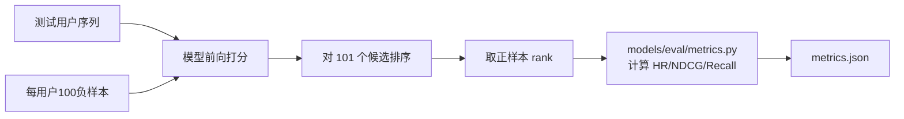

# 实验方案与评价体系

> **本文是毕业论文「实验设计」章节的素材来源**，所有实验脚本、参数、口径以本文为准。
> 指标实现唯一来源：`models/eval/metrics.py`。**禁止在任何脚本中重写指标计算。**
> 消融实验细节见 [ablation-study.md](ablation-study.md)，结果填写见 [result-analysis.md](result-analysis.md)。

---

## 一、实验目标

验证四个递进命题：

| # | 命题 | 对应实验 |
|---|---|---|
| H1 | 序列建模优于传统协同过滤 | 基线对比（ItemCF vs GRU4Rec vs SASRec） |
| H2 | 自注意力优于循环神经网络 | 基线对比（SASRec vs GRU4Rec） |
| H3 | 多兴趣建模提升小众题材覆盖 | 消融实验 + 分题材实验 |
| H4 | 内容融合缓解新番冷启动 | 消融实验 + 冷启动专项 |

---

## 二、数据集与预处理

### 2.1 数据集概况

来源：**MyAnimeList（MAL）**，已落位于 `dataset/` 目录。

| 文件 | 规模 | 用途 |
|---|---|---|
| `animes.csv` | 20,237 条动漫元数据 | 物品侧信息（标题/类型/年份/评分/题材/细分标签） |
| `ratings.npy` | 148,170,496 条评分（int32×3） | **权威交互源**，见下方「数据源判定」 |
| `ratings.csv` / `ratings.dat` | 同为 148,170,496 条，两者完全相同 | 参考源（相对 npy 有整体 +1 偏移，见下） |
| `id_to_genreids.json` | 20,237 条映射 | 动漫 → 21 类 MAL 主题材 ID |
| `dataset.pkl` | 用户 1,306,691 / 物品 15,687 | 已切分的 train/val/test 序列 + id 映射（**序列顺序的唯一口径**） |
| `random-sample_size100-seed98765.pkl` | 每用户 100 个负样本 | 评估负采样池 |
| `pretrained_bert.pth` | 116 MB | **⚠️ 不是内容编码器**，见下方说明 |

#### 数据源判定（必须记录，否则实验不可复现）

三个交互文件**并非同一口径**，实测结论如下：

| 用哪个文件重建 `dataset.pkl` 的物品集合 | 1,500 个抽样用户的一致率 |
|---|---|
| `ratings.npy` | **100.0%** |
| `ratings.csv`（= `ratings.dat`） | 90.7% |

全量抽样 1,500 用户的实测明细：可比评分单元 **166,567** 对，其中不同的 **8,896** 对（**5.34%**），
差异以 **+1 偏移为主（8,825 对，占差异的 99.2%）**，即 csv 相对 npy 被整体 +1 微调；
落在 6/7 正样本边界上、会造成判定翻转的有 **1,494 对（0.90%）**。
**结论：`dataset.pkl` 由 `ratings.npy` 口径构建（集合复现率 100%），本项目一律以 `ratings.npy` 为权威交互源。**
依据可复现：运行 `python scripts/diagnose_dataset_source.py`，结论落盘于 `data/processed/dataset_source_verdict.json`。

#### ⚠️ `ratings.npy` 存在重复评分行（去重规则必须写进论文）

实测发现**同一 `(userID, animeID)` 在 `ratings.npy` 中出现多行**：
抽样 300 个用户中有 **16 户**存在重复（共 **541 条冗余行**），
其中 **1 户**出现跨 7 分冲突（同一物品既有 `7` 也有 `<7` 的评分行）。

`dataset.pkl` 采用的是**逐行判定**口径——只要该物品存在**任一行** `rating >= 7`，
即计入该用户的正样本（不是「取最后一行」、也不是「取平均」）。这一点已用
`scripts/verify_stage1.py` 的 C 组检查固定下来：若误用 last-value 语义，该用户会少 1 个物品。

> 影响范围：这是清洗章节必须披露的细节。若后续自行重建数据集，
> 去重规则应写成「按 `(user, anime)` 取 max(rating)」，与官方切分保持一致。

#### ⚠️ `pretrained_bert.pth` 的真实身份

文档早期版本把它写成 DistilBERT 权重，**这是错的**。实际检查其 state_dict：

```
bert.embedding.token_ids            (15687,)        物品 id 表
bert.embedding.genre_ids            (15687, 5)      每物品的题材 id
bert.embedding.token.weight         (15689, 256)    物品嵌入
bert.embedding.genre_embed.weight   (22, 256)       题材嵌入
bert.transformer_blocks.0/1         (256 维, 2 层)
out.weight                          (15688, 256)    物品输出投影
```

这是一个**跑在本数据集上的 BERT4Rec 式序列推荐模型**（epoch=3 的中断训练检查点），
不是文本编码器——它没有词表、没有 word_embeddings，无法编码任何自然语言文本。
内容语义向量改用真正下载的 `distilbert-base-multilingual-cased`，见 2.4。

#### 已完成的过滤（已用 `scripts/preprocess.py` 逐条复现验证）

| 过滤项 | 更正后的真实规则 | 结果 |
|---|---|---|
| 正样本判定 | `rating >= 7`（评分 1~6 一律丢弃，7~10 一律保留，无例外） | 77.24% 的交互为正样本 |
| 用户过滤 | **正样本交互数 >= 10** | 保留 **1,306,691** 用户 |
| 物品过滤 | **正样本交互数 >= 10** | 保留 **15,687** 物品 |
| 缺失值 | `score` 列的 `?` 占位符（593 条）、`year` 非数值（136 条）转 NaN | 已处理 |
| 不合规题材 | **`dataset.pkl` 实际并未剔除**，见第十节 | 1,551 个此类物品在池内，评估阶段屏蔽 |

> 早期文档把用户阈值写作「< 5」、物品阈值写作「< 10」，与数据实际不符，已更正。
> 注意：物品阈值 >= 10 意味着**池内不存在交互数 < 10 的物品**，
> 因此「交互数 < 10 即新番」的冷启动口径会得到空集，2.5 节改用长尾分位口径。

### 2.2 题材体系（12 类）

从 21 类 MAL 主题材 + `genres_detailed` 细分标签归并为 12 类，用于分题材实验与兴趣胶囊打标。
口径定义在 `configs/genre_taxonomy.yaml`（唯一事实来源）。

| id | 题材 | MAL 映射 | 覆盖数（可多标签） | 主标签数 |
|---|---|---|---|---|
| 1 | 热血战斗 | Action | 4,664 | 680 |
| 2 | 冒险奇幻 | Adventure, Fantasy | 5,205 | 2,849 |
| 3 | 日常治愈 | Slice of Life, Gourmet | 1,084 | 780 |
| 4 | 恋爱校园 | Romance (+Girls/Boys Love) | 2,287 | 1,258 |
| 5 | 悬疑推理 | Mystery, Suspense | 1,145 | 1,047 |
| 6 | 科幻机战 | Sci-Fi | 2,728 | 2,173 |
| 7 | 喜剧搞笑 | Comedy | 5,389 | 1,304 |
| 8 | **运动竞技** | Sports | 618 | **567** |
| 9 | 超自然灵异 | Supernatural, Horror | 1,582 | 1,005 |
| 10 | 剧情文艺 | Drama, Award Winning, Avant Garde | 2,934 | 680 |
| 11 | **青春音乐** | 细分标签词边界匹配（idol/band/musical/…） | 1,364 | 1,364 |
| 12 | **后宫福利** | Ecchi | 813 | 732 |

> 统计范围为**推荐池的 15,687 个物品**（非全部 20,237 条元数据）。
> 「覆盖数」为包含该题材的物品数（一物可多题材）；「主标签数」为 `is_primary` 唯一的物品数。

**主标签（`is_primary`）的确定**：一部动漫常有多个题材，分题材实验（E4）需要唯一主标签，
故采用**特定优先**原则——越具体的题材优先级越高，避免小众番被 Comedy/Action 这类泛题材吞掉：

```
青春音乐 > 运动竞技 > 后宫福利 > 悬疑推理 > 科幻机战 > 超自然灵异
        > 日常治愈 > 恋爱校园 > 冒险奇幻 > 热血战斗 > 剧情文艺 > 喜剧搞笑
```

若不做此处理，2,000 多部运动/音乐番会被归到喜剧或热血里，**直接摧毁 H3 假设的检验效力**。

**「青春音乐」的判定为什么不用 `music` 标签**：语料中带 `music` 标签的动漫有 3,616 部，
但其中 2,339 部只是配乐出色（Cowboy Bebop、Samurai Champloo、Initial D…），并非音乐番。
改用「表演性」强信号词（idol/band/musical/singer/concert/…）并做**词边界**匹配后，
命中 2,100 部，语义准确度显著提升；词边界也避免了 `contraband` 命中 `band` 这类误判。

> **小众题材关注对象**：运动竞技（567）、后宫福利（732）、青春音乐（1,364）、悬疑推理（1,047）。
> 这四类的 Recall@10 提升是验证「多兴趣建模价值」的关键证据。
>
> 注：1,248 个池内物品**没有任何 12 类题材标签**（8.0%）——它们的 MAL 题材只有
> Hentai/Erotica，即下文第十节的合规题材。这些物品在题材实验中被排除。


### 2.3 序列构造与数据集划分

采用**留一法（Leave-One-Out）**，直接复用 `dataset.pkl` 的划分：

| 划分 | 内容 | 样本量 |
|---|---|---|
| 训练集 `train` | 用户序列去掉最后 2 条 | 1,306,691 用户 |
| 验证集 `val` | 倒数第 2 条 | 1,306,691 条 |
| 测试集 `test` | 倒数第 1 条 | 1,306,691 条 |
| 负采样池 | 每用户 100 个随机负样本 | 130,669,100 条 |

#### ⚠️ 时序口径（必须写进论文「局限性」）

原始三个交互文件**都没有时间戳字段**（只有 `userID, animeID, rating`），
因此 rq.md 要求的「按时间戳升序排序」**在数据层面无法执行**。
进一步实测：`dataset.pkl` 的序列顺序也无法从原始文件复现——

| 顺序复现（1,500 抽样用户） | 一致率 |
|---|---|
| 物品**集合** | **100.0%**（规则已完全还原） |
| 物品**顺序** | 60.7%（npy 口径） |

即：**能重建出"用户看过哪些番"，但重建不出"按什么顺序看的"**。
`dataset.pkl` 是唯一保留了排序信息的载体（推测其构建者使用了带时间戳的原始版本，
而落盘的 csv/dat/npy 是剥离时间戳后的再导出）。

**处理方式**：以 `dataset.pkl` 的既有顺序作为唯一时序口径，不做重排。
**论文表述要求**：不得声称序列是"按真实播放/收藏时间排序"，
应表述为「采用公开数据集提供的序列顺序，该顺序承载了数据集构建时的时序信息」。
这是本项目最需要如实披露的数据局限。

**序列长度**：`max_len = 50`。超出截断（保留最近 50 条），不足左侧补齐 `PAD=0`。
实测 592,753 个用户的训练序列长度超过 48，会被截断。

⚠️ **两种"截断"不是一回事，容易混**（M2.3 落地时定稿）：

| 概念 | 值 | 含义 |
|---|---|---|
| 完整序列（train+val+test）上限 | 50 | 数据侧口径 |
| **模型单次前向的输入上限** | **48** | = 50 − val 占 1 位 − test 占 1 位 |
| 每个用户贡献的**样本数** | `len(train)`，**不因截断而减少** | = 窗口数 |

即第 `t` 个样本取「原序列中 `t` 之前的**最近 48 条**」作为输入，
而**不是**先把序列砍到 48 条再滑窗 —— 后者会把窗口数从 1.09 亿压到 6,272 万，
与阶段一验收过的数字对不上。48 这个上限保证 `val` 评估（输入 = train，≤48）
与 `test` 评估（输入 = train+val，≤49）都不会超过 50 个位置，位置编码不越界。

**训练样本扩充**：滑动窗口。对长度为 `n` 的训练序列，构造 `n` 个训练样本 `(prefix[0:t] → item[t])`（`t` 从 1 到 `n`）。

```
原始序列: [v1, v2, v3, v4, v5]
样本1: []            → v1
样本2: [v1]          → v2
样本3: [v1, v2]      → v3
样本4: [v1, v2, v3]  → v4
样本5: [v1..v4]      → v5
```

**实测规模**：滑动窗口展开后共 **109,081,471** 个训练样本（均值 83.5 / 用户，最大 8,917）。
样本量过大不宜落盘，实际训练时由 `models/sasrec/dataset.py` **在线生成**，
`scripts/preprocess.py` 只负责统计规模（见 `data/processed/preprocess_report.json`）。

### 2.4 内容特征库构建

| 步骤 | 做法 |
|---|---|
| 输入文本 | `title + alternative_title + genres(中文12类) + genres_detailed(细分标签，最多 24 个)` |
| 编码模型 | `distilbert-base-multilingual-cased`（本地权重 `models/content_encoder/pretrained/`） |
| 池化 | 取 `[CLS]` 向量（768 维） |
| 降维 | 在语料上拟合 **PCA** 投影到 **512 维**（累计解释方差比见 `content_meta.json`） |
| 归一化 | L2 归一化（使内积等价于余弦相似度） |
| 输出 | `data/features/content_vec_512.npy`（15,687 × 512，float32，约 32MB）<br>`data/features/content_vec_512_all.npy`（20,237 × 512，含未入池新番） |
| 索引 | FAISS `IndexFlatIP`（内积即余弦，因已归一化） |

#### 两处与早期文档的偏差（已更正）

**偏差一：没有剧情简介。** `animes.csv` 的列只有
`animeID/title/alternative_title/type/year/score/episodes/mal_url/sequel/image_url/genres/genres_detailed`，
**不存在 summary / synopsis 字段**。rq.md 要求的「题材标签 + 剧情简介」只能取前一半。
替代方案是用 `genres_detailed` 的数十个细分标签（如 `battle of wits`、`time skip`、
`based on a light novel`），其信息密度足以支撑语义向量。
若后续要补简介，可用 `mal_url` 爬取（20,237 次请求），或引入外部带简介的数据集。

**偏差二：降维不用「随机线性投影」。** 早期文档写「[CLS] → 线性投影到 512 维」，
但未训练的随机线性层会破坏语义结构。改为在语料上拟合 PCA（确定性、可复现），
投影矩阵落盘为 `content_pca.npz`，新番上线时用同一矩阵投影即可。
若要严格照搬文档口径，加 `--reduce random`。

```bash
# ① 一次性下载权重到本地（脚本内置代理，避开 huggingface_hub 的代理兼容问题）
python scripts/download_content_encoder.py

# ② 构建向量（CPU 可跑，默认离线加载本地权重）
python scripts/build_content_vectors.py --dim 512 --reduce pca --batch-size 64

# ③ 仅对进入推荐池的 15,687 个物品构建
python scripts/build_content_vectors.py --subset pool
```

> 注意：CPU 环境（本机 torch 为 `2.14.0+cpu`）下编码 20,237 条文本约数分钟。
> 有 GPU 时加 `--device cuda` 显著加速。

### 2.5 冷启动子集构造（E3 的核心，口径经过重设计）

| 项 | 定义 |
|---|---|
| 构建脚本 | `scripts/build_cold_start_subset.py` |
| **口径** | **holdout：上映年份 >= 2021 的动漫全部从训练集剥离**（模拟新番上线） |
| 新番规模 | **2,783 个物品**（占推荐池 17.7%） |
| 冷启动测试集 | **209,912 条**测试样本（目标物品属于新番，远超 5,000 的统计显著性下限） |
| 训练集剥离 | **15,344,636** 条交互（占训练总量 **14.07%**），涉及 743,556 个用户 |
| 负样本 | 池限定为新番集合（同分布），每样本 100 个，`cold_start_negatives.npy` |
| 出厂配置 | `configs/data.yaml` 的 `cold_start` 段 |

#### ⚠️ 为什么必须改口径：本数据集不存在严格意义的物品冷启动

早期文档定义新番为「交互数 < 10」。逐条核对后发现**这个口径不可用**：

1. 物品过滤规则本身就是「保留正样本交互数 >= 10 的物品」，故池内**不存在**交互数 < 10
   的物品，「< 10」得到空集；
2. 更根本的是，留一法只把每个用户的最后 2 条划给 val/test，
   因此**池内每个物品在训练集中至少出现 6 次**（实测最小值 = 6，
   训练中出现次数 <= 5 的物品数为 0）——**没有任何物品是模型「没见过」的**。

也就是说，这个数据集在构造时就把冷启动物品过滤掉了。必须用**模拟**口径。

#### 两种可选口径与其代价（实测）

| 口径 | 新番数 | 冷启动测试样本 | 剥离训练交互 | 占训练总量 |
|---|---|---|---|---|
| 年份 >= 2018 | 4,657 | 466,952 | 34,871,712 | **31.97%** |
| 年份 >= 2019 | 3,997 | 380,670 | 27,664,655 | 25.36% |
| **年份 >= 2021（默认）** | **2,783** | **209,912** | **15,344,636** | **14.07%** |
| 长尾后 20%（交互数 <= 38） | 3,200 | 446 | 67,199 | 0.06% |

选择 2021 的理由：剥离 14% 训练交互意味着「这些新番在训练时还不存在」，
正是真实的冷启动场景，而模型仍有 86% 的学习信号可用于学习物品嵌入与序列模式。
若把阈值调到 2018，剥离比例升至 32%，训练信号损失过大，会造成 E1/E2 与 E3 不可比。

> 长尾口径虽然几乎不动训练集，但测试样本仅 446 条，**达不到统计显著性要求**，
> 故仅作为备选（`--mode longtail`），不用于主实验。

#### 两条「否则实验无效」的约束

1. **新番在训练集中必须不可见**——否则模型从交互中学到了它，内容融合的贡献被高估。
   本方案通过 `strip_from_train_item_ids` 强制剥离，实现方式是训练时对序列做掩码过滤。
2. **负样本必须与新番同分布**——若负样本来自热门物品，模型可凭「热度先验」区分正负，
   而不是靠内容向量。故 `cold_start_negatives.npy` 的负样本池**限定为新番集合**。

#### 训练时的具体做法

```python
# models/sasrec/dataset.py / train.py
strip = set(cold_split["strip_from_train_item_indices"])   # 2,783 个 smap 索引
# 构造训练序列时过滤掉这些索引（等价于它们当时尚未上线）
seq = [x for x in user_seq if x not in strip]
```

> E3 必须**单独训练一次模型**（用剥离后的训练集），不能复用 E1/E2 的权重，
> 否则「新番不可见」的前提不成立。

---

### 2.6 阶段一产物的验收方式

阶段一产物（`data/processed/`、`data/features/`）体积大且不入库，无法靠「看文件」验收；
也不应只信 `*_report.json`——**报告是产物，本身可能写错**。因此专门提供了独立检验器：

```bash
python scripts/verify_stage1.py              # 快速档，跑 A~F 共 31 项，约 40 秒
python scripts/verify_stage1.py --full       # 追加 G 段权威源比对，共 33 项，约 2 分钟
python scripts/verify_stage1.py --sample-users 500   # 加大抽样用户数（更稳但更慢）
```

`verify_stage1.py` 的核心原则是**独立重算**：它不把任何 `*_report.json` 当作依据，
而是回到 `dataset/` 与 `configs/` 原始文件重新推导每一条结论，再与产物比对。
所以「报告写错」或「产物与代码不一致」都会在这里暴露。

检查覆盖七组：快速档 31 项（A~F），加 `--full` 后 33 项（含 G）。
最近一次运行 2026-09-12：快速档 **31/31 通过，耗时 40 秒**；`--full` **33/33 通过，耗时 122 秒**。

| 组 | 检查内容 | 关键判据 |
|---|---|---|
| A | 产物完整性 | 15 个文件存在且非空（合计约 625 MB）；不齐则直接退出 |
| B | 序列数据集结构 | 用户 1,306,691 / 物品 15,687；**输出 pkl 与官方切分逐键一致（抽 2,000 用户）**；每用户正样本数 >= 10 |
| C | 交互口径 | 全量扫描 `ratings.npy` 独立复现：正样本阈值 = 7（逐项比对）；正样本>=10 的用户 1,306,705 ≈ 1,306,691；物品恰 15,687；重复评分按「任一行 >= 7」的逐行口径 |
| D | 题材与合规 | 池内仍含 1,551 个 Hentai/Erotica 物品；12 类题材每类非空 |
| E | 内容向量 | 形状 (15687, 512) / (20237, 512)；L2 归一化；**池内矩阵与全量矩阵按 anime_id 精确对齐**；无空行 |
| F | 时序与冷启动 | `ratings.csv` 无时间戳列；holdout 新番集合 == {year>=2021} ∩ 池；负样本仅取自新番；训练集内物品最少出现 6 次（无严格冷启动） |
| G | 权威源口径（仅 `--full`） | `ratings.npy` 集合复现率 100%，`ratings.csv` 明显偏低（300 用户抽样 95.0%）——证明必须用 npy |

结构化结果落盘 `data/processed/stage1_acceptance.json`，可直接贴入论文附录。
退出码 `0` = 全部通过，`1` = 存在失败项，可直接接入 CI。

> 注意：B 组的「与官方切分逐键一致」是**回归护栏**——任何后续改动若误改
> `train/val/test`，会立即 FAIL。验收标准的口径常量集中在脚本顶部 `EXPECT` 字典，
> 改口径必须同步本文件。

### 2.7 阶段一脚本执行顺序

阶段一共 6 个脚本（1 条主链路 + 1 个一次性下载 + 1 个取证器 + 1 个验收器），
依赖关系如下。**顺序不可随意调换**：`build_content_vectors.py` 与
`build_cold_start_subset.py` 都依赖 `preprocess.py` 的产物，跑在它前面会直接报错；
而只重跑后者而不重跑前者，会得到「内容向量与物品集合对不上」的静默错误。

| # | 脚本 | 依赖 | 产物 | 性质 |
|---|---|---|---|---|
| ① | `preprocess.py` | `dataset/` 原始文件 + `configs/` | `data/processed/` 7 个文件 | **必须最先** |
| ② | `download_content_encoder.py` | 无（联网） | `models/content_encoder/pretrained/` | 一次性，权重已存在则跳过 |
| ③ | `build_content_vectors.py` | ① 的 `anime_meta` / `anime_detailed_tags` | `data/features/` 内容向量 | 与 ④ 独立 |
| ④ | `build_cold_start_subset.py` | ① 的 `item_stats` / `seq_dataset` | `cold_start_*.pkl/npy/json` | 与 ③ 独立 |
| ⑤ | `diagnose_dataset_source.py` | 仅 `dataset/` 原始文件 | `dataset_source_verdict.json` | 与 ① 无依赖，可随时跑 |
| ⑥ | `verify_stage1.py` | ①③④⑤ 的全部产物 | `stage1_acceptance.json` | **必须最后** |

为此提供了固化顺序的一键执行器（已内置前置检查与产物检查，顺序跑错会明确报出应先跑哪一步）：

```bash
python scripts/run_stage1.py                 # 缺什么跑什么；产物已存在的步骤自动跳过
python scripts/run_stage1.py --dry-run       # 只打印将执行的命令与跳过理由
python scripts/run_stage1.py --force         # 忽略「产物已存在」，全部重跑
python scripts/run_stage1.py --from content  # 从 ③ 开始（前面已完成的跳过）
python scripts/run_stage1.py --only verify --verify-full
python scripts/run_stage1.py --list          # 列出步骤、依赖、产物与当前状态
```

> 完全重跑一次全流水线（`.gitignore` 已排除产物，新克隆仓库必须全跑）的顺序即 ①→⑥；
> 日常开发通常只需 ⑥，约 40 秒。

> **工作目录无关**：以上命令（含单独执行某一个脚本）在**任意目录**下结果一致。
> `configs/*.yaml` 里的相对路径在读取配置时会被锚定到项目根，因此
> `cd F:/pj && python scripts/preprocess.py` 与
> `python F:/pj/scripts/preprocess.py`（在别的目录下）完全等价。
> 新增脚本必须遵守该约定，见 `docs/dev-conventions.md` 第 3.0 节。

### 2.8 阶段二评估栈的验收方式

M2.2（评估器）与 M2.3（滑动窗口 Dataset）是主链路上**最容易静默跑偏**的两块：
滑窗索引错一位，指标只是小幅变化，看不出是 bug 还是正常波动；负采样不小心把训练
物品放进去，指标会**明显变好**——而"变好"没人会去查。因此与阶段一同款做法：
提供独立验收器，**不信任何报告**，回到 `seq_dataset.pkl` 重新推导。

```bash
python scripts/verify_eval_stack.py                      # 32 项，约 21 秒
python scripts/verify_eval_stack.py --sample-users 50000 # 加大抽样（更稳）
```

最近一次运行 2026-09-12：**32/32 通过，耗时 21.3 秒**。
结构化结果落盘 `data/processed/eval_stack_acceptance.json`，退出码 `0/1` 接 CI。

| 组 | 检查内容 | 关键判据 |
|---|---|---|
| A | 数据集结构 | 窗口总数 == **109,081,471**；输入上限 == 48；截断用户数 == **592,753**（与阶段一逐位吻合） |
| B | **因果性** | 只改未来物品 → 前半段窗口输入**逐字节不变**（真实数据、最长序列 8,917 上验证）；输入严格等于 `seq[t-48:t]` 的左填充 |
| C | 负采样 | 不含训练物品、不含正样本、每行 100 个互不相同、同 seed 逐位一致、**打乱顺序/取子集后逐行结果不变**、dtype=int32 |
| D | 评估输入 | `val` 输入 = train；`test` 输入 = train+val 且泄漏率在数据固有水平内 |
| E | **端到端无偏性** | 随机打分器的 HR@10 ≈ **10/101**（3σ 容忍带）、HR@5 ≈ 5/101；`batch_size=1` 与 `1024` 结果一致（分块无损） |

> E 组的「随机打分器 HR@10 ≈ 10/101」是评估链路无偏的**硬证据**：
> 正样本固定放第 0 列若被无意中赋予了额外优势、或排序方向写反，
> 这个数字会立刻偏离，且不随样本量增大而收敛。
>
> ⚠️ 该随机打分器必须用**独立同分布**的随机分数（本项目用固定种子的
> `rng.random()` 查表）。**不要用 `(id * C) % P` 这类线性哈希冒充随机**：
> 相邻 id 的哈希差恒定，正负样本的 id 分布差异会变成系统性偏移，
> 实测会让 HR@10 稳定停在 0.0783（真值 0.0990），样本量再大也不收敛。

---

## 三、实验环境

### 3.1 硬件与软件

> ⚠️ **下表为实测值**（2026-09-12 核对）。早期版本写的是「RTX 3090 24GB / 双端验证」，与实际不符，已更正。
> **GPU 已于 2026-09-12 打通**：`torch.cuda.is_available() == True`，
> 实测 fp16 矩阵乘 **12.8 TFLOPS**（Tensor Core 已启用，AMP 可用）。
> 打通过程与完整证据链（驱动文件写坏 → 设备 Code 52）见 [progress.md](progress.md) §3.3。

| 项 | 实测配置 | 备注 |
|---|---|---|
| 操作系统 | Windows（内核 10.0.26200 / DisplayVersion 25H2） | Linux 端**未验证** |
| CPU | Intel 16 逻辑核 | — |
| GPU | **NVIDIA RTX 2060 / 6 GB / sm_75 / 驱动 616.92** | ✅ 已验证可用；注意 **batch 上限 2048**，4096 会因显存触顶（5.46 GB）性能崩塌 |
| 内存 | 31.7 GB | 加载 `ratings.npy`（6.9 GB）前建议先释放内存 |
| 磁盘 | F: 余 66 GB | 充足 |
| Python | 3.11.16（conda env `py3_11`） | `E:\tools\anaconda\envs\py3_11\python.exe` |
| PyTorch | **2.14.0+cu130**（CUDA 13.0）+ cuDNN 92400 | ⚠️ PyPI 默认源只给 `+cpu` 轮子，必须显式指定 CUDA 索引 |
| 实测吞吐 | **train 40,083 / infer 98,088 samples/s** | batch 2048 + AMP + 训练候选 2；MFU 6.2%（瓶颈在 kernel 启动与小矩阵，非算力） |
| 关键库 | numpy 2.4.6, pandas 2.3.3, transformers 4.57.1, scikit-learn 1.9.0 | faiss 未安装（阶段 2 可先用 numpy 精确内积） |

### 3.2 环境固化

```bash
# 完整环境快照（论文附录用）
python -c "import torch,sys;print(sys.version);print(torch.__version__, torch.version.cuda)"
pip freeze > experiments/{exp_id}/requirements_freeze.txt
```

每次实验输出目录必须包含 `requirements_freeze.txt` 与 `git commit hash`，保证可复现。

> ✅ **已完成（2026-09-12）**：环境快照固化为根目录 `requirements.lock`（152 包，记录真实版本号）。
> **不用 `pip freeze` 的原因**：本机是 conda 环境，conda 装的包在 pip freeze 里会显示成
> `pkg @ file:///C:/...` 的本地路径，既不可移植、也无法在别的机器上安装。
> 论文附录建议同时给出 `requirements.lock` 与 §3.1 的硬件表。

### 3.3 随机性控制

| 项 | 值 |
|---|---|
| 随机种子 | `42`（主实验）；`{42, 2024, 2025}` 三种子取平均（最终报告） |
| 控制范围 | `random` / `numpy` / `torch` / `cuda` 全部设种 |
| cuDNN | `torch.backends.cudnn.deterministic = True`，`benchmark = False` |
| DataLoader | **训练集 `shuffle=True`（必须）**；验证 / 评估集 `shuffle=False` 且按行号升序 |
| 结果波动 | 同种子重跑指标必须完全一致；否则视为有未控随机源，必须排查 |

> **为什么训练集必须 shuffle**（M2.3 落地时定稿）：滑动窗口样本是按用户行号
> **连续排列**的（用户 0 的全部窗口 → 用户 1 的全部窗口 → …）。若不 shuffle，
> 一个 batch 内全是同一批用户的连续历史，梯度方向严重偏斜、loss 不收敛。
> 这与「序列推荐按用户顺序可固定」的早期设想相反，早期文档的 `shuffle=False`
> 是针对"每个用户一条样本"的写法，不适用于本项目的在线滑窗。
>
> **为什么评估集必须不 shuffle**：评估要能按用户行号切片分组（E4 分题材、
> E3 冷启动子集），顺序一变分组就错位；且评估本身不涉及梯度，无需打乱。

```python
# scripts/train.py 中的 set_seed
def set_seed(seed):
    random.seed(seed); np.random.seed(seed)
    torch.manual_seed(seed); torch.cuda.manual_seed_all(seed)
    torch.backends.cudnn.deterministic = True
    torch.backends.cudnn.benchmark = False
```

---

## 四、对比基线

| 类型 | 模型 | 实现位置 | 实现的公平性要求 |
|---|---|---|---|
| 零信息对照 | **Popularity（热度）** | `models/baselines/popularity.py` | 只用**训练集**物品频次；完全忽略用户历史（E1 强制项，见 6.7） |
| 传统协同过滤 | **ItemCF** | `models/baselines/itemcf.py` | 基于训练集**二值**共现矩阵，余弦相似度，TopK=200 邻居 |
| 经典序列模型 | **GRU4Rec** | `models/baselines/gru4rec.py` | 隐藏层 64，1 层 GRU，与本文模型同嵌入维度 |
| 基准序列模型 | **原版 SASRec** | `models/sasrec/model.py` | 2 层、2 头、hidden=64、dropout=0.2 |
| 本文模型 | **多兴趣 + 内容融合 SASRec** | `models/multi_interest/` + `content_encoder/` | 在上者基础上加 K=4 胶囊 + 双路融合 |

一键复现（三个基线共用主链路的抽样/负样本/评估器/早停）：

```bash
python scripts/run_baselines.py --baseline all --scale main       # 热度、ItemCF 秒级；GRU4Rec 要训练
python scripts/run_baselines.py --baseline popularity --scale main --split test
```

实现细节与两处坑（`pack_padded_sequence` 不适用于左填充、ItemCF 全零行的并列假象）
见 [`models/baselines/README.md`](../models/baselines/README.md)。

### 4.1 公平性控制（论文答辩必问）

| 控制项 | 做法 |
|---|---|
| 同一数据划分 | 全部模型用同一个 `dataset.pkl` 的 train/val/test |
| 同一负采样池 | 全部模型共用 `random-sample_size100-seed98765.pkl` |
| 同一嵌入维度 | 物品嵌入统一 64 维（ItemCF 无需嵌入） |
| 同一评估协议 | 全部走 `models/eval/evaluator.py`，候选 = 1 正 + 100 负 |
| 同一早停策略 | 看验证集 NDCG@10，patience=10 |
| 超参搜索预算一致 | 每个模型同样的网格规模（见 4.2） |

### 4.2 超参搜索网格

| 参数 | 搜索范围 | 最优值（待实验确定） |
|---|---|---|
| `hidden_size` | {32, 64, 128} | 待填 |
| `num_layers` | {1, 2, 3} | 待填 |
| `num_heads` | {1, 2, 4} | 待填 |
| `dropout` | {0.1, 0.2, 0.3, 0.5} | 待填 |
| `lr` | {1e-4, 5e-4, 1e-3, 2e-3, 4e-3} | 待填（M2.4 预扫描已定 1e-3 为起点：debug 档 8 epoch 固定预算下 0.001 最优 0.7871 > 0.002 的 0.7807 > 0.004 的 0.7739，5e-4 探针 0.7842 确认不在边界外；组间差 ≤1.3% 接近噪声，正式最优先由 HPO 定） |
| `batch_size` | {512, 1024, 2048} | 待填（⚠️ 128/256 已从网格移除：M2.0 实测无吞吐优势，且 AMP 在其上**反而更慢**） |
| `K`（兴趣数） | {2, 4, 6, 8} | 待填（预期 4） |

搜索方式：先粗网格定范围，再对 `hidden/lr/dropout` 做细搜。**记录完整搜索日志到 `experiments/{exp_id}/hpo_log.csv`**，论文可放热力图。

---

## 五、评价指标

### 5.1 指标定义

统一采用留一法 + 100 负采样（1 正 : 100 负）的标准序列推荐评估协议。

**HR@K（Hit Ratio，命中率）**

```
HR@K = (1/|U|) · Σ_{u∈U} 1( rank(positive_u) ≤ K )
```

含义：推荐列表 TopK 中出现真实下一部动漫的用户占比。

**NDCG@K（Normalized Discounted Cumulative Gain）**

```
DCG@K  = Σ_{i=1..K} (2^rel_i - 1) / log2(i + 1),   rel_i = 1 若位置 i 是正样本，否则 0
IDCG@K = 1 / log2(2) = 1                            (理想情况正样本排在第 1 位)
NDCG@K = DCG@K / IDCG@K
```

含义：不但要看"有没有命中"，还要看"排在第几"。命中位置越靠前得分越高。

**Recall@K（分题材实验用）**

```
Recall@K = Σ_u |TopK_u ∩ Relevant_u| / Σ_u |Relevant_u|
```

含义：在分题材实验中，`Relevant_u` 限定为该题材的测试正样本，用于衡量模型对该题材的覆盖能力。

**MRR（辅助指标）**

```
MRR = (1/|U|) · Σ_u 1 / rank(positive_u)
```

**K 取值**：`K ∈ {5, 10}`，与 rq.md 要求一致。

### 5.2 评估流程



**严格实现要求**：

| 要求 | 说明 |
|---|---|
| 候选集 | 1 个正样本 + 100 个负样本 = 101 个候选，**不是全库排序** |
| 负样本 | 使用预生成的 `random-sample_size100-seed98765.pkl`，所有模型完全一致 |
| 排名定义 | 从 1 开始计数（`rank=1` 表示排第一） |
| 并列处理 | 用**稳定排序** `torch.argsort(..., descending=True, stable=True)`：并列元素保持列序，**列序在前者优先**。评估时正样本固定放第 0 列，故完全并列时正样本得 `rank=1`（对正样本的乐观口径） |
| 无效样本 | 若正样本在训练/验证集已出现，该样本剔除并记录数量 |
| 聚合方式 | HR / NDCG / MRR 为**宏平均（macro）**：先按用户算再平均；**Recall@K 例外**，按 5.1 的定义是 micro（`Σ命中 / Σ相关`） |
| 空样本集 | 返回 `0.0` 而非 `nan`（保证 `metrics.json` 是合法 JSON）。因与"真的得 0 分"不可区分，**必须同时报告样本量** |
| 输入序列上限 | **48**（= `max_seq_len 50` − val/test 各占的 1 个位置），左填充 `PAD=0` |

> **实现位置**：以上全部由 `models/eval/metrics.py` 唯一实现（约定见 dev-conventions 3.x）。
> `ranking_metrics()` 会一并返回 `n_samples`，满足上表最后一行与 6.3 节的样本量披露要求。

**评估栈的分工**（各司其职，不重复实现）：

| 关注点 | 唯一实现 | 说明 |
|---|---|---|
| 指标公式 | `models/eval/metrics.py` | HR / NDCG / Recall / MRR |
| 抽哪些负样本 | `models/data/negatives.py` | 1 正 100 负、无放回、排除训练物品 |
| 历史序列怎么拼 | `models/sasrec/dataset.py` | 滑窗、截断、左填充、E3 剥离 |
| 串起来跑前向 | `models/eval/evaluator.py` | 分批打分、剔除泄漏、产出 `metrics.json` |
| 验收 | `scripts/verify_eval_stack.py` | 32 项独立重算，退出码接 CI |

#### M2.2 实测记录：答案泄漏率（**必须写进论文**）

「若正样本已出现则剔除」这条口径此前只有规定、没有数字。M2.2 实测结果如下
（抽样 20,000 用户，seed 42）：

| 口径 | test 泄漏率 | val 泄漏率 |
|---|---|---|
| 按**完整历史**判断（train 或 train+val 里出现过） | **1.665%** | **1.995%** |
| 按**模型实际可见的输入**判断（截断到 48 之后） | **0.95%** | ~1.0% |

**成因**：用户在序列中**重复消费同一部番**。例如用户行 693545（train 长度 1,195）
的 test 目标是物品 3427，而该物品在 train 中出现于第 507 / 561 / 722 位 ——
留一法把"最后一次"划给 test，但更早的历史里已经有它。实测该用户序列中有 339 个
物品重复出现（最多 8 次）。

**这不是 bug，是数据的真实性质**，但有两个直接影响：

1. **评估流程必须真的剔除**（`evaluator.drop_leaked_samples()`），不能只在文档里写；
2. **论文必须披露剔除数量**，否则"评估用户数 130,669"与"实际参与计算的样本数"
   对不上。按 0.95% 估算，`main` 档实际评估样本约 **129,400** 而非 130,669。

> 两条泄漏率的差异（1.665% vs 0.95%）来自**尾部截断**：超长序列里位置很靠前的
> 重复，截断到最近 48 条后模型根本看不到。判据取「模型可见输入」才与模型实际
> 获得的信息一致，故 `evaluator` 采用后者。

#### M2.2 实测记录：负采样成本

负采样实测 **67 μs / 用户**（`(seed, row)` 派生独立随机流，见下）。
换算到各档位：`dev` 约 0.9 秒、`main` 约 8.7 秒、全量 130 万用户约 **87 秒**。

因此**必须落盘缓存、跨模型复用**，不要每次训练都重算 —— 这同时保证了
「同一组对比实验内所有模型共用同一批负样本」这条公平性约束在实现层面成立。
缓存路径规范：`data/processed/negatives/{split}_{n_split}_seed{seed}.npy`
（`.gitignore` 内，不入库）。

> 为什么不是「一个 rng 顺序跑」：那样"第 k 个用户的负样本"会依赖"在它之前抽了
> 多少次"，换个子集或换个遍历顺序结果就变，跨模型复用的前提随之失效。
> `models/data/negatives.py` 为每行派生独立随机流，做到
> **同 seed + 同用户 ⇒ 永远同一批负样本，与子集、顺序、分块方式全都无关**
> （验收项 C7~C9 锁定该性质）。

#### 两条容易踩的口径坑（M2.1 实测记录）

1. **必须显式写 `stable=True`，不能依赖默认行为。**
   实测本机 torch 2.14.0：并列元素较多时（n ≥ 64，101 候选的真实规模必然满足），
   **非稳定**排序会给出任意次序；而 n ≤ 32 时它又"碰巧"按列序输出，所以这个问题
   在小规模自测中完全看不出来。一旦漏掉，NDCG 会随实现、线程数、设备变化而**不可复现**。
   回归测试：`tests/test_metrics/test_ranking_pipeline.py::test_stable_order_matches_python_reference`
   （用纯 Python 参考实现 `sorted(key=(-score, col))` 对拍，锁定 101 候选规模）。

2. **并列时对正样本取乐观口径必须写进论文。**
   正样本放第 0 列 + 稳定排序 ⇒ 完全并列时正样本排第 1。若换一种并列规则（例如对正样本
   取悲观口径），同一批分数会得到不同的 NDCG。这是**口径选择而非实现细节**，
   需在论文「评价协议」中一句话说明。

> 指标实现的测试是否**有效**，可用 `python scripts/check_metrics_mutation.py` 验证：
> 它故意把 6 类典型改错注入 `metrics.py`，要求测试逐一变红。基线本身不通过时会
> 直接拒绝给出结论（避免"基线在失败 → 退出码恒非 0 → 每个变异都假装被抓住"的假阳性）。


### 5.3 统计显著性

仅报告平均值不够，需给出显著性检验：

| 检验 | 用途 |
|---|---|
| 配对 t 检验（paired t-test） | 本文模型 vs 各基线，p < 0.05 视为显著 |
| 三随机种子取均值 ± 标准差 | 主实验表格中报 `mean ± std` |
| 样本量 | 1,306,691 用户，远超显著性所需样本量 |

---

## 六、实验分组

### 6.1 实验组 E1：整体效果对比

| 项 | 内容 |
|---|---|
| **目的** | 验证 H1、H2，证明本文模型综合最优 |
| **变量** | 模型（4 个：ItemCF / GRU4Rec / SASRec / 本文模型） |
| **控制** | 数据划分、负采样池、评估协议、早停策略全部一致 |
| **测试集** | 全量测试集（1,306,691 用户，每用户 101 候选） |
| **指标** | HR@5、HR@10、NDCG@5、NDCG@10、MRR |
| **输出** | `experiments/E1_overall/metrics.json` + 对比柱状图 |

### 6.2 实验组 E2：消融实验

| 项 | 内容 |
|---|---|
| **目的** | 验证 H3、H4，量化每个模块的独立增益与协同增益 |
| **变量** | 4 组配置（纯 SASRec / +多兴趣 / +内容融合 / 完整模型） |
| **控制** | 其余超参完全一致（同一 `hidden/layers/heads/lr/epochs`） |
| **测试集** | 全量测试集 |
| **指标** | HR@5/10、NDCG@5/10 |
| **输出** | 详见 [ablation-study.md](ablation-study.md) |

### 6.3 实验组 E3：冷启动专项

| 项 | 内容 |
|---|---|
| **目的** | 验证 H4——内容融合对无交互新番的作用 |
| **变量** | 完整模型 vs 纯 SASRec |
| **测试集** | **冷启动子集**（目标物品交互数 < 10 的测试样本） |
| **控制** | 训练时新番交互已剥离；负采样同为 100 个随机负样本 |
| **额外控制** | 对比「内容融合权重 0.3 vs 0.5」两档，验证动态权重设计 |
| **指标** | HR@10、NDCG@10 |
| **输出** | `experiments/E3_coldstart/metrics.json` |

**关键注意事项（否则实验无效）**：
1. 新番在训练集中**必须不可见**——否则模型从交互中学到了，内容融合的贡献被高估。
2. 冷启动子集的负样本也应该是新番（或至少同分布），否则模型可能靠"热门"而非"内容"区分正负。
3. 需报告冷启动子集的样本量。样本量过小时结论不可靠。

### 6.4 实验组 E4：分题材细分指标

| 项 | 内容 |
|---|---|
| **目的** | 验证 H3——多兴趣建模对小众题材的覆盖提升 |
| **变量** | 4 组消融配置（同 E2）× 12 类题材 |
| **测试集** | 全量测试集，按目标物品的主题材分组 |
| **指标** | Recall@10（每类题材单独计算） |
| **重点** | 小众题材（运动竞技/后宫福利/悬疑推理/青春音乐）的提升幅度 |
| **输出** | 12 × 4 的指标矩阵 + 分组柱状图 |

> **假设**：多兴趣模型对**小众题材**的提升应显著大于对主流题材（如喜剧搞笑、热血战斗）的提升——因为主流题材的单一兴趣向量已经能覆盖，小众题材必须靠多向量才能召回。**如果结果相反，需要在论文中如实讨论。**

### 6.5 实验矩阵总览

训练规模按 **档位** 控制（定义见 `configs/scale.yaml`），并且通过「跨实验组复用训练结果」压缩训练次数：

| 实验 | 档位 | 训练次数 | 复用说明 |
|---|---|---|---|
| E1 整体对比 | `main` | 9 | itemcf 无需训练；3 个神经模型 × 3 种子 |
| E2 消融 | `dev` | 2 | E2_1 复用 E1 的 sasrec，E2_4 复用 E1 的 ours，只剩 E2_2 / E2_3 |
| E3 冷启动 | `dev` | 2 | pure_sasrec 复用 E2_1，只剩 ours_w03 / ours_w05 |
| E4 分题材 | 复用 | 0 | 复用 E2 训练结果，只做评估 |
| HPO | `smoke` → `dev` | 8 + 3 | 粗搜 8 组单种子；入选的 3 组到 `dev` 档细搜 |
| 补充实验 | `dev` | 10 | K 敏感性 4 组 + 融合权重 6 组，均单种子 |
| **合计** | — | **约 26 次** | 原设计约 230 次（其中 HPO 60 组 × 3 种子 = 180 次） |

> ✅ **已实测（M2.0，2026-09-12）**：RTX 2060 6GB、`bs2048 + AMP` 实测 **40,083 samples/s**
> （**纯计算**）。上表约 26 次训练按「每档跑满 30 epoch」的保守口径合计 **1.66 天**。
>
> ⚠️ **M2.4 端到端复测后修正为约 2.2 天**（`bs1024`，实测 **39 ms/step**，
> 比纯计算慢约 35% —— 差额来自取数、训练侧负采样与 CPU↔GPU 搬运）。
> 各档端到端单次耗时：`smoke` 17.6 s/epoch（实测）/ `debug` 约 83 s /
> `dev` 约 207 s / `main` 约 416 s。**排期与论文里请用端到端数字**，
> 完整对照表与三条调参发现见 [progress.md](progress.md) §4.1 的 M2.4 记录。
>
> 早期文档的「~77 h / 72 次训练」按 RTX 3090 估 —— **已废弃，不得再引用**。

---

### 6.6 训练档位与算力预算

#### 6.6.1 为什么必须分档

总训练时长 = **每 epoch 样本量 × epoch 数 × 训练次数 ÷ 训练吞吐**。
本项目的瓶颈不只在吞吐（2060 相对 3090 慢数倍），更在**训练次数**：
按原设计，E1~E4 加 HPO 加补充实验，再乘 3 个随机种子，合计约 230 次训练。
即便单次训练只需 1 小时，总量级也是「年」。

因此采用三管齐下的策略：

| 杠杆 | 手段 | 效果 |
|---|---|---|
| 每 epoch 样本量 | 用户抽样（只抽用户，不抽物品） | 抽 5% 降到 1/20 |
| 训练次数 | HPO 降档、单种子、跨实验组复用 | 230 次 → 约 26 次 |
| 训练吞吐 | AMP 混合精度、数据加载调优 | 约 1.5~2 倍 |
| 评估开销 | 评估降频（`every_n_epochs: 5`） | ✅ 实测已证伪「评估与训练同量级」：`main` 档全量评估仅约 **1.6 s/轮**，全周期 ≈10 s，可忽略 |

#### 6.6.2 五个档位

| 档位 | 用户比例 | 用户数 | epoch 上限 | 种子数 | 纯计算 sec/epoch | **端到端 sec/epoch** | 用途 |
|---|---|---|---|---|---|---|---|
| `smoke` | 0.5% | 6,533 | 3 | 1 | 13 s | **17.6 s（实测）** | 改完代码先跑，确认链路没断 |
| `debug` | 2% | 26,134 | 30 | 1 | 54 s | 约 83 s | 判断改动方向（涨/跌），不看绝对值 |
| `dev` | 5% | 65,335 | 30 | 1 | 136 s | 约 207 s | HPO 细搜、消融、基线对比 |
| `main` | 10% | 130,669 | 30 | 3 | 273 s | 约 416 s | E1 主对比 + E2 消融的正式数字 |
| `full` | 100% | 1,306,691 | 30 | 1 | 2,721 s | 约 69 分钟 | 附录的全量规模验证，时间不够可放弃 |

> 用户在 [AskUserQuestion] 中的决策：**纯本地不花钱 + 先抽样、有余力再全量 + 优先牺牲种子数**。
> ✅ **2026-09-12 定稿：`main` 档取 10%，不上调 20%**（M2.4 实测端到端 416 s/epoch，
> 10% 档 E1 约 1.3 天；20% 会让 E1 单独吃掉 2.6 天，而 10% 已有 13 万用户 /
> 1,092 万样本，对本科毕设的结论强度足够）。只有 `main` 跑 3 个种子 ——
> 种子数是对结论影响最小的取舍项。

#### 6.6.3 抽样的三条口径（论文「实验设置」小节必须披露）

1. **只抽用户，不抽物品。** 物品池恒为 15,687，模型结构与输出层维度在所有档位完全一致，
   因此 `dev` 档选出的超参可以直接拿到 `main` 档使用，不需要按档位重新调参。
2. **抽样是确定性且严格嵌套的。** `0.5% ⊂ 2% ⊂ 5% ⊂ 10% ⊂ 100%`，
   实现见 `models/data/user_subset.py`（按 `user_id` 的 blake2b 哈希排序后取前缀）。
   换档位是「放大验证」而非「换一套数据重做」；且抽样结果与数组顺序无关，
   预处理重跑后历史实验仍然可比。
3. **评估子集独立抽取，且同档位内固定不变。** 否则不同 epoch 的指标不可比，best model 会选错。

> ⚠️ **分题材实验（E4）不得使用低于 `main` 的档位。**
> 运动竞技 743 条、后宫福利 837 条在 5% 抽样下只剩三四十条，分题材指标不具统计意义。
> 详见 `configs/experiment.yaml` 的 `E4_by_genre.min_scale_ratio`。

#### 6.6.4 算力预算（✅ M2.0 纯计算实测 + M2.4 端到端修正）

实测口径：**batch 2048 + AMP**，`train 40,083 samples/s`、`infer 98,088 samples/s`
（**纯计算**）。复现：`python scripts/bench_throughput.py --batch-sizes 512 1024 2048 --train-negatives 1`

⚠️ 下表用 **M2.4 端到端实测**（`bs1024`，39 ms/step）：

| 实验组 | 训练次数 | 档位 | 单次耗时（端到端） | 小计 |
|---|---|---|---|---|
| E1 整体对比 | 9 | `main`（10%，30 epoch） | 3.5 h | **1.31 天** |
| E2 消融 | 2 | `dev` | 1.7 h | 3.4 h |
| E3 冷启动 | 2 | `dev` | 1.7 h | 3.4 h |
| E4 分题材 | 0 | 复用 E2 | — | — |
| HPO 粗搜 | 8 | `smoke`（0.5%，3 epoch） | 53 s | 7 分钟 |
| HPO 细搜 | 3 | `dev` | 1.7 h | 5.1 h |
| 补充实验 | 10 | `dev` | 1.7 h | 17.0 h |
| **合计** | **约 26** | — | — | **≈ 2.5 天** |

口径说明：

- 上表按「每档都跑满 `max_epochs`」计，是**保守（偏大）**估计；实际有早停
  （patience=10，通常 20~30 epoch 收敛），总时长会更短。
- **端到端 vs 纯计算**：M2.0 那版表（合计 1.66 天）只算 GPU 上的矩阵运算，
  不含取数与滑窗组装。M2.4 落地训练循环后实测端到端比纯计算慢约 35%，
  故修正为 **2.5 天**。论文里报"训练耗时"时请用端到端数字。
- 上表不含 E1 新增的 **popularity 基线**（零训练成本，秒级出结果，见 §6.7）。
- 训练侧与评估侧的负样本数是**两件事**：评估恒为 1 正 + 100 负（口径固定，
  改则指标不可比）；训练侧取 SASRec 原论文的「每位置 1 个负样本」。
  实测两者对吞吐的影响只有 26%，见 `configs/model.yaml` 的 `train.negatives_per_position`。
- 三条影响调参的实测发现（AMP 需大 batch、候选集不是瓶颈、显存硬上限 2048）
  见 [progress.md](progress.md) §5.0。

#### 6.6.5 四条不可破坏的不变式

改档位时若破坏任一条，"小档调参、大档直接用"的策略立即失效：

1. 只抽用户，物品池恒为全量；
2. 各档位的用户集合必须严格嵌套；
3. 同一档位内，评估用户子集固定不变；
4. 模型结构与训练超参（`hidden_size` / `batch_size` / `lr` 等）**不随档位变化**。

> 这三条已写入 `configs/scale.yaml` 的 `invariants` 段，并由
> `tests/test_data/test_user_subset.py` 的嵌套性测试锁定。

#### 6.7 评估协议可信度：**必须**报告热度基线（M2.4 实测发现）

M2.4 训出第一个模型时 `val ndcg@10 = 0.716`，好得可疑（公开数据集上 SASRec 通常 0.05~0.20）。
做了三组对照后确认：**本数据集在「1 正 + 100 均匀负采样」协议下，指标主要由热度先验贡献。**

| 打分器（smoke 档，1 正 + 100 负） | hr@10 | ndcg@10 |
|---|---|---|
| 随机 | 0.074 | 0.030 |
| **仅按物品热度**（完全不知道用户是谁） | **0.866** | **0.607** |
| smoke 档模型 | 0.920 | 0.716 |

成因是**结构性**的，不是代码 bug：

* 正样本必然是「用户交互过、且交互数 ≥ 10 才进池」的物品 → 天然偏热门；
* 负样本从全池均匀抽 → 而全池热度极度长尾（中位 **288** 次 vs 均值 6,687 次）。

实测**正样本热度均值是负样本的 24.7 倍**，所以"给热门打高分"这条零信息策略
就能把正样本顶进前 10。模型只比它高 6%（HR）/ 18%（NDCG）。

**三条处置（缺一不可）：**

1. **E1 必须包含 popularity 基线**（`configs/experiment.yaml` 已加入）。
   SASRec 原论文表 3 也有这一行；不报它等于把热度先验的功劳记给序列建模。
2. **论文必须如实披露这一现象**，并在「局限性」里写明：
   该协议下绝对指标偏高，跨数据集比较需谨慎。
3. **诊断可复现**：`python scripts/diagnose_popularity_bias.py --scale smoke --ckpt <路径>`
   → 结果落 `logs/popularity_bias_*.json`。

**2026-09-14（M2.7）定量更新：连 ItemCF 也一起报。**
`scripts/run_baselines.py` 跑出 main 档（10% 用户 / seed 42）的正式数字：

| 打分器（main 档，test 集，n=129,382） | 训练成本 | 参数 | hr@5 | hr@10 | ndcg@10 | mrr |
|---|---|---|---|---|---|---|
| 仅按物品热度 | 0 | 0 | 0.7934 | 0.8996 | 0.6645 | 0.5956 |
| **ItemCF**（共现+余弦，TopK 200） | 0 | 0 | 0.8930 | **0.9597** | **0.7514** | 0.6865 |
| 正/负样本热度倍数 27.6×（正均值 17,381 / 负均值 629）、仅 5,176 个不同正样本 | | | | | | |

⇒ **本文模型的增益必须相对 ItemCF 报告**，"相对随机 +5 倍"在本协议下没有信息量。
同理，任何"我们的模型 ndcg@10 达到 0.7x"的表述都必须同时给出这两行，
否则读者无法判断其中多少来自热度与共现先验。

> ⚠️ **不要**为了让指标"更真实"而私自改负采样口径（例如改成热度分层负采样）——
> 阶段一的负样本 `random-sample_size100-seed98765.pkl` 已经定稿，
> 改口径会让全部历史实验失去可比性。若要补充更严格的协议，应作为
> **独立对照实验**另跑一组，并在论文里同时报告两套数字。

---

## 七、变量控制与测试集划分说明

### 7.1 三类变量的处理

| 变量类型 | 实验中的处理 |
|---|---|
| **自变量** | 要验证的模块开关（多兴趣有/无、内容融合有/无）、模型种类 |
| **控制变量** | 数据划分、负采样池、嵌入维度、层数、学习率、训练轮数、早停策略、随机种子 |
| **因变量** | HR@5/10、NDCG@5/10、Recall@10、MRR |

### 7.2 测试集划分的唯一性

**整个项目只有一份测试集**：`dataset.pkl` 的 `test` 字段（1,306,691 用户，每用户 1 条正样本）。所有实验从它派生：

| 派生子集 | 派生规则 | 仅用于 |
|---|---|---|
| 全量测试集 | 原样 | E1、E2、E4 |
| 冷启动子集 | 正样本属于 `n_interactions < 10` 的新番 | E3 |
| 分题材子集 | 按正样本的 `is_primary` 题材分组 | E4 |

> ⚠️ **绝不允许**为了让指标好看而重新划分测试集。任何划分变更必须记录在 `experiments/SPLIT_CHANGELOG.md`。

### 7.3 训练超参一致性检查

消融实验最容易犯的错是"某个配置多训了几轮"。必须用**同一份配置基线**：

```yaml
# configs/experiment.yaml
base:                        # 所有消融组共享的基线配置
  max_seq_len: 50
  hidden_size: 64
  num_layers: 2
  num_heads: 2
  dropout: 0.2
  batch_size: 1024           # M2.0 实测甜点（256 已废弃：无吞吐优势且 AMP 更慢）
  lr: 0.001                  # ✅ M2.4 已重标定：batch 1024 下 0.001 仍最优（见 4.2）
  epochs: 200                # 仅作上限，实际由档位的 max_epochs 收紧
  early_stop_patience: 10
  neg_sample_num: 100        # 【评估】1 正 + 100 负，改动会使全部指标不可比
  train_negatives_per_position: 1   # 【训练】SASRec 原论文口径，与上面是两件事
  amp: true                  # ⚠️ 仅在 batch>=512 时才有收益
  seed: 42

groups:
  E2_1_pure_sasrec:      { use_multi_interest: false, use_content_fusion: false }
  E2_2_multi_interest:   { use_multi_interest: true,  use_content_fusion: false }
  E2_3_content_fusion:   { use_multi_interest: false, use_content_fusion: true  }
  E2_4_full:             { use_multi_interest: true,  use_content_fusion: true  }
```

跑实验时只允许覆盖 `groups` 里的开关，`base` 里的任何值被改动都必须记录原因。

> **本节是唯一事实源。** 上面这份配置曾与 `configs/experiment.yaml` 不一致
> （文档写 `batch_size: 256`、配置写 1024），M2.4 已对齐。改任一处请同时改另一处。

---

## 八、实验执行

### 8.1 一键跑全部实验

```bash
# 全部实验（E1 + E2 + E3 + E4）
python scripts/run_experiments.py --config configs/experiment.yaml --all

# 只跑消融
python scripts/run_experiments.py --config configs/experiment.yaml --group E2

# 只跑冷启动
python scripts/run_experiments.py --config configs/experiment.yaml --group E3

# 指定输出目录与种子
python scripts/run_experiments.py --all --seed 42 --out experiments/20260912_E_all
```

### 8.2 输出目录规范

```
experiments/20260912_E_all/
├── config.yaml              # 本次实验的完整配置快照
├── requirements_freeze.txt  # 环境快照
├── git_commit.txt           # 代码版本
├── hpo_log.csv              # 超参搜索日志
├── E1_overall/
│   ├── itemcf/metrics.json
│   ├── gru4rec/metrics.json
│   ├── sasrec/metrics.json
│   ├── ours/metrics.json
│   └── summary.csv          # 汇总表
├── E2_ablation/
│   ├── pure_sasrec/  multi_interest/  content_fusion/  full/
│   └── summary.csv
├── E3_coldstart/
│   └── summary.csv
├── E4_by_genre/
│   └── recall10_matrix.csv
└── figures/                 # 生成的图表
    ├── fig1_overall_bar.png
    ├── fig2_ablation_grouped.png
    ├── fig3_genre_recall.png
    └── fig4_coldstart.png
```

### 8.3 结果回写

实验脚本跑完后，指标回写数据库，供管理后台展示：

```bash
python scripts/backfill_metrics.py \
  --exp-dir experiments/20260912_E_all \
  --model-ver multi_interest_content_v1
# → 写入 metric_snapshot 表（metric_type = hr5/hr10/ndcg5/ndcg10/recall10）
```

---

## 九、实验结果模板

> 数值待实验完成后填写，**禁止编造**。填写规范见 [result-analysis.md](result-analysis.md)。

### 9.1 E1 整体效果对比

| 模型 | HR@5 | HR@10 | NDCG@5 | NDCG@10 | MRR |
|---|---|---|---|---|---|
| ItemCF | 待填 | 待填 | 待填 | 待填 | 待填 |
| GRU4Rec | 待填 | 待填 | 待填 | 待填 | 待填 |
| SASRec（原版） | 待填 | 待填 | 待填 | 待填 | 待填 |
| **本文模型** | **待填** | **待填** | **待填** | **待填** | **待填** |

### 9.2 E2 消融实验

| 配置 | HR@5 | HR@10 | NDCG@5 | NDCG@10 | 相对基准 |
|---|---|---|---|---|---|
| 纯 SASRec | 待填 | 待填 | 待填 | 待填 | — |
| + 多兴趣 | 待填 | 待填 | 待填 | 待填 | 待填 |
| + 内容融合 | 待填 | 待填 | 待填 | 待填 | 待填 |
| 完整模型 | 待填 | 待填 | 待填 | 待填 | 待填 |

### 9.3 E3 冷启动专项

| 模型 | HR@10 | NDCG@10 | 样本量 |
|---|---|---|---|
| 纯 SASRec | 待填 | 待填 | 待填 |
| 完整模型（内容权重 0.3） | 待填 | 待填 | 待填 |
| 完整模型（内容权重 0.5） | 待填 | 待填 | 待填 |

### 9.4 E4 分题材 Recall@10

| 题材 | 动漫数 | 纯 SASRec | +多兴趣 | +内容融合 | 完整模型 |
|---|---|---|---|---|---|
| 热血战斗 | 5,387 | 待填 | 待填 | 待填 | 待填 |
| 冒险奇幻 | 8,423 | 待填 | 待填 | 待填 | 待填 |
| 日常治愈 | 1,615 | 待填 | 待填 | 待填 | 待填 |
| 恋爱校园 | 2,218 | 待填 | 待填 | 待填 | 待填 |
| 悬疑推理 | 1,431 | 待填 | 待填 | 待填 | 待填 |
| 科幻机战 | 3,255 | 待填 | 待填 | 待填 | 待填 |
| 喜剧搞笑 | 6,902 | 待填 | 待填 | 待填 | 待填 |
| **运动竞技** | 743 | 待填 | 待填 | 待填 | 待填 |
| 超自然灵异 | 2,114 | 待填 | 待填 | 待填 | 待填 |
| 剧情文艺 | 3,907 | 待填 | 待填 | 待填 | 待填 |
| **青春音乐** | 待填 | 待填 | 待填 | 待填 | 待填 |
| **后宫福利** | 837 | 待填 | 待填 | 待填 | 待填 |

---

## 十、伦理与合规

| 项 | 说明 |
|---|---|
| 数据合规 | MAL 数据为公开数据集，仅用于学术研究；不二次分发原始数据 |
| 内容合规 | `Hentai` / `Erotica` 题材不进入推荐候选池与全部实验，见下方实测说明 |
| 隐私 | 实验仅使用匿名 `userID`，不涉及任何真实身份信息 |
| 可复现 | 所有实验提供配置、种子、环境快照与代码版本 |

### ⚠️ 合规题材的实测情况（必须如实披露）

早期文档称「已剔除 Hentai(1,602) / Erotica(73) 共 1,675 条，不入推荐池」。
**逐条核对后发现这不成立**——所提供的 `dataset.pkl` 并未做这项剔除：

| 指标 | 实测值 |
|---|---|
| 元数据中 Hentai/Erotica 动漫数 | 1,675 |
| **其中进入推荐池（`smap`）的** | **1,551（占推荐池 9.89%）** |
| test 正样本属于合规题材的样本数 | 5,594（占 0.428%） |
| 训练集中涉及合规题材的交互占比 | 约 0.56%（30,000 用户抽样） |
| 池内无任何 12 类题材标签的物品 | 1,248（其 MAL 题材仅剩合规题材） |

**处理方式**：**不改动 `dataset.pkl` 的原始切分**（改动会破坏与负采样文件的配套关系、
并使所有已记录指标失去可比性），而是在**候选池与评估阶段屏蔽**——

1. 评估打分时把 1,551 个合规物品的得分置为 `-inf`；
2. 负采样池中若出现合规物品，同样剔除后重采（由 `models/eval/evaluator.py` 保证）；
3. 分题材实验（E4）中排除无 12 类标签的 1,248 个物品。

屏蔽清单落盘在 `data/processed/preprocess_report.json` 的
`compliance.forbidden_item_indices`，可随时审计。

> **论文表述要求**：不能写「已从数据集中剔除不合规内容」，应写
> 「公开数据集包含 1,551 个不合规题材物品，本文在候选池与评估阶段将其屏蔽，
> 未纳入任何推荐结果与指标计算」。这是答辩时可能被追问的点，需提前准备。


---

## 十一、相关文档

- 消融实验细节 → [ablation-study.md](ablation-study.md)
- 结果分析与图表 → [result-analysis.md](result-analysis.md)
- 指标代码位置 → [project-structure.md](project-structure.md) `models/eval/`
- 指标回写接口 → [api-specification.md](api-specification.md) `/admin/metrics`
