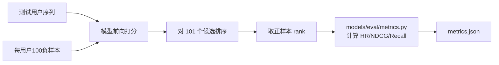

# 实验方案与评价体系

> **本文是毕业论文「实验设计」章节的素材来源**，所有实验脚本、参数、口径以本文为准。
> 指标实现唯一来源：`models/eval/metrics.py`。**禁止在任何脚本中重写指标计算。**
> 消融实验细节见 [ablation-study.md](ablation-study.md)，结果填写见 [result-analysis.md](result-analysis.md)。

---

## 一、实验目标

验证四个递进命题：

| # | 命题 | 对应实验 |
|---|---|---|
| H1 | 序列建模优于传统协同过滤 | 基线对比（ItemCF vs GRU4Rec vs SASRec） |
| H2 | 自注意力优于循环神经网络 | 基线对比（SASRec vs GRU4Rec） |
| H3 | 多兴趣建模提升小众题材覆盖 | 消融实验 + 分题材实验 |
| H4 | 内容融合缓解新番冷启动 | 消融实验 + 冷启动专项 |

---

## 二、数据集与预处理

### 2.1 数据集概况

来源：**MyAnimeList（MAL）**，已落位于 `dataset/` 目录。

| 文件 | 规模 | 用途 |
|---|---|---|
| `animes.csv` | 20,237 条动漫元数据 | 物品侧信息（标题/类型/年份/评分/题材/细分标签） |
| `ratings.csv` | 148,170,496 条评分记录 | 用户-物品交互 |
| `id_to_genreids.json` | 20,237 条映射 | 动漫 → 21 类 MAL 主题材 ID |
| `dataset.pkl` | 用户 1,306,691 / 物品 15,687 | 已切分的 train/val/test 序列 + id 映射 |
| `random-sample_size100-seed98765.pkl` | 每用户 100 个负样本 | 评估负采样池 |
| `pretrained_bert.pth` | 116 MB | 内容编码器预训练权重 |

**已完成的过滤**（来自 `dataset.pkl` 的构建过程）：

| 过滤项 | 规则 | 结果 |
|---|---|---|
| 用户过滤 | 交互数 < 5 剔除 | 保留 **1,306,691** 用户 |
| 物品过滤 | 交互数 < 10 剔除 | 保留 **15,687** 物品 |
| 不合规题材 | `genres` 含 `Hentai`(1602) / `Erotica`(73) 剔除 | 剔除 **1,675** 条，不入推荐池 |
| 缺失值 | `rating` 为空、`animeID` 无法映射的处理 | 见 `scripts/preprocess.py` 日志 |

### 2.2 题材体系（12 类）

从 21 类 MAL 主题材 + `genres_detailed` 细分标签归并为 12 类，用于分题材实验与兴趣胶囊打标：

| id | 题材 | MAL 映射 | 数据量级（动漫数） |
|---|---|---|---|
| 1 | 热血战斗 | Action | 5,387 |
| 2 | 冒险奇幻 | Adventure, Fantasy | 4,714+3,709 |
| 3 | 日常治愈 | Slice of Life, Gourmet | 1,437+178 |
| 4 | 恋爱校园 | Romance | 2,218 |
| 5 | 悬疑推理 | Mystery, Suspense | 975+456 |
| 6 | 科幻机战 | Sci-Fi | 3,255 |
| 7 | 喜剧搞笑 | Comedy | 6,902 |
| 8 | 运动竞技 | Sports | 743 |
| 9 | 超自然灵异 | Supernatural, Horror | 1,536+578 |
| 10 | 剧情文艺 | Drama, Award Winning, Avant Garde | 2,836+244+827 |
| 11 | 青春音乐 | Music / Idol（细分标签判定） | 待统计 |
| 12 | 后宫福利 | Ecchi | 837 |

> **小众题材关注对象**：运动竞技（743）、后宫福利（837）、悬疑推理（975）、青春音乐，这四类的 Recall@10 提升是验证「多兴趣建模价值」的关键证据。

### 2.3 序列构造与数据集划分

采用**留一法（Leave-One-Out）**，与 `dataset.pkl` 的构建口径完全一致：

| 划分 | 内容 | 样本量 |
|---|---|---|
| 训练集 `train` | 用户序列去掉最后 2 条 | 1,306,691 用户 |
| 验证集 `val` | 倒数第 2 条 | 1,306,691 条 |
| 测试集 `test` | 倒数第 1 条 | 1,306,691 条 |
| 负采样池 | 每用户 100 个随机负样本 | 130,669,100 条 |

**序列长度**：`max_len = 50`。超出截断（保留最近 50 条），不足左侧补齐 `PAD=0`。

**训练样本扩充**：滑动窗口。对长度为 `n` 的序列，构造 `n` 个训练样本 `(prefix[0:t] → item[t])`（`t` 从 1 到 `n`）。

```
原始序列: [v1, v2, v3, v4, v5]
样本1: []            → v1
样本2: [v1]          → v2
样本3: [v1, v2]      → v3
样本4: [v1, v2, v3]  → v4
样本5: [v1..v4]      → v5
```

### 2.4 内容特征库构建

| 步骤 | 做法 |
|---|---|
| 输入文本 | `title + genres(中文12类) + summary`（简介为空时只用前两者） |
| 编码模型 | `distilbert-base-multilingual-cased`（`pretrained_bert.pth`） |
| 池化 | 取 `[CLS]` 向量 → 线性投影到 **512 维** → L2 归一化 |
| 输出 | `data/features/content_vec_512.npy`（15,687 × 512，float32，约 32MB） |
| 索引 | FAISS `IndexFlatIP`（内积即余弦，因已归一化） |

```bash
python scripts/build_content_vectors.py --batch-size 256 --out data/features/content_vec_512.npy
python scripts/build_faiss_index.py --vec data/features/content_vec_512.npy --out data/features/faiss.index
```

### 2.5 冷启动子集构造

| 项 | 定义 |
|---|---|
| 新番判定 | 物品交互数 `< 10`（与 `.env` 的 `COLD_START_THRESHOLD` 一致） |
| 冷启动测试集 | 测试集中的目标物品属于新番子集的样本 |
| 构建脚本 | `scripts/build_cold_start_subset.py` |
| 预期规模 | 待实验统计（目标：≥ 5,000 条测试样本以保证统计显著性）|

> **关键设计**：冷启动实验中，模型训练时**不能见到**这些新番的任何交互，只能靠内容向量。因此需要在训练前把冷启动新番从训练集中剥离，否则内容融合的效果会被"其实见过"污染。

---

## 三、实验环境

### 3.1 硬件与软件

| 项 | 配置 |
|---|---|
| 操作系统 | Windows 11 / Ubuntu 22.04（两端均验证） |
| CPU | Intel i7-12700 / AMD R7 5800X 及以上 |
| GPU | NVIDIA RTX 3090 24GB（训练）／ RTX 4060 8GB（可跑小批量） |
| 内存 | 32 GB |
| Python | 3.10 / 3.11 |
| PyTorch | 2.1 – 2.5（CUDA 12.1） |
| 关键库 | numpy 1.26, pandas 2.1, transformers 4.40, faiss-cpu 1.8 |

### 3.2 环境固化

```bash
# 完整环境快照（论文附录用）
python -c "import torch,sys;print(sys.version);print(torch.__version__, torch.version.cuda)"
pip freeze > experiments/{exp_id}/requirements_freeze.txt
```

每次实验输出目录必须包含 `requirements_freeze.txt` 与 `git commit hash`，保证可复现。

### 3.3 随机性控制

| 项 | 值 |
|---|---|
| 随机种子 | `42`（主实验）；`{42, 2024, 2025}` 三种子取平均（最终报告） |
| 控制范围 | `random` / `numpy` / `torch` / `cuda` 全部设种 |
| cuDNN | `torch.backends.cudnn.deterministic = True`，`benchmark = False` |
| DataLoader | `shuffle=False`（序列推荐按用户顺序可固定） |
| 结果波动 | 同种子重跑指标必须完全一致；否则视为有未控随机源，必须排查 |

```python
# scripts/train.py 中的 set_seed
def set_seed(seed):
    random.seed(seed); np.random.seed(seed)
    torch.manual_seed(seed); torch.cuda.manual_seed_all(seed)
    torch.backends.cudnn.deterministic = True
    torch.backends.cudnn.benchmark = False
```

---

## 四、对比基线

| 类型 | 模型 | 实现位置 | 实现的公平性要求 |
|---|---|---|---|
| 传统协同过滤 | **ItemCF** | `models/baselines/itemcf.py` | 基于训练集共现矩阵，余弦相似度，TopK=200 邻居 |
| 经典序列模型 | **GRU4Rec** | `models/baselines/gru4rec.py` | 隐藏层 64，1 层 GRU，与本文模型同嵌入维度 |
| 基准序列模型 | **原版 SASRec** | `models/sasrec/model.py` | 2 层、2 头、hidden=64、dropout=0.2 |
| 本文模型 | **多兴趣 + 内容融合 SASRec** | `models/multi_interest/` + `content_encoder/` | 在上者基础上加 K=4 胶囊 + 双路融合 |

### 4.1 公平性控制（论文答辩必问）

| 控制项 | 做法 |
|---|---|
| 同一数据划分 | 全部模型用同一个 `dataset.pkl` 的 train/val/test |
| 同一负采样池 | 全部模型共用 `random-sample_size100-seed98765.pkl` |
| 同一嵌入维度 | 物品嵌入统一 64 维（ItemCF 无需嵌入） |
| 同一评估协议 | 全部走 `models/eval/evaluator.py`，候选 = 1 正 + 100 负 |
| 同一早停策略 | 看验证集 NDCG@10，patience=10 |
| 超参搜索预算一致 | 每个模型同样的网格规模（见 4.2） |

### 4.2 超参搜索网格

| 参数 | 搜索范围 | 最优值（待实验确定） |
|---|---|---|
| `hidden_size` | {32, 64, 128} | 待填 |
| `num_layers` | {1, 2, 3} | 待填 |
| `num_heads` | {1, 2, 4} | 待填 |
| `dropout` | {0.1, 0.2, 0.3, 0.5} | 待填 |
| `lr` | {1e-4, 5e-4, 1e-3, 3e-3} | 待填 |
| `batch_size` | {128, 256, 512} | 待填 |
| `K`（兴趣数） | {2, 4, 6, 8} | 待填（预期 4） |

搜索方式：先粗网格定范围，再对 `hidden/lr/dropout` 做细搜。**记录完整搜索日志到 `experiments/{exp_id}/hpo_log.csv`**，论文可放热力图。

---

## 五、评价指标

### 5.1 指标定义

统一采用留一法 + 100 负采样（1 正 : 100 负）的标准序列推荐评估协议。

**HR@K（Hit Ratio，命中率）**

```
HR@K = (1/|U|) · Σ_{u∈U} 1( rank(positive_u) ≤ K )
```

含义：推荐列表 TopK 中出现真实下一部动漫的用户占比。

**NDCG@K（Normalized Discounted Cumulative Gain）**

```
DCG@K  = Σ_{i=1..K} (2^rel_i - 1) / log2(i + 1),   rel_i = 1 若位置 i 是正样本，否则 0
IDCG@K = 1 / log2(2) = 1                            (理想情况正样本排在第 1 位)
NDCG@K = DCG@K / IDCG@K
```

含义：不但要看"有没有命中"，还要看"排在第几"。命中位置越靠前得分越高。

**Recall@K（分题材实验用）**

```
Recall@K = Σ_u |TopK_u ∩ Relevant_u| / Σ_u |Relevant_u|
```

含义：在分题材实验中，`Relevant_u` 限定为该题材的测试正样本，用于衡量模型对该题材的覆盖能力。

**MRR（辅助指标）**

```
MRR = (1/|U|) · Σ_u 1 / rank(positive_u)
```

**K 取值**：`K ∈ {5, 10}`，与 rq.md 要求一致。

### 5.2 评估流程



**严格实现要求**：

| 要求 | 说明 |
|---|---|
| 候选集 | 1 个正样本 + 100 个负样本 = 101 个候选，**不是全库排序** |
| 负样本 | 使用预生成的 `random-sample_size100-seed98765.pkl`，所有模型完全一致 |
| 排名定义 | 从 1 开始计数（`rank=1` 表示排第一） |
| 并列处理 | 得分并列时用稳定排序（`torch.argsort(stable=True)`） |
| 无效样本 | 若正样本在训练/验证集已出现，该样本剔除并记录数量 |
| 聚合方式 | 全部测试用户的**算术平均**，宏平均（macro） |

### 5.3 统计显著性

仅报告平均值不够，需给出显著性检验：

| 检验 | 用途 |
|---|---|
| 配对 t 检验（paired t-test） | 本文模型 vs 各基线，p < 0.05 视为显著 |
| 三随机种子取均值 ± 标准差 | 主实验表格中报 `mean ± std` |
| 样本量 | 1,306,691 用户，远超显著性所需样本量 |

---

## 六、实验分组

### 6.1 实验组 E1：整体效果对比

| 项 | 内容 |
|---|---|
| **目的** | 验证 H1、H2，证明本文模型综合最优 |
| **变量** | 模型（4 个：ItemCF / GRU4Rec / SASRec / 本文模型） |
| **控制** | 数据划分、负采样池、评估协议、早停策略全部一致 |
| **测试集** | 全量测试集（1,306,691 用户，每用户 101 候选） |
| **指标** | HR@5、HR@10、NDCG@5、NDCG@10、MRR |
| **输出** | `experiments/E1_overall/metrics.json` + 对比柱状图 |

### 6.2 实验组 E2：消融实验

| 项 | 内容 |
|---|---|
| **目的** | 验证 H3、H4，量化每个模块的独立增益与协同增益 |
| **变量** | 4 组配置（纯 SASRec / +多兴趣 / +内容融合 / 完整模型） |
| **控制** | 其余超参完全一致（同一 `hidden/layers/heads/lr/epochs`） |
| **测试集** | 全量测试集 |
| **指标** | HR@5/10、NDCG@5/10 |
| **输出** | 详见 [ablation-study.md](ablation-study.md) |

### 6.3 实验组 E3：冷启动专项

| 项 | 内容 |
|---|---|
| **目的** | 验证 H4——内容融合对无交互新番的作用 |
| **变量** | 完整模型 vs 纯 SASRec |
| **测试集** | **冷启动子集**（目标物品交互数 < 10 的测试样本） |
| **控制** | 训练时新番交互已剥离；负采样同为 100 个随机负样本 |
| **额外控制** | 对比「内容融合权重 0.3 vs 0.5」两档，验证动态权重设计 |
| **指标** | HR@10、NDCG@10 |
| **输出** | `experiments/E3_coldstart/metrics.json` |

**关键注意事项（否则实验无效）**：
1. 新番在训练集中**必须不可见**——否则模型从交互中学到了，内容融合的贡献被高估。
2. 冷启动子集的负样本也应该是新番（或至少同分布），否则模型可能靠"热门"而非"内容"区分正负。
3. 需报告冷启动子集的样本量。样本量过小时结论不可靠。

### 6.4 实验组 E4：分题材细分指标

| 项 | 内容 |
|---|---|
| **目的** | 验证 H3——多兴趣建模对小众题材的覆盖提升 |
| **变量** | 4 组消融配置（同 E2）× 12 类题材 |
| **测试集** | 全量测试集，按目标物品的主题材分组 |
| **指标** | Recall@10（每类题材单独计算） |
| **重点** | 小众题材（运动竞技/后宫福利/悬疑推理/青春音乐）的提升幅度 |
| **输出** | 12 × 4 的指标矩阵 + 分组柱状图 |

> **假设**：多兴趣模型对**小众题材**的提升应显著大于对主流题材（如喜剧搞笑、热血战斗）的提升——因为主流题材的单一兴趣向量已经能覆盖，小众题材必须靠多向量才能召回。**如果结果相反，需要在论文中如实讨论。**

### 6.5 实验矩阵总览

| 实验 | 变量数 | 配置组合数 | 模型训练次数 | 预估耗时 |
|---|---|---|---|---|
| E1 整体对比 | 4 模型 | 4 | 4 | ~12 h |
| E2 消融 | 4 配置 | 4 | 4 | ~12 h |
| E3 冷启动 | 2 模型 × 2 权重 | 4 | 4 | ~12 h |
| E4 分题材 | 复用 E2 结果 | 4 | 0（复用） | ~1 h（评估） |
| 超参搜索 | 7 参数 | ~60 组 | 60 | ~40 h |
| **合计** | — | — | **72** | **~77 h** |

> 消融组 2、3 与 E1 的 SASRec 基准可复用同一次训练结果，实际训练次数可压缩。

---

## 七、变量控制与测试集划分说明

### 7.1 三类变量的处理

| 变量类型 | 实验中的处理 |
|---|---|
| **自变量** | 要验证的模块开关（多兴趣有/无、内容融合有/无）、模型种类 |
| **控制变量** | 数据划分、负采样池、嵌入维度、层数、学习率、训练轮数、早停策略、随机种子 |
| **因变量** | HR@5/10、NDCG@5/10、Recall@10、MRR |

### 7.2 测试集划分的唯一性

**整个项目只有一份测试集**：`dataset.pkl` 的 `test` 字段（1,306,691 用户，每用户 1 条正样本）。所有实验从它派生：

| 派生子集 | 派生规则 | 仅用于 |
|---|---|---|
| 全量测试集 | 原样 | E1、E2、E4 |
| 冷启动子集 | 正样本属于 `n_interactions < 10` 的新番 | E3 |
| 分题材子集 | 按正样本的 `is_primary` 题材分组 | E4 |

> ⚠️ **绝不允许**为了让指标好看而重新划分测试集。任何划分变更必须记录在 `experiments/SPLIT_CHANGELOG.md`。

### 7.3 训练超参一致性检查

消融实验最容易犯的错是"某个配置多训了几轮"。必须用**同一份配置基线**：

```yaml
# configs/experiment.yaml
base:                        # 所有消融组共享的基线配置
  max_seq_len: 50
  hidden_size: 64
  num_layers: 2
  num_heads: 2
  dropout: 0.2
  batch_size: 256
  lr: 0.001
  epochs: 200
  early_stop_patience: 10
  seed: 42

groups:
  E2_1_pure_sasrec:      { use_multi_interest: false, use_content_fusion: false }
  E2_2_multi_interest:   { use_multi_interest: true,  use_content_fusion: false }
  E2_3_content_fusion:   { use_multi_interest: false, use_content_fusion: true  }
  E2_4_full:             { use_multi_interest: true,  use_content_fusion: true  }
```

跑实验时只允许覆盖 `groups` 里的开关，`base` 里的任何值被改动都必须记录原因。

---

## 八、实验执行

### 8.1 一键跑全部实验

```bash
# 全部实验（E1 + E2 + E3 + E4）
python scripts/run_experiments.py --config configs/experiment.yaml --all

# 只跑消融
python scripts/run_experiments.py --config configs/experiment.yaml --group E2

# 只跑冷启动
python scripts/run_experiments.py --config configs/experiment.yaml --group E3

# 指定输出目录与种子
python scripts/run_experiments.py --all --seed 42 --out experiments/20260912_E_all
```

### 8.2 输出目录规范

```
experiments/20260912_E_all/
├── config.yaml              # 本次实验的完整配置快照
├── requirements_freeze.txt  # 环境快照
├── git_commit.txt           # 代码版本
├── hpo_log.csv              # 超参搜索日志
├── E1_overall/
│   ├── itemcf/metrics.json
│   ├── gru4rec/metrics.json
│   ├── sasrec/metrics.json
│   ├── ours/metrics.json
│   └── summary.csv          # 汇总表
├── E2_ablation/
│   ├── pure_sasrec/  multi_interest/  content_fusion/  full/
│   └── summary.csv
├── E3_coldstart/
│   └── summary.csv
├── E4_by_genre/
│   └── recall10_matrix.csv
└── figures/                 # 生成的图表
    ├── fig1_overall_bar.png
    ├── fig2_ablation_grouped.png
    ├── fig3_genre_recall.png
    └── fig4_coldstart.png
```

### 8.3 结果回写

实验脚本跑完后，指标回写数据库，供管理后台展示：

```bash
python scripts/backfill_metrics.py \
  --exp-dir experiments/20260912_E_all \
  --model-ver multi_interest_content_v1
# → 写入 metric_snapshot 表（metric_type = hr5/hr10/ndcg5/ndcg10/recall10）
```

---

## 九、实验结果模板

> 数值待实验完成后填写，**禁止编造**。填写规范见 [result-analysis.md](result-analysis.md)。

### 9.1 E1 整体效果对比

| 模型 | HR@5 | HR@10 | NDCG@5 | NDCG@10 | MRR |
|---|---|---|---|---|---|
| ItemCF | 待填 | 待填 | 待填 | 待填 | 待填 |
| GRU4Rec | 待填 | 待填 | 待填 | 待填 | 待填 |
| SASRec（原版） | 待填 | 待填 | 待填 | 待填 | 待填 |
| **本文模型** | **待填** | **待填** | **待填** | **待填** | **待填** |

### 9.2 E2 消融实验

| 配置 | HR@5 | HR@10 | NDCG@5 | NDCG@10 | 相对基准 |
|---|---|---|---|---|---|
| 纯 SASRec | 待填 | 待填 | 待填 | 待填 | — |
| + 多兴趣 | 待填 | 待填 | 待填 | 待填 | 待填 |
| + 内容融合 | 待填 | 待填 | 待填 | 待填 | 待填 |
| 完整模型 | 待填 | 待填 | 待填 | 待填 | 待填 |

### 9.3 E3 冷启动专项

| 模型 | HR@10 | NDCG@10 | 样本量 |
|---|---|---|---|
| 纯 SASRec | 待填 | 待填 | 待填 |
| 完整模型（内容权重 0.3） | 待填 | 待填 | 待填 |
| 完整模型（内容权重 0.5） | 待填 | 待填 | 待填 |

### 9.4 E4 分题材 Recall@10

| 题材 | 动漫数 | 纯 SASRec | +多兴趣 | +内容融合 | 完整模型 |
|---|---|---|---|---|---|
| 热血战斗 | 5,387 | 待填 | 待填 | 待填 | 待填 |
| 冒险奇幻 | 8,423 | 待填 | 待填 | 待填 | 待填 |
| 日常治愈 | 1,615 | 待填 | 待填 | 待填 | 待填 |
| 恋爱校园 | 2,218 | 待填 | 待填 | 待填 | 待填 |
| 悬疑推理 | 1,431 | 待填 | 待填 | 待填 | 待填 |
| 科幻机战 | 3,255 | 待填 | 待填 | 待填 | 待填 |
| 喜剧搞笑 | 6,902 | 待填 | 待填 | 待填 | 待填 |
| **运动竞技** | 743 | 待填 | 待填 | 待填 | 待填 |
| 超自然灵异 | 2,114 | 待填 | 待填 | 待填 | 待填 |
| 剧情文艺 | 3,907 | 待填 | 待填 | 待填 | 待填 |
| **青春音乐** | 待填 | 待填 | 待填 | 待填 | 待填 |
| **后宫福利** | 837 | 待填 | 待填 | 待填 | 待填 |

---

## 十、伦理与合规

| 项 | 说明 |
|---|---|
| 数据合规 | MAL 数据为公开数据集，仅用于学术研究；不二次分发原始数据 |
| 内容合规 | 剔除 `Hentai` / `Erotica` 等不合规题材，不进入推荐池与实验 |
| 隐私 | 实验仅使用匿名 `userID`，不涉及任何真实身份信息 |
| 可复现 | 所有实验提供配置、种子、环境快照与代码版本 |

---

## 十一、相关文档

- 消融实验细节 → [ablation-study.md](ablation-study.md)
- 结果分析与图表 → [result-analysis.md](result-analysis.md)
- 指标代码位置 → [project-structure.md](project-structure.md) `models/eval/`
- 指标回写接口 → [api-specification.md](api-specification.md) `/admin/metrics`
