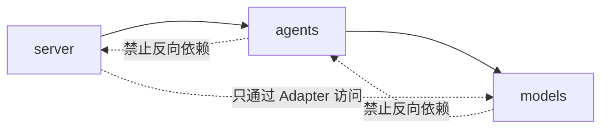
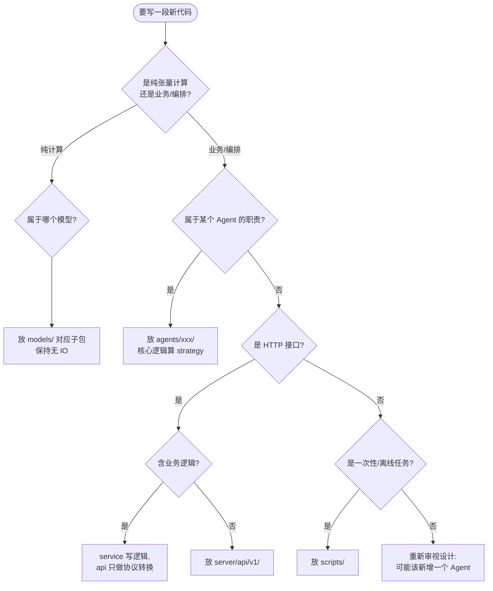

# 代码目录结构说明

> 本文回答：**代码放哪、每个目录干嘛、Agent 代码怎么组织**。
> 落地时以本文为准，新增目录必须同步更新本文。

---

## 一、根目录总览

```
anirec/
├── README.md                  # 项目门面
├── requirements.txt           # Python 依赖
├── .env.example               # 环境变量模板（.env 不入库）
├── .gitignore
├── pyproject.toml             # ruff / black / pytest 配置
├── .pre-commit-config.yaml    # 提交前自动检查
│
├── agents/                    # ③ Agent 层：业务决策与语义生成
├── models/                    # ④ 算法层：纯计算，无业务、无 IO
├── server/                    # ② 应用层：HTTP 服务与任务调度
├── frontend/                  # ① 用户层：Vue 3 前端
│
├── data/                      # 数据产物（不入库）
├── dataset/                   # 原始数据集（不入库，走网盘分发）
├── configs/                   # 全部 YAML 配置
├── scripts/                   # 一次性 / 离线运行脚本
├── tests/                     # 测试
├── deploy/                    # 部署相关
├── docs/                      # 设计文档
└── logs/                      # 运行日志
```

### 三个核心分区的边界（最重要）

| 目录 | 可以做什么 | **绝对不可以做** |
|---|---|---|
| `models/` | 张量运算、模型定义、训练、指标计算 | 连数据库、读 `.env`、调 LLM、import `agents/` 或 `server/` |
| `agents/` | 编排、策略、调模型、调 LLM、读写自己的状态表 | 写张量运算、直接 `torch.load`、写复杂 SQL 聚合 |
| `server/` | HTTP 协议、鉴权、参数校验、事务、调 Agent | 写推荐算法逻辑、直接 `import torch` |

> 用一句话记：**`models` 不认识 Agent，`server` 不认识模型，`agents` 是它们中间唯一的桥。**

依赖方向（不可逆）：



CI 中通过 `scripts/check_imports.py` 静态检查该依赖方向，违反直接失败。

---

## 二、`agents/` —— Agent 层

### 组织方式：**一个 Agent 一个子包 + 一个公共包**

不按"能力"横向切（那样会导致一个 Agent 的文件散落各处），而是**按 Agent 纵向切包**。每个包内部结构与职责完全一致，新人能靠一个包学会全部 10 个 Agent。

```
agents/
├── __init__.py
├── common/                    # 公共基础设施（所有 Agent 复用）
│   ├── envelope.py            #   消息信封定义与序列化
│   ├── registry.py            #   Agent 注册中心（按名字取实例）
│   ├── llm.py                 #   统一 LLM 客户端（超时/重试/降级/计量）
│   ├── tools.py               #   工具注册与 Function Calling Schema 生成
│   ├── memory.py              #   长短期记忆读写封装
│   ├── errors.py              #   统一错误码
│   ├── tracing.py             #   trace_id 透传与 agent_trace 落库
│   └── base.py                #   BaseAgent 抽象类
│
├── orchestrator/              # A0 调度
│   ├── agent.py               #   入口：OrchestratorAgent.invoke()
│   ├── graph.py               #   LangGraph 状态图定义
│   ├── intent.py              #   意图识别（LLM + 规则兜底）
│   ├── prompts.py             #   System Prompt 常量
│   ├── schemas.py             #   输入输出 Pydantic 模型
│   └── README.md              #   本 Agent 的设计说明
├── profile/                   # A1 用户画像
├── recall/                    # A2 序列召回
├── coldstart/                 # A3 冷启动内容
├── fusion/                    # A4 融合排序
├── explain/                   # A5 解释生成
├── drift/                     # A6 兴趣漂移
├── chat/                      # A7 对话推荐
├── dataops/                   # A8 数据运营
└── eval/                      # A9 评估监控
```

### 单个 Agent 包的标准结构

以 `agents/recall/` 为例：

```
agents/recall/
├── __init__.py                # 导出 RecallAgent，供 registry 注册
├── agent.py                   # 核心类：继承 BaseAgent，实现 invoke()
├── adapter.py                 # 与 models/ 的适配层（唯一耦合点）
├── schemas.py                 # RecallInput / RecallOutput（Pydantic v2）
├── strategy.py                # 业务策略：多兴趣合并去重、已看过滤
├── config.py                  # 本 Agent 的配置项定义
└── README.md                  # 设计说明：职责/输入输出/边界/降级
```

| 文件 | 职责 | 是否每个 Agent 都有 |
|---|---|---|
| `agent.py` | Agent 主逻辑，实现 `invoke(input) -> output` | ✅ 必需 |
| `schemas.py` | 输入/输出契约，Pydantic v2 | ✅ 必需 |
| `adapter.py` | 需要调模型/DB 时才有 | 🔶 按需（A1/A2/A3/A4/A5/A7/A9）|
| `strategy.py` | 有多步业务策略时才有 | 🔶 按需（A2/A3/A4）|
| `prompts.py` | 需要 LLM 时才有 | 🔶 按需（A0/A1/A5/A6/A7/A8/A9）|
| `graph.py` | 需要多步状态机编排时才有 | 🔶 按需（A0/A7）|
| `config.py` | 有可调参数时才有 | 🔶 按需 |
| `README.md` | 设计说明 | ✅ 必需 |

### `BaseAgent` 抽象约定

所有 Agent 必须继承 `agents/common/base.py` 的 `BaseAgent`，统一具备：

```python
class BaseAgent(ABC):
    agent_id: str                    # "A2"
    name: str                        # "recall"

    @abstractmethod
    async def invoke(self, payload: dict) -> dict: ...

    async def handle(self, env: Envelope) -> Envelope:
        """统一入口：计时、trace 落库、错误包装、降级。子类不要覆写。"""
```

这样 `registry.get("recall").handle(envelope)` 就能统一处理所有横切关注点，Agent 自身代码只关心业务。

---

## 三、`models/` —— 算法层

```
models/
├── __init__.py
├── sasrec/                    # SASRec 基座
│   ├── model.py               #   SASRec 网络定义（嵌入 + 因果注意力 + FFN）
│   ├── dataset.py             #   torch Dataset：滑动窗口样本构造
│   ├── train.py               #   训练循环（早停、负采样、BCE 损失）
│   ├── config.py              #   超参 dataclass（对齐 configs/model.yaml）
│   └── README.md
├── multi_interest/            # 多兴趣胶囊网络
│   ├── capsule.py             #   初级胶囊 + 动态路由（K=4）
│   ├── model.py               #   多兴趣 SASRec（组合 sasrec + capsule）
│   ├── train.py
│   └── README.md
├── content_encoder/           # 内容语义编码与融合
│   ├── encoder.py             #   DistilBERT 编码器封装
│   ├── fusion.py              #   候选侧拼接 / 排序侧加权
│   ├── build_vectors.py       #   批量生成 512 维内容向量
│   └── README.md
├── baselines/                 # 对比基线（保证公平复现）
│   ├── itemcf.py              #   ItemCF 协同过滤
│   ├── gru4rec.py             #   GRU4Rec
│   └── README.md
├── eval/                      # 指标实现的唯一来源
│   ├── metrics.py             #   HR@K / NDCG@K / Recall@K / MRR
│   ├── evaluator.py           #   评估循环（全量 / 分题材 / 冷启动子集）
│   └── README.md
└── checkpoint/                # 模型保存/加载工具（state_dict 规范）
```

### 算法层的硬性约定

| 约定 | 说明 |
|---|---|
| **纯函数化** | 给定相同输入张量必得相同输出；不读全局随机状态（除非显式设 seed） |
| **无 IO** | 不读数据库、不读 `.env`、不写日志文件（用 `logging` 输出即可） |
| **配置用 dataclass** | 不在模型内部硬编码超参，统一从 `config.py` 的 dataclass 注入 |
| **接口稳定** | 对外只暴露 `encode()` / `forward()` / `score()`，改内部不影响 Agent |
| **指标唯一实现** | 所有 HR/NDCG 计算只能来自 `models/eval/metrics.py`，禁止在脚本里重写 |

### 模型对外接口契约（Agent 依赖这些签名）

```python
# models/sasrec/model.py
def encode(seq: LongTensor, mask: LongTensor) -> Tuple[Tensor, Tensor]:
    """返回 (hidden_states [B,L,H], user_repr [B,H])"""

# models/multi_interest/model.py
def multi_interest_repr(user_repr: Tensor) -> Tensor:
    """返回 [B, K, H]，K=4"""

# models/content_encoder/encoder.py
def encode_text(texts: List[str]) -> Tensor:
    """返回 [N, 512]"""

# models/content_encoder/fusion.py
def fusion_score(behavior: Tensor, content: Tensor, n_inter: Tensor) -> Tensor:
    """按 7:3 / 冷启动 5:5 加权，返回最终得分"""
```

---

## 四、`server/` —— 应用层

```
server/
├── main.py                    # FastAPI 实例、中间件注册、路由挂载
├── api/
│   ├── deps.py                # 依赖注入：当前用户、DB Session、Agent 注册中心
│   └── v1/
│       ├── auth.py            #   /auth/*
│       ├── users.py           #   /users/*
│       ├── animes.py          #   /animes/*
│       ├── records.py         #   /records/*
│       ├── recommend.py       #   /recommend/*  ← 主链路
│       ├── chat.py            #   /chat/*       ← SSE 流式
│       ├── analysis.py        #   /analysis/*
│       ├── admin.py           #   /admin/*
│       └── internal.py        #   /internal/agents/*  ← Agent 内部调用（内网鉴权）
├── services/                  # 业务服务：调 Agent、聚合结果、管事务
│   ├── recommend_service.py   #   组织 A0~A5 完成一次推荐
│   ├── record_service.py      #   追番记录 CRUD + 投递行为事件
│   ├── analysis_service.py
│   ├── admin_service.py
│   └── agent_client.py        #   调用 Agent 的统一客户端（进程内 / HTTP 两模式）
├── schemas/                   # Pydantic 请求/响应模型（对外契约）
│   ├── common.py              #   统一响应体 Result[T]、分页
│   ├── auth.py  user.py  anime.py  record.py  recommend.py  chat.py
├── core/                      # 基础设施
│   ├── config.py              #   pydantic-settings 读 .env
│   ├── logging.py             #   结构化日志 + trace_id 注入
│   ├── security.py            #   JWT 签发校验、密码哈希
│   ├── exceptions.py          #   业务异常 + 全局异常处理器
│   ├── response.py            #   统一响应包装
│   ├── rate_limit.py          #   限流
│   └── cache.py               #   Redis 客户端与缓存工具
├── tasks/                     # APScheduler 任务
│   ├── scheduler.py           #   调度器装配
│   ├── offline_recommend.py   #   每日 03:00 全量推荐
│   ├── sync_new_anime.py      #   每周一 04:00 新番同步
│   └── metrics_snapshot.py    #   每小时指标快照
└── db/
    ├── base.py                #   Declarative Base
    ├── session.py             #   Session 工厂
    ├── models/                #   ORM 模型（与 database-design.md 表一一对应）
    │   ├── user.py  anime.py  record.py  recommend.py
    │   ├── profile.py  capsule.py
    │   └── agent_state.py  memory.py  metric.py
    └── migrations/            #   Alembic
```

> ⚠️ `server/services/` 是**唯一**允许同时接触 Agent 与数据库的地方。API 路由层只做协议转换，不写业务。

---

## 五、`frontend/` —— 用户层

```
frontend/
├── index.html
├── vite.config.ts             # 开发代理 → 127.0.0.1:8000
├── package.json
└── src/
    ├── main.ts                # 入口：挂载 Pinia + Router + Element Plus
    ├── App.vue
    ├── router/index.ts        # 路由表 + 登录守卫
    ├── store/                 # Pinia
    │   ├── user.ts            #   登录态、token
    │   └── recommend.ts       #   推荐列表缓存
    ├── api/                   # 与 api-specification.md 一一对应的请求封装
    │   ├── request.ts         #   axios 实例：拦截器、统一错误处理
    │   ├── recommend.ts  record.ts  anime.ts  analysis.ts  chat.ts
    ├── views/                 # 页面
    │   ├── Login.vue
    │   ├── RecommendFeed.vue      # 首页推荐（含推荐理由）
    │   ├── RecommendByGenre.vue   # 分类推荐
    │   ├── NewAnimeZone.vue       # 新番专区
    │   ├── MyRecords.vue          # 追番列表 + 时间轴
    │   ├── InterestAnalysis.vue   # 兴趣雷达 + 漂移趋势
    │   ├── ChatRecommend.vue      # 对话推荐
    │   └── admin/
    │       ├── AnimeManage.vue  UserManage.vue  MetricsDashboard.vue  ColdStartBoard.vue
    ├── components/            # 复用组件
    │   ├── AnimeCard.vue      ExplainBadge.vue   GenreRadar.vue
    │   ├── WatchTimeline.vue  AgentTraceViewer.vue
    ├── composables/           # 组合式函数（useXxx）
    └── assets/
```

---

## 六、其余目录

| 目录 | 内容 | 约定 |
|---|---|---|
| `configs/` | `data.yaml` / `model.yaml` / `experiment.yaml` / `log.yaml` | 一个 `configs/config.py` 负责加载合并，支持 `--config` 覆盖 |
| `scripts/` | `preprocess.py`、`train.py`、`run_experiments.py`、`plot_results.py`、`init_db.py`、`import_anime_meta.py`、`build_content_vectors.py`、`check_imports.py` | **可重复执行**（幂等）；每个脚本顶部必须有 docstring 说明用法 |
| `tests/` | `test_models/`、`test_agents/`、`test_api/`、`test_metrics/` | 指标与 Agent 契约必须有测试；覆盖率目标 60% |
| `deploy/` | `Dockerfile`、`docker-compose.yml`、`nginx.conf` | 定时任务容器与 API 容器分离 |
| `data/` | `raw/` `processed/` `features/` `checkpoints/` | 全部不入库；路径由 `.env` 控制 |
| `logs/` | 按天滚动 | 不入库 |

---

## 七、新增文件的决策树



---

## 八、文件命名规范

| 类型 | 规范 | 示例 |
|---|---|---|
| Python 模块 | 小写下划线 | `recommend_service.py` |
| Python 类 | 大驼峰 | `FusionRankAgent` |
| Python 函数 | 小写下划线 | `merge_candidates()` |
| 常量 | 全大写下划线 | `MAX_SEQ_LEN` |
| Vue 组件 | 大驼峰 | `AnimeCard.vue` |
| 配置/脚本 | 小写下划线 | `run_experiments.py` |
| 文档 | 小写连字符 | `agent-prompt-design.md` |
| Agent 目录 | 小写英文单词 | `agents/coldstart/` |

---

## 九、相关文档

- 分层与数据流 → [architecture.md](architecture.md)
- Agent 职责 → [agents.md](agents.md)
- 表结构与目录对应 → [database-design.md](database-design.md)
- 接口与路由对应 → [api-specification.md](api-specification.md)
